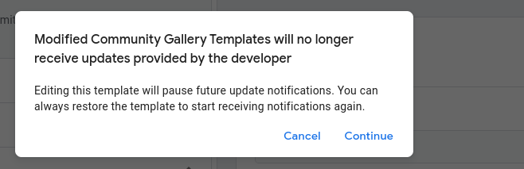

This page describes the settings available in the Snowplow Settings Variable template for Google Tag Manager.

## Tracker Options

### Tracker Name

It is important to set the tracker name. The reason you might have more than one tracker name generated on the site is if you have different configuration objects or tracking endpoints to which you want to send commands.

When the tag runs, it first checks if a tag with this name has already been initialized. If it has, it then proceeds to send the command to this tracker name. If a tracker with this name has _not_ been initialized, a new tracker is initialized with the tracker configuration from this settings variable.

This means that a tracker configuration is applied **only once** to the tracker. Thus if you have more than one tag running on the site, each with the same tracker name but different tracker configurations, only the configuration of the tag that fires _first_ will be applied to the tracker.

### Collector Endpoint Hostname

This needs to be set to the hostname/domain (e.g. `sp.domain.com`) on which you’ve configured your [Snowplow Collector](/docs/pipeline/collector/index.md)

## JavaScript Tracker

### Snowplow JavaScript Tracker Library

This determines the source of the Snowplow JavaScript tracker library. You can choose to load the tracker from a CDN or host it on your own server. For production usage, we recommend [self-hosting the tracker](/docs/sources/web-trackers/tracker-setup/hosting-the-javascript-tracker/index.md).

### Self-Hosted Library URL

This field is required if you choose to load the Snowplow JavaScript tracker from your own server. Enter the URL of the tracker library here.

:::warning

The default Tag doesn't have the permission to inject scripts from a custom URL.

You will need to update the `Injects Scripts` permission to reflect the new location, by editing the `Snowplow Analytics v3/v4 Tag` template. Delete the content of the `Allowed URL Match Patterns` field, and type the full URL to the library there. Again, it must match what you input into the tag itself when creating it.

Modifying permissions **breaks the gallery link** and you will no longer be notified about updates to the template.

:::

:::note

Since v1.1.0, an alternative to prevent breaking the gallery update link is to use the `Do not load` option from the corresponding drop down menu:

:::

### Library Version

This field is required if you choose to load the Snowplow JavaScript tracker from a CDN. Enter the version of the tracker library you want to load here.

## Application Settings

### Application ID

This is the unique identifier for your application. It is used to distinguish different applications in your Snowplow pipeline.

### Platform

This is the platform on which your application is running. This is used to distinguish different platforms in your Snowplow pipeline.

## Privacy Settings

### Respect 'Do Not Track'

This setting allows you to respect the Do Not Track setting in the user's browser. When enabled, the Snowplow JavaScript tracker will not track users who have enabled the Do Not Track setting in their browser, along with preventing any cookies from being set.

### Anonymous Tracking

#### Server Anonymisation

Server-side anonymisation affects user identifiers set server-side. In particular, these are the network_userid property set in server-side cookie and the user IP address.

Setting the flag will add a `SP-Anonymous` HTTP header to requests sent to the Snowplow collector. The Snowplow pipeline will take care of anonymising the identifiers.

#### Anonymous Session Tracking

This setting disables client-side user identifiers but tracks session information. In practice, this means that events track the Session context entity but the userId property is a null UUID (00000000-0000-0000-0000-000000000000). In case Platform context is enabled, the IDFA identifiers will not be present.

#### Cookie Extension Service

This allows you to set the endpoint for the [Cookie Extension Service](/docs/events/cookie-extension/index.md).

## Cookie Settings

### State Storage Strategy

This setting allows you to choose the strategy for storing the Snowplow tracker state. The available options are:

- `Cookie and Local Storage`: The Snowplow tracker will store the state in both cookies and local storage.
- `Cookie`: The Snowplow tracker will store the state in cookies only.
- `Local Storage`: The Snowplow tracker will store the state in local storage only.
- `None`: The Snowplow tracker will not store the state.

### Cookie Domain

This setting allows you to specify the domain for which the Snowplow tracker cookies will be set. This is useful when you want to track users across subdomains.

By default, `auto` will be used, which will set the domain to the root domain.

See [here](/docs/sources/web-trackers/cookies-and-local-storage/configuring-cookies/index.md#cookie-domain) for more information.

### Cookie Lifetime

This setting allows you to specify the lifetime of the Snowplow tracker cookies. By default, the cookies will be active for 2 years.

If the lifetime is set to `0`, the cookie will expire at the end of the session (when the browser closes). If set to `-1`, the first-party cookies will be disabled.

### Cookie SameSite

This setting allows you to specify the SameSite attribute for the Snowplow tracker cookies. The SameSite attribute is used to prevent CSRF attacks.

### Session Cookie Timeout

This setting allows you to specify the timeout for the session cookie. By default, the session cookie will expire after 30 minutes of inactivity.

### Synchronously Write Cookies

This setting allows you to specify whether the Snowplow tracker should [write cookies synchronously](/docs/sources/web-trackers/configuring-how-events-sent/index.md#synchronous-cookie-writes). By default, the tracker will write cookies asynchronously.

## Dispatching

### Common

#### Dispatch Method

This setting allows you to choose the method for sending events to the Snowplow collector. The available options are:

- `POST`
- `GET`

It is recommended to use the default `POST` method for sending events to the collector as it allows for larger payloads, unless you have specific requirements for using the `GET` method.

#### Encode Into Base64

This setting allows you to encode the payload into Base64 before sending it to the collector. If you are using the `GET` method for sending events to the collector, it is recommended to enable this setting, as it will help prevent issues with special characters in the payload. Otherwise, it is recommended to leave this setting disabled to reduce the payload size.

#### Connection Timeout

This setting allows you to specify the timeout for the connection to the Snowplow collector. By default, the timeout is set to 5000 milliseconds.

### `POST` Specific

#### Buffer Size

This setting allows you to specify the number of events to buffer
before sending them to the collector. By default, the buffer size is set to 1.

If you set the buffer size to a value greater than 1, the tracker will buffer events and send them in batches to the collector. Although this can help reduce the number of requests made to the collector, it comes at the expense of potential data loss for non-returning visitors.

#### POST Path

This setting allows you to specify the path to which the events will be sent. By default, the events will be sent to the `/com.snowplowanalytics.snowplow/tp2` path.

#### Maximum POST Payload Size

This setting allows you to specify the maximum size of the payload that will be sent to the collector. By default, the maximum payload size is set to 40000 bytes.

If an event is generated that is over the maximum payload size, the event will bypass the buffer and be sent immediately to the collector. This means that if it fails, it will not be retried.

#### Enable keepalive

This setting allows you to enable or disable the [keepalive](/docs/sources/web-trackers/configuring-how-events-sent/index.md#keepalive-option-for-collector-requests) feature. This will enable requests to continue to be sent, even if the user navigates away from the page that sent the request.

Defaults to `false`.

## Predefined Contexts

Predefined contexts provide additional metadata for your Snowplow events. By including these contexts, you can capture common data points like device information, session details, or geolocation without having to define them manually.

Available predefined contexts are:

| Name                          | Description                                                                                                                              | Source Plugin                                                                                                                                       |
| ----------------------------- | ---------------------------------------------------------------------------------------------------------------------------------------- | --------------------------------------------------------------------------------------------------------------------------------------------------- |
| `webPage`                     | Information about the web page where the event occurred.                                                                                 | [Web Page tracking](/docs/sources/web-trackers/tracking-events/page-views/index.md#webpage-page-view-id-context-entity) |
| `gaCookies`                   | Information about the Google Analytics cookies.                                                                                          | [Google Analytics Cookies Plugin](/docs/sources/web-trackers/tracking-events/ga-cookies/index.md)                       |
| `clientHints`                 | Information about the client's device.                                                                                                   | [Client Hints Plugin](/docs/sources/web-trackers/tracking-events/client-hints/index.md)                                 |
| `geolocation`                 | Information about the client's geolocation.                                                                                              | [Geolocation](/docs/events/ootb-data/geolocation/index.md)                                                                                          |
| `session`                     | Information about the user session.                                                                                                      | [Session](/docs/events/ootb-data/user-and-session-identification/index.md#client-session-context-entity)                                            |
| `performanceNavigationTiming` | Retrieves data from the [PerformanceNavigationTiming](https://developer.mozilla.org/en-US/docs/Web/API/PerformanceNavigationTiming) API. | [Performance Navigation Timing](/docs/sources/web-trackers/tracking-events/timings/index.md)                            |
