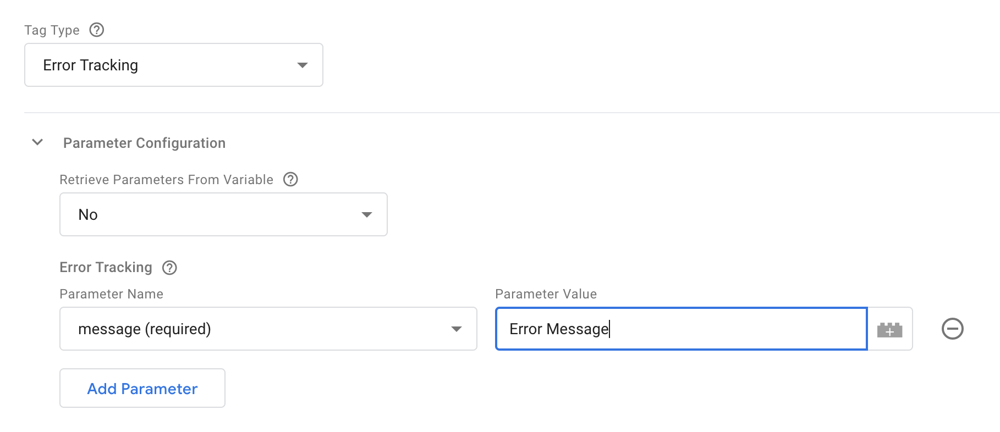

This template implements the [Snowplow JavaScript tracker](/docs/sources/web-trackers/index.md) for Google Tag Manager. It allows for the sending of [Snowplow events](docs/events/index.md) from your website to your Snowplow collector.

Tag Types are the kinds of events that can be tracked with the Snowplow v4 Tag Template. Each tag type has its own set of options and parameters that can be configured.

You can also configure [plugins](/docs/sources/google-tag-manager/snowplow-template/plugins/index.md) to use with this template.

## Ad Tracking

The Ad Tracking tag is used to track impressions and ad clicks. This can used by, for example, ad networks to identify which sites and web pages users visit across a network, so that they can be segmented.

<details>
<summary>Ad Tracking Parameters</summary>

All ad tracking events take the following common parameters:

| Name           | Required? | Description                                                            | Example |
| -------------- | --------- | ---------------------------------------------------------------------- | ------- |
| `advertiserId` | No        | The advertiser ID                                                      | 201     |
| `campaignId`   | No        | The campaign ID                                                        | 12      |
| `cost`         | No        | The cost of the ad                                                     | 5.5     |
| `costModel`    | No        | The cost model for the campaign. Must be one of `cpc`, `cpm`, or `cpa` | cpc     |


The ad tracking tag includes three event types, each with its own set of additional parameters:

### Impression Event

| Name           | Required? | Description                                                      | Example                 |
| -------------- | --------- | ---------------------------------------------------------------- | ----------------------- |
| `impressionId` | No        | Identifier for the particular impression instance                | 67965967893             |
| `targetUrl`    | No        | The destination URL                                              | https://www.example.com |
| `bannerId`     | No        | Adserver identifier for the ad banner (creative) being displayed | 23                      |
| `zoneId`       | No        | Adserver identifier for the zone where the ad banner is located  | 7                       |

### Click Event

| Name        | Required? | Description                                                      | Example                 |
| ----------- | --------- | ---------------------------------------------------------------- | ----------------------- |
| `targetUrl` | Yes       | The destination URL                                              | https://www.example.com |
| `clickId`   | No        | Identifier for the particular click instance                     | 12243253                |
| `bannerId`  | No        | Adserver identifier for the ad banner (creative) being displayed | 23                      |
| `zoneId`    | No        | Adserver identifier for the zone where the ad banner is located  | 7                       |

### Conversion Event

| Name           | Required? | Description                                       | Example   |
| -------------- | --------- | ------------------------------------------------- | --------- |
| `conversionId` | No        | Identifier for the particular conversion instance | 743560297 |
| `category`     | No        | Conversion category                               | ecommerce |
| `action`       | No        | The type of user interaction                      | purchase  |
| `property`     | No        | Describes the object of the conversion            | shoes     |
| `initialValue` | No        | How much the conversion is initially worth        | 99        |

</details>


## Button Click Tracking

This tag will enable the tracking of clicks on buttons, covering both `<button>` and `<input type="button">` elements.

:::info

This does not track track a button click event directly, but rather will enable listen for button clicks.

:::

### Filter

The `Filter` option allows you to specify a list of CSS classes that will be used to filter out elements that should not be tracked. This can be useful if you have a large number of buttons on your site, but only want to track clicks on a subset of them.

There are two types of filters you can use:
- Allow: Only elements that match the specified CSS classes will be tracked.
- Block: Elements that match the specified CSS classes will not be tracked.


Each filter takes a comma-separated list of CSS classes. For example, to only track clicks on buttons with the classes "track-me" and "click-me" you would add enter `track-me, click-me`  into `Classes` when the `Allow` filter type is selected.


## Cart Tracking

The Cart Tracking tag is used to track interactions with a shopping cart. This can be used to track the addition and removal of items to a cart.

<details>
<summary>Cart Tracking Parameters</summary>

Add To Cart and Remove From Cart events take the following parameters:

| Name        | Required? | Description                                                     | Example    |
| ----------- | --------- | --------------------------------------------------------------- | ---------- |
| `sku`       | Yes       | The stock keeping unit (SKU) of the product being added/removed | 000345     |
| `unitPrice` | Yes       | The price of the product being added/removed                    | 12.99      |
| `quantity`  | Yes       | The quantity of the product being added/removed                 | 2          |
| `name`      | No        | The name of the product being added/removed                     | 'blue tie' |
| `category`  | No        | The category of the product being added/removed                 | 'clothing' |
| `currency`  | No        | The currency of the product being added/removed                 | 'USD'      |

</details>
<br/>

:::info

We recommend migrating to the [Snowplow Ecommerce Tag](/docs/sources/google-tag-manager/ecommerce-tag-template/index.md) template to take advantage of the latest ecommerce tracking features.

:::

## Site Search

The Site Search tag can be used to track searches on your website, using the [Site Search Schema](https://github.com/snowplow/iglu-central/blob/master/schemas/com.snowplowanalytics.snowplow/site_search/jsonschema/1-0-0)


<details>
<summary>Site Search Parameters</summary>

| Name           | Required? | Description                     | Example                   |
| -------------- | --------- | ------------------------------- | ------------------------- |
| `terms`        | Yes       | Search terms                    | ['unified, log']          |
| `filters`      | No        | Search filters                  | \{'category': 'clothing'} |
| `totalResults` | No        | Results found                   | 10                        |
| `pageResults`  | No        | Results displayed on first page | 5                         |

</details>

## Timing

This is used to track user timing events, such as how long resources take to load.

<details>
<summary>Timing Parameters</summary>

| Name       | Required? | Description                    | Example            |
| ---------- | --------- | ------------------------------ | ------------------ |
| `category` | Yes       | Timing category                | 'load'             |
| `variable` | Yes       | Timed variable                 | 'map_loaded'       |
| `timing`   | Yes       | Number of milliseconds elapsed | 50                 |
| `label`    | No        | Label for the event            | 'Map loading time' |

</details>

## Enhanced Consent

The Enhanced Consent tag is used to track user consent preferences. This can be used to track whether a user has given consent to certain tracking activities, such as tracking cookies or personalized ads.

<details>
<summary>Enhanced Consent Events</summary>


| Name           | Description                                             |
| -------------- | ------------------------------------------------------- |
| Allow All      | Track an acceptance of user consent.                    |
| Allow Selected | Track a specific selection of consented scopes.         |
| Pending        | Track the unconfirmed selection about user consent.     |
| Implicit       | Track the implicit consent on user consent preferences. |
| Deny           | Track a denial of user consent.                         |
| Expired        | Track the expiration of a consent selection.            |
| Withdrawn      | Track the withdrawal of user consent.                   |


</details>


<details>
<summary>Enhanced Consent Parameters</summary>

| Attribute            | Description                                                                         | Example                 |
| -------------------- | ----------------------------------------------------------------------------------- | ----------------------- |
| `basisForProcessing` | GDPR lawful basis for data collection & processing.                                 | Consent                 |
| `consentUrl`         | URI of the privacy policy related document.                                         | https://example.com     |
| `consentVersion`     | Version of the privacy policy related document.                                     | 1.0                     |
| `consentScopes`      | The scopes allowed after the user finalized their selection of consent preferences. | 'analytics, functional' |
| `domainsApplied`     | The domains for which this consent allows these preferences to persist to.          | https://example.com     |
| `gdprApplies`        | Determine if GDPR applies based on the user's geo-location.                         | -                       |

</details>


## Enhanced Ecommerce

For Google Analytics 4 compatible ecommerce tracking, see the dedicated [Snowplow v3 Ecommerce Tag](/docs/sources/google-tag-manager/previous-versions/v3/v3-tags/ecommerce-tag-template/index.md) template instead.


:::info

The following Enhanced Ecommerce plugin has been deprecated in favor of the [Snowplow Ecommerce Tag](/docs/sources/google-tag-manager/ecommerce-tag-template/index.md) template, it is recommended to use the new template for the latest ecommerce tracking features. This tag remains for compatibility with existing setups.

:::

The Enhanced Ecommerce tag is used to track ecommerce events, such as product views, add to cart, and purchases.

When you select [Enhanced Ecommerce](/docs/sources/web-trackers/tracking-events/ecommerce/enhanced/index.md), you are left with two options: Use Data Layer or Choose Variable. The way it works is very similar to Enhanced Ecommerce in Google Analytics.

If you choose the first, the template will look into the `dataLayer` structure for the most recently pushed [Enhanced Ecommerce object](https://www.simoahava.com/analytics/enhanced-ecommerce-guide-for-google-tag-manager/#data-types-actions), and map this object to the request to Snowplow Analytics.

If you selected `Choose Variable`, you need to provide a GTM variable that returns an object in the correct, expected format.

## Error Tracking

The Errors tracker tag provides a way to manually track any errors that occur on your website.

<details>
<summary>Error Tracking Parameters</summary>

| **Name**   | **Required?** | **Description**                     | **Example**              |
| ---------- | ------------- | ----------------------------------- | ------------------------ |
| `message`  | Yes           | Error message                       | 'Cannot get user object' |
| `filename` | No            | Filename or URL                     | 'shop.js'                |
| `lineno`   | No            | Line number of problem code chunk   | 23                       |
| `colno`    | No            | Column number of problem code chunk | 45                       |
| `error`    | No            | JS `ErrorEvent`                     | \{Stack trace string}    |

</details>

## Page View

You can provide a `Custom Page Title` if you wish, and you can add a [custom entity](/docs/events/custom-events/index.md#custom-entities) to the request, as also described [here](/docs/sources/web-trackers/tracking-events/page-views/index.md#tracking-a-page-view).

If you enable `Page Activity Tracking`, page pings will be sent at intervals that you can specify.

The `Callback Function` is something you can set to a JavaScript function. If you set the callback, then instead of sending the page ping to Snowplow, the function gets invoked instead. See the [JavaScript tracker documentation](/docs/sources/web-trackers/tracking-events/activity-page-pings/index.md#activity-tracking-callback) for more information.


## Link Click Tracking

The `Track Link Click` event is similar to regular parameter-based events, as it lets you add parameters and track a link click as a manually encoded hit.

The `Enable Automatic Link Click Tracking` adds listeners to the page, which will track clicks on links permitting they adhere to the allow/denylisted class names you can optionally provide. It is intended to trigger [early on a page](https://support.google.com/tagmanager/answer/7679319) to begin listening for click events, _not_ to trigger on click events like [Click Triggers](https://support.google.com/tagmanager/answer/7679320).

The `Fix Middle-click Tracking` adds a fix for some browsers where middle-clicks were not tracked properly.

If you check `Track HTML Content Of Clicked Link`, then the full text content of the link element will be sent to Snowplow as well.

:::note

This setting enables the tracker's native [Link Click Tracking plugin](/docs/sources/web-trackers/tracking-events/link-click/index.md), it does not directly fire an event.

:::

## Form Tracking

Form tracking has just two options, because filters and transformations won’t work with the custom template (due to lack of support for processing HTML elements). The options are to set form and/or field denylists and allowlists.

Denylists and allowlists for forms are a list of comma-separated HTML class names. If denylisted, then any form element with a listed class will not trigger the form event. If allowlisted, then _only_ form elements with a listed classname will be tracked.

For fields, denylists and allowlists work similarly, except they use the `name` attribute rather than the class.

Note that this tag enables the tracker's native [Form Tracking plugin](/docs/sources/web-trackers/tracking-events/form-tracking/index.md), it does not directly fire an event.
It is intended to trigger [early on a page](https://support.google.com/tagmanager/answer/7679319) to begin listening for form events, _not_ to trigger on form events like [Form Submit Triggers](https://support.google.com/tagmanager/answer/7679217).

## Custom commands

For any other commands which are supported by the Snowplow JavaScript Tracker v4, you can select the `[Custom Command]` option. Once selected, you can enter any function name and the associated parameter for that function. The parameter can either be a simple string, in examples such as `setUserId`:


Or it can be set to a Custom JavaScript Variable in the instances where an Object should be passed to the function, such as with `enableAnonymousTracking`:


And then use this variable as your Command Argument:


For a list of available commands, consult the [API documentation](https://github.com/snowplow/snowplow-javascript-tracker/blob/master/trackers/browser-tracker/src/api.ts) for the Browser Tracker

## Additional Tracking Parameters


### Add custom context entities

Using the Context Entities table allows you to attach [custom context entities](/docs/sources/web-trackers/tracking-events/index.md#custom-context) to the Snowplow event. Each row should be set to a variable value that must be an array of custom context objects that will all be concatenated to add to the Event.

For example to manually attach the web page context, create a custom JavaScript variable that returns an array with the custom context object:

```js
function() {
    return [{
        schema: 'iglu:com.example/web_page/jsonschema/1-0-0',
        data: {
            id: '12345',
            title: 'Example Page',
            url: 'https://example.com'
        }
    }];
}
```

Then set this variable as the value in the Context Entities table.


### Set Custom Timestamp

You can also choose to [set the True Timestamp](/docs/sources/web-trackers/tracking-events/index.md#adding-custom-timestamps-to-events) with this field. The format must be UNIX time in milliseconds.

## Parameter Object

Tags that can derive their parameters from a Google Tag Manager variable are:

- [Ad Tracking](/docs/sources/web-trackers/tracking-events/ads/index.md)
- [Cart Tracking](/docs/sources/web-trackers/previous-versions/web-trackers-v3/tracking-events/ecommerce/original/index.md)
- [Error Tracking](/docs/sources/web-trackers/tracking-events/errors/index.md)
- [Self-describing Event](/docs/sources/web-trackers/custom-tracking-using-schemas/index.md#tracking-a-custom-event-self-describing)
- [Site Search](/docs/sources/web-trackers/tracking-events/site-search/index.md)
- [Social Interaction](/docs/sources/web-trackers/tracking-events/social-media/index.md)
- [Structured Event](/docs/fundamentals/events/index.md#structured-events)
- [Timing](/docs/sources/web-trackers/tracking-events/timings/generic/index.md)

You can set the Retrieve Parameters From Variable setting to a Google Tag Manager variable. This parameter _must_ return an object. In the object, the key-value pairs should reflect the named parameters in the [event documentation](/docs/sources/web-trackers/tracking-events/index.md). For example, to have the variable populate an [Error event](/docs/sources/web-trackers/tracking-events/index.md#error-tracking), you could use a Custom JavaScript variable like this:

```javascript
function() {
  return {
    message: 'Some Error Happened',
    filename: 'somefile.js',
    lineno: 5,
    colno: 236,
    error: null
  }
}
```

Alternatively, you can set the drop-down to the value `No`, and add the parameters manually instead:



Some tag types will add additional selections to this section. Follow the [official tracker documentation](/docs/sources/web-trackers/tracking-events/index.md) for more information about what each option does.
