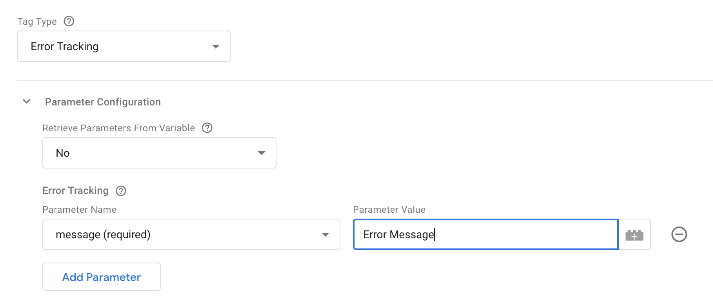
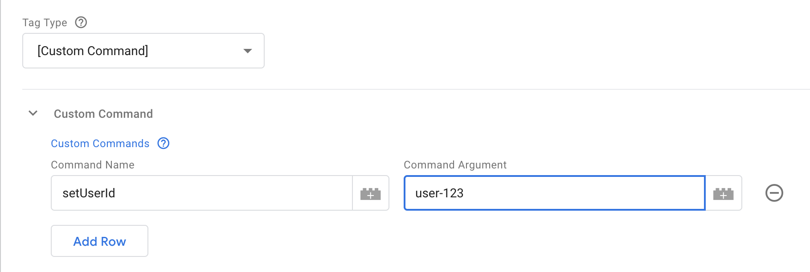
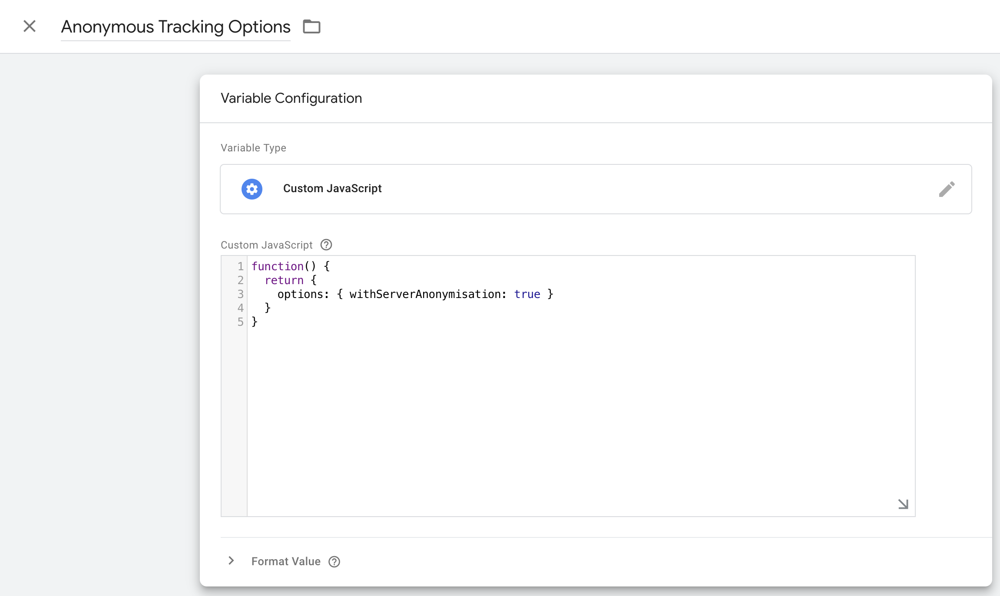

Snowplow provides the following custom GTM Tag templates to use:

```mdx-code-block
import DocCardList from '@theme/DocCardList';

<DocCardList />
```

### Tag Type

Under **Tag Type**, you can choose what type of command is compiled and sent to the endpoint. The tag types are split here into three groups: commands that utilize a common **parameters** object, commands that have **special conditions**, and **custom commands**.

#### Tags with a parameter object

Tags that can derive their parameters from a Google Tag Manager variable are:

- [Ad Tracking](/docs/sources/trackers/javascript-trackers/web-tracker/tracking-events/ads/index.md)
- [Cart Tracking](/docs/sources/trackers/javascript-trackers/web-tracker/previous-versions/web-trackers-v3/tracking-events/ecommerce/original/index.md)
- [Error Tracking](/docs/sources/trackers/javascript-trackers/web-tracker/tracking-events/errors/index.md)
- [Consent](/docs/sources/trackers/javascript-trackers/web-tracker/previous-versions/web-trackers-v3/tracking-events/consent-gdpr/original/index.md)
- [Self-describing Event](/docs/sources/trackers/javascript-trackers/web-tracker/custom-tracking-using-schemas/index.md#tracking-a-custom-event-self-describing)
- [Site Search](/docs/sources/trackers/javascript-trackers/web-tracker/tracking-events/site-search/index.md)
- [Social Interaction](/docs/sources/trackers/javascript-trackers/web-tracker/tracking-events/social-media/index.md)
- [Structured Event](/docs/fundamentals/events/index.md#structured-events)
- [Timing](/docs/sources/trackers/javascript-trackers/web-tracker/tracking-events/timings/generic/index.md)

You can set the **Retrieve Parameters From Variable** setting to a Google Tag Manager variable. This parameter _must_ return an object. In the object, the key-value pairs should reflect the named parameters in the [event documentation](/docs/sources/trackers/javascript-trackers/web-tracker/tracking-events/index.md). For example, to have the variable populate an [Error event](/docs/sources/trackers/javascript-trackers/web-tracker/tracking-events/index.md#error-tracking), you could use a Custom JavaScript variable like this:

```javascript
function() {
  return {
    message: 'Some Error Happened',
    filename: 'somefile.js',
    lineno: 5,
    colno: 236,
    error: null
  }
}
```

Alternatively, you can set the drop-down to the value `No`, and add the parameters manually instead:



Some tag types will add additional selections to this section. Follow the [official tracker documentation](/docs/sources/trackers/javascript-trackers/web-tracker/tracking-events/index.md) for more information about what each option does.

#### Special tags

Some tag types have special conditions and have been separated into their own configurations.

##### Enhanced Ecommerce

When you select [Enhanced Ecommerce](/docs/sources/trackers/javascript-trackers/web-tracker/tracking-events/ecommerce/enhanced/index.md), you are left with two options: **Use Data Layer** or **Choose Variable**. The way it works is very similar to Enhanced Ecommerce in Google Analytics.

If you choose the first, the template will look into the `dataLayer` structure for the **most recently** pushed [Enhanced Ecommerce object](https://www.simoahava.com/analytics/enhanced-ecommerce-guide-for-google-tag-manager/#data-types-actions), and map this object to the request to Snowplow Analytics.

If you selected **Choose Variable**, you need to provide a GTM variable that returns an object in the correct, expected format.

For Google Analytics 4 compatible ecommerce tracking, see the dedicated [Snowplow v3 Ecommerce Tag](/docs/sources/trackers/google-tag-manager/previous-versions/v3/v3-tags/ecommerce-tag-template/index.md) template instead.

##### Form Tracking

Form tracking has just two options, because **filters** and **transformations** won’t work with the custom template (due to lack of support for processing HTML elements). The options are to set form and/or field **blacklists** and **whitelists**.

Blacklists and whitelists for forms are a list of comma-separated HTML class names. If blacklisted, then any form element with a listed class will not trigger the form event. If whitelisted, then _only_ form elements with a listed classname will be tracked.

For fields, blacklists and whitelists work similarly, except they use the `name` attribute rather than the class.

Note that this tag enables the tracker's native [Form Tracking plugin](/docs/sources/trackers/javascript-trackers/web-tracker/tracking-events/form-tracking/index.md), it does not directly fire an event.
It is intended to trigger [early on a page](https://support.google.com/tagmanager/answer/7679319) to begin listening for form events, _not_ to trigger on form events like [Form Submit Triggers](https://support.google.com/tagmanager/answer/7679217).

##### Link Click Tracking

The **Track Link Click** event is similar to regular parameter-based events, as it lets you add parameters and track a link click as a manually encoded hit.

The **Enable Automatic Link Click Tracking** adds listeners to the page, which will track clicks on links permitting they adhere to the blacklisted/whitelisted class names you can optionally provide.

The **Fix Middle-click Tracking** adds a fix for some browsers where middle-clicks were not tracked properly.

If you check **Track HTML Content Of Clicked Link**, then the full text content of the link element will be sent to Snowplow as well.

Note that this tag enables the tracker's native [Link Click Tracking plugin](/docs/sources/trackers/javascript-trackers/web-tracker/tracking-events/link-click/index.md), it does not directly fire an event.
It is intended to trigger [early on a page](https://support.google.com/tagmanager/answer/7679319) to begin listening for click events, _not_ to trigger on click events like [Click Triggers](https://support.google.com/tagmanager/answer/7679320).

##### Page View

You can provide a **Custom Page Title** if you wish, and you can add a [custom context](/docs/sources/trackers/javascript-trackers/web-tracker/tracking-events/index.md#custom-context) to the request, as also described [here](/docs/sources/trackers/javascript-trackers/web-tracker/tracking-events/index.md#trackpageview).

If you enable **Page Activity Tracking**, the tag will setup a _heartbeat_ tracker, and send page pings to Snowplow at intervals that you can specify.

The **Callback Function** is something you can set to a JavaScript function. If you set the callback, then instead of sending the page ping to Snowplow, the function gets invoked instead.

#### Custom Commands

For any other commands which are supported by the Snowplow JavaScript Tracker v3, you can select the **[Custom Command]** option. Once select, you can enter any function name and the associated parameter for that function. The parameter can either be a simple string, in examples such as `setUserId`:



Or it can be set to a Custom JavaScript Variable in the instances where an Object should be passed to the function, such as with `enableAnonymousTracking`:



And then use this variable as your Command Argument:


### Additional Tracking Parameters


#### Add Custom Context Entities

Using the **Context Entities** table allows you to attach [custom context entities](/docs/sources/trackers/javascript-trackers/web-tracker/tracking-events/index.md#custom-context) to the Snowplow event. Each row should be set to a variable value that must be an **array of custom context objects** that will all be concatenated to add to the Event.

#### Set Custom Timestamp

You can also choose to [set the True Timestamp](/docs/sources/trackers/javascript-trackers/web-tracker/tracking-events/index.md#setting-the-true-timestamp) with this field. The format must be UNIX time in milliseconds.

## Acknowledgements

Thanks to [Simo Ahava](https://www.simoahava.com/) for building the initial release of this template.