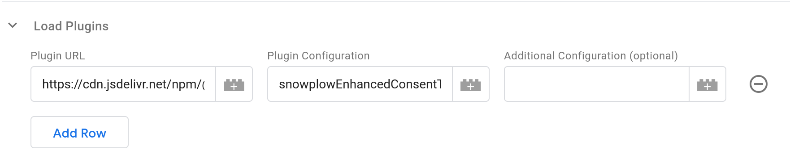

[Plugins](/docs/sources/trackers/web-trackers/plugins/index.md) provide an easy way to distribute custom behavior for the tracker.
Each Plugin can be loaded from external URLs or provided inline within GTM, and can optionally take some custom configuration.
A Plugin may add new methods to the tracker that can be called via [Custom Commands](#custom-commands).



Plugins are configured by using the **Load Plugins** table.
Each row in the table takes three values and loads a single plugin.
Plugins are loaded in order, and processed before the configured **Tag Type** configuration is executed -- so you can load a plugin in the same Tag that uses its functionality via Custom Commands.
The plugins will remain configured in the tracker and be accessible to later Tags.

## External Plugins

You can load external plugins by entering their URL in the **Plugin URL** field.
The tracker will try to load plugins each time they are requested.
This is usually acceptable as the browser will have cached the first request; if you don't want this behavior we suggest creating an empty **Custom Command** Tag with no commands that loads the plugins; you can make this Tag fire [once per page](https://support.google.com/tagmanager/answer/6279951) and add it as a [Setup Tag](https://support.google.com/tagmanager/answer/6238868) to any other Tags that use its commands.

:::tip

Plugins are loaded by the tracker SDK directly, not via the Tag Template:
You do not need to adjust the Template permissions to allow loading plugins from these URLs.

:::

:::note

Official Snowplow Plugin versions are updated in lock-step with the tracker version, to ensure maximum compatibility.
For best results, try to keep your SDK version and plugin versions in sync.
If you are loading your tracker SDK file and the plugins from a CDN like unpkg or jsDelivr (built into the Template), the version is located in the URLs.
Consider keeping your version in a GTM Variable that you can use to define your SDK version and include in the URLs for plugins to keep them in sync.
If you are self-hosting the files, make sure to update the plugin files at the same time you update the SDK.

:::

The Plugin's documentation will describe the value to use for the **Plugin Configuration** field.
This is usually an array with two string elements, for example `['snowplowWebVitals', 'WebVitalsPlugin']`.
The Tag Template will split the value entered here on `,` to make it an array, so you should enter the string values joined with that character, such as `snowplowWebVitals,WebVitalsPlugin`.

Finally, the optional **Additional Configuration** field allows you to add any configuration the Plugin may require.
Plugins are allowed to take zero or more parameters, but you are only given a single field to enter them in the Tag Template configuration.
You can either type in a string value, or reference a Variable containing another value, which should return an Array of arguments to pass to the Plugin (this will typically be a Custom JavaScript Variable).
If you enter a string, the Tag Template will check if it contains a `,` character, and if so, will split it into an array of strings and pass them as separate arguments to the Plugin, otherwise passing your string as the only argument.

:::warning

The Tag Template will try to call `.indexOf(',')` on the **Additional Configuration** value, so values of types other than Array or String may fail and break the Tag.
String values (before or after splitting) of `true`, `false`, `null`, and numeric values will become their respective typed JSON values.
It is not possible to pass a single `null`, `undefined`, or empty string value as a parameter to a Plugin, instead no arguments will be passed to the plugin.

:::

:::info

If your configuration includes functions, GTM will wrap those functions in [its sandbox](https://developers.google.com/tag-platform/tag-manager/templates/sandboxed-javascript), even when passed to the SDK for execution.
Complex values like DOM elements will be replaced by `null` when passed to or returned from your function.
This may make some plugins not function as intended.

:::

## Inline Plugins

[Inline Plugins](/docs/sources/trackers/web-trackers/plugins/creating-your-own-plugins/index.md#inline-plugins) are plugins that don't require being fetched from an external file to load.

You can create Inline Plugins in GTM by using Custom JavaScript Variables in the **Plugin URL** field.
The Variable should return an Object with a method that returns another Object meeting the [Plugin Interface](/docs/sources/trackers/web-trackers/plugins/creating-your-own-plugins/index.md#plugin-interface) (any other methods on the outer Object will become tracker methods).

For **Plugin Configuration**, the UI enforces the comma-seperated values syntax required for external Plugins and unconditionally calls `.split(',')` on the string.
The SDK requires that for inline-plugins only a single string may be used.
To work around this limitation, create another Custom JavaScript Variable that returns your constructor method name wrapped in an Object with a fake `split()` method:

```javascript
function() {
  return {
    split: function() {
      return "myInlineConstructorMethodName";
    }
  };
}
```

Configuration for **Additional Configuration** is the same as for [External Plugins](#external-plugins).
