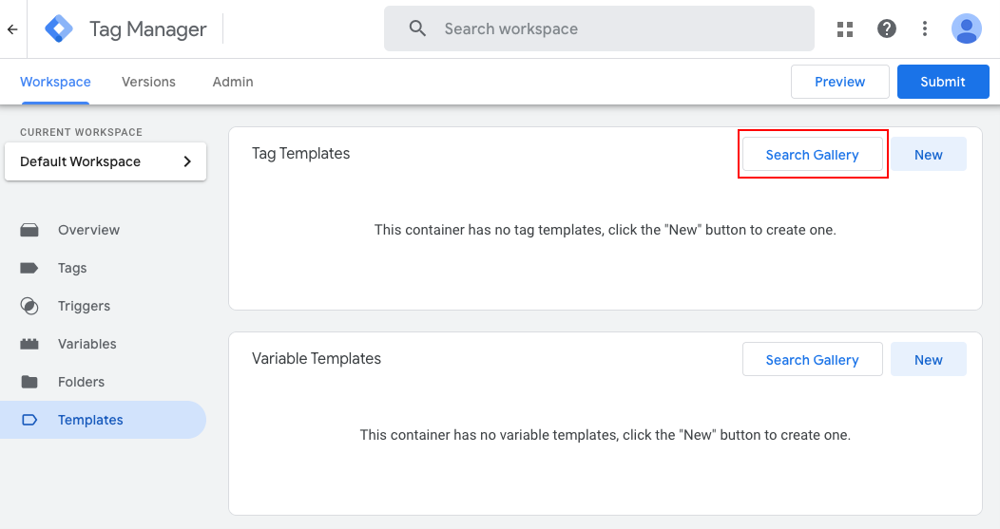
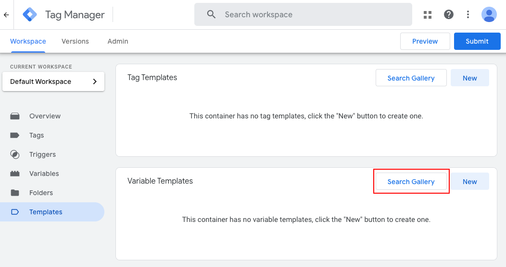
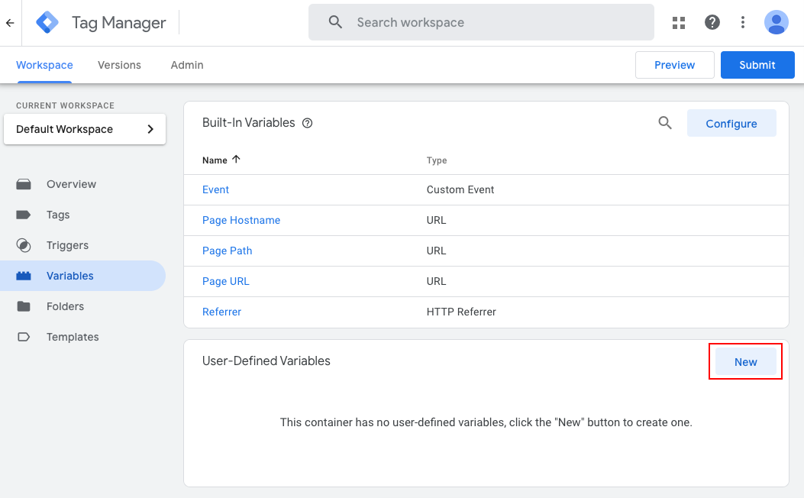
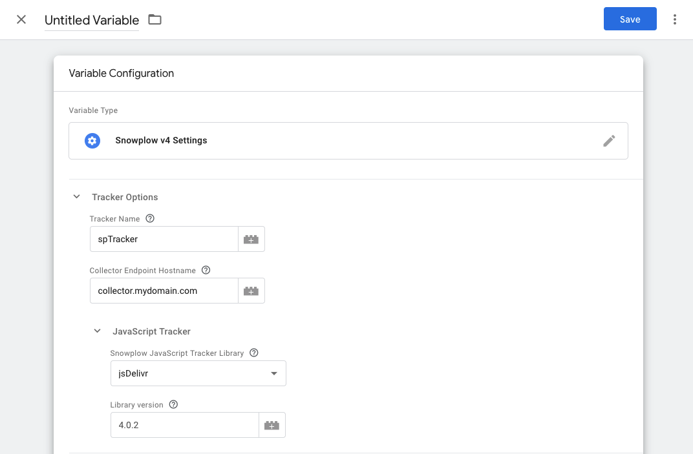
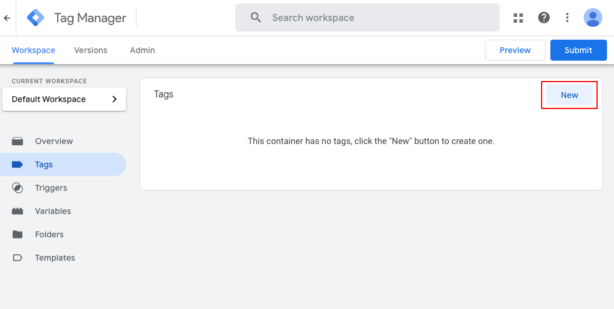

This guide will walk you through the initial setup for Snowplow in Google Tag Manager.

## Adding the Templates

To get started with Snowplow in Google Tag Manager, you will need to add the Snowplow Tag Template and the Snowplow Settings Variable Template to your GTM workspace.

Links to both templates can be found [here](/docs/sources/trackers/google-tag-manager/index.md).

### Snowplow Tag Template

1. Navigate to the `Templates` tab in your GTM workspace and click the `Search Gallery` button in the `Tag Templates` section.

2. Search for "Snowplow v4"

3. Click on the template, and then click `Add to Workspace` in the next screen. Review the permissions and click `Add` to finalize the import.

### Snowplow Settings Variable Template

The Snowplow Settings Variable template is used to configure the Snowplow tracker, such as the collector endpoint, privacy options, and tracker version. Although possible to use the Snowplow tag without the settings variable, it's highly recommended to use it for ease of configuration, along with keeping the tracker configuration separate from the tag.

1. Again in the `Templates` tab in your GTM workspace, click the `Search Gallery` button in the `Variable Templates` section.

2. Search for "Snowplow v4 Settings"

3. Click on the template, and then click `Add to Workspace` in the next screen. No permissions are required, so click `Add` to finalize the import.

## Configuring the Settings Variable

1. Navigate to the `Variables` tab in your GTM workspace and click `New` in `User-Defined Variables`.

2. Select `Snowplow v4 Settings` from the list of available variables.

3. Under `Tracker Options`, enter your Snowplow collector endpoint set up when [configuring your collector](https://docs.snowplow.io/docs/collecting-data/configuring-collector/).

:::info

You might consider using conditional variables to set the collector endpoint based on the environment, e.g. sending data to [Micro](https://docs.snowplow.io/docs/data-product-studio/data-quality/snowplow-micro/)/[Mini](https://docs.snowplow.io/docs/api-reference/snowplow-mini/) collector endpoint during development.

:::

4. Under `JavaScript Tracker`, choose a hosting option. To get started quickly, select either `unpkg` or `jsDelivr` and enter a library version.

5. Give your variable a name and click `Save`.

## Implementing the Snowplow Tag

In this section, we will create a simple tag to fire a page view event.

1. Navigate to the `Tags` tab in your GTM workspace and click `New`.

2. Click on the `Tag Configuration` section and select `Snowplow v4`.

3. Set the `Tag Type` to `Page View`, if it is not already selected.

4. Under `Tracker Initialisation`, select the Snowplow Settings variable we created earlier.

5. Add a trigger to the tag. This will determine when the tag is fired. For a page view tag, you can use the built-in `All Pages` trigger.

5. Give your tag a name and click `Save`.

## Testing the Tag

To test the tag, you can use the GTM preview mode. Click the `Preview` button in the top right of the GTM interface. This will open a new tab with your website and the GTM preview console.

Ensure that you see the Page View event in your Snowplow pipeline. If you don't have a full pipeline set up yet and are hosting the site locally, you can use [Snowplow Micro](/docs/data-product-studio/data-quality/snowplow-micro/index.md), or [Snowplow Inspector](/docs/data-product-studio/data-quality/snowplow-inspector/index.md) to check that the event is sent correctly.
