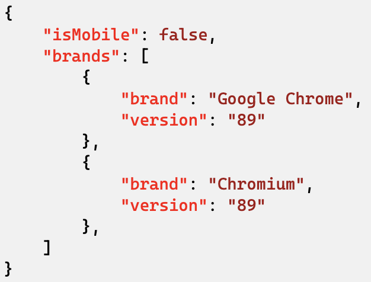

```mdx-code-block
import ReleaseBadge from '@site/docs/reusable/javascript-tracker-release-badge-v3/_index.md'

<ReleaseBadge/>
```

[Client Hints](https://www.chromium.org/updates/ua-ch) are being rolled out across a number of browsers and are an alternative the tracking the User Agent, which is particularly useful in those browsers which are freezing the User Agent string.

## Installation

- `npm install @snowplow/browser-plugin-client-hints`
- `yarn add @snowplow/browser-plugin-client-hints`
- `pnpm add @snowplow/browser-plugin-client-hints`

## Initialization

```javascript
import { newTracker, trackPageView } from '@snowplow/browser-tracker';
import { ClientHintsPlugin } from '@snowplow/browser-plugin-client-hints';

newTracker('sp1', '{{collector_url}}', { 
   appId: 'my-app-id', 
   plugins: [ ClientHintsPlugin() ], 
            // Use ClientHintsPlugin(true) to capture high entropy values
});
```

### Functions

This plugin does not contain any new functions.

### Context

Adding this plugin will automatically capture the following context:

| Context                                                                                                                                                        | Example                                           |
|----------------------------------------------------------------------------------------------------------------------------------------------------------------|---------------------------------------------------|
| [iglu:org.ietf/http_client_hints/jsonschema/1-0-0](https://github.com/snowplow/iglu-central/blob/master/schemas/org.ietf/http_client_hints/jsonschema/1-0-0) |  |
