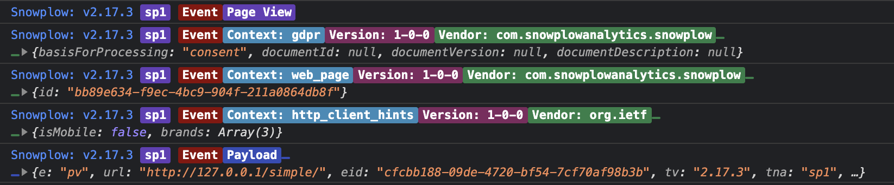

```mdx-code-block
import ReleaseBadge from '@site/docs/reusable/javascript-tracker-release-badge-v3/_index.md'

<ReleaseBadge/>
```

## Installation

- `npm install @snowplow/browser-plugin-debugger`
- `yarn add @snowplow/browser-plugin-debugger`
- `pnpm add @snowplow/browser-plugin-debugger`

## Initialization

```javascript
import { newTracker, trackPageView } from '@snowplow/browser-tracker';
import { DebuggerPlugin } from '@snowplow/browser-plugin-debugger';

newTracker('sp1', '{{collector_url}}', { 
   appId: 'my-app-id', 
   plugins: [ DebuggerPlugin() ],
});
```

### Debugging

Adding this plugin will automatically start printing out `debug` logs to your Developer Tools console. This will help you debug what events are being tracked and what properties are included in each event that is being tracked and to what tracker instance.

**Note:** You may need to enable `Verbose` logs in your Developer Tools, as this plugin uses `console.debug` to output results.



An example of the output from this plugin
