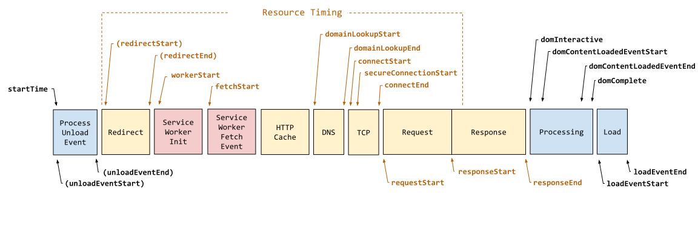

# Timings tracking

```mdx-code-block
import Tabs from '@theme/Tabs';
import TabItem from '@theme/TabItem';
```

Create and track general timing events using the [site tracking plugin](./generic/index.md).

To add performance timing context entities to your Snowplow tracking, use this Performance navigation timing plugin.

By default all its metrics are relative to the page load rather than absolute time stamps, making it easy to analyze and aggregate. To learn more about the properties tracked, you can visit the [specification](https://www.w3.org/TR/navigation-timing-2/) or MDN [documentation site](https://developer.mozilla.org/en-US/docs/Web/API/PerformanceNavigationTiming).

The following diagram shows the ResourceTiming and PerformanceNavigationTiming properties and how they connect to the navigation of the page main document.



_Performance navigation timeline from the [W3C specification](https://www.w3.org/TR/navigation-timing-2/)._

:::note
The plugin is available since version 3.10 of the tracker.
:::

Adding this plugin will automatically capture [this](https://github.com/snowplow/iglu-central/blob/master/schemas/org.w3/PerformanceNavigationTiming/jsonschema/1-0-0) context entity.

Performance navigation timing context entities are **automatically tracked** once configured.

## Install plugin

<Tabs groupId="platform" queryString>
  <TabItem value="js" label="JavaScript (tag)" default>

| Tracker Distribution | Included |
| -------------------- | -------- |
| `sp.js`              | ❌        |
| `sp.lite.js`         | ❌        |

**Download:**

<table className="has-fixed-layout"><tbody><tr><td>Download from GitHub Releases (Recommended)</td><td><a href="https://github.com/snowplow/snowplow-javascript-tracker/releases" target="_blank" rel="noreferrer noopener">Github Releases (plugins.umd.zip)</a></td></tr><tr><td>Available on jsDelivr</td><td><a href="https://cdn.jsdelivr.net/npm/@snowplow/browser-plugin-performance-navigation-timing@3/dist/index.umd.min.js" target="_blank" rel="noreferrer noopener">jsDelivr</a> (latest)</td></tr><tr><td>Available on unpkg</td><td><a href="https://unpkg.com/@snowplow/browser-plugin-performance-navigation-timing@3/dist/index.umd.min.js" target="_blank" rel="noreferrer noopener">unpkg</a> (latest)</td></tr></tbody></table>

**Note:** The links to the CDNs above point to the current latest version. You should pin to a specific version when integrating this plugin on your website if you are using a third party CDN in production.

```javascript
window.snowplow('addPlugin',
  "https://cdn.jsdelivr.net/npm/@snowplow/browser-plugin-performance-navigation-timing@3/dist/index.umd.min.js",
  ["snowplowPerformanceNavigationTiming", "PerformanceNavigationTimingPlugin"]
);
```

  </TabItem>
  <TabItem value="browser" label="Browser (npm)">

- `npm install @snowplow/browser-plugin-performance-navigation-timing@3`
- `yarn add @snowplow/browser-plugin-performance-navigation-timing@3`
- `pnpm add @snowplow/browser-plugin-performance-navigation-timing@3`

```javascript
import { newTracker, trackPageView } from '@snowplow/browser-tracker';
import { PerformanceNavigationTimingPlugin } from '@snowplow/browser-plugin-performance-navigation-timing';

newTracker('sp1', '{{collector_url}}', {
   appId: 'my-app-id',
   plugins: [ PerformanceNavigationTimingPlugin() ],
});
```

  </TabItem>
</Tabs>

## More detailed analysis for Single Page Applications (SPA)

As these metrics are primarily related to the initial page serve and load, after the window.onload handler ends the metrics will likely stay static for the life of the SPA page. If there's a pattern to the API requests the SPA makes for new content, the [PerformanceObserver](https://developer.mozilla.org/en-US/docs/Web/API/PerformanceObserver) could be used to capture the network metrics for that request from the performance API and re-use the schema.

For actual rendering performance, the application will have to use the PerformanceMark/PerformanceMeasure [User timing](https://developer.mozilla.org/en-US/docs/Web/API/Performance_API/User_timing) APIs. These allow custom timing milestones, but since it's completely custom and there are no common conventions for using these APIs, currently there is no automatic support in the tracker for tracking these. Therefore we encourage you to build your custom schema in case you believe you would benefit from these additional metrics.

## Performance timing plugin (original)

This older plugin has been superseded by the Performance Navigation Timing plugin, which has a newer API and additional metrics such as the compressed/decompressed page size, and information about the navigation that can contextualise cache usage that can impact the measured metrics, as well as server-side metrics, etc.

If this context entity is enabled, the JavaScript Tracker will use the create a context JSON from the `window.performance.timing` object, along with the Chrome `firstPaintTime` field (renamed to `chromeFirstPaint`) if it exists. This data can be used to calculate page performance metrics.

Note that if you fire a page view event as soon as the page loads, the `domComplete`, `loadEventStart`, `loadEventEnd`, and `chromeFirstPaint` metrics in the Navigation Timing API may be set to zero. This is because those properties are only known once all scripts on the page have finished executing.

<details>
  <summary>Advanced PerformanceTiming usage</summary>
  The `domComplete`, `loadEventStart`, and `loadEventEnd` metrics in the NavigationTiming API are set to 0 until after every script on the page has finished executing, including sp.js. This means that the corresponding fields in the PerformanceTiming reported by the tracker will be 0.

  To get around this limitation, you can wrap all Snowplow code in a `setTimeout` call:

  ```javascript
  setTimeout(function () {

  // Load Snowplow and call tracking methods here

  }, 0);
  ```

  This delays its execution until after those NavigationTiming fields are set.

</details>

Additionally the `redirectStart`, `redirectEnd`, and `secureConnectionStart` are set to 0 if there is no redirect or a secure connection is not requested.

For more information on the Navigation Timing API, see [the specification](http://www.w3.org/TR/2012/REC-navigation-timing-20121217/#sec-window.performance-attribute).

Performance timing context entities are **automatically tracked** once configured. The schema is [here](https://github.com/snowplow/iglu-central/blob/master/schemas/org.w3/PerformanceTiming/jsonschema/1-0-0).

### Install plugin

<Tabs groupId="platform" queryString>
  <TabItem value="js" label="JavaScript (tag)" default>

| Tracker Distribution | Included |
| -------------------- | -------- |
| `sp.js`              | ✅        |
| `sp.lite.js`         | ❌        |

**Download:**

<table className="has-fixed-layout"><tbody><tr><td>Download from GitHub Releases (Recommended)</td><td><a href="https://github.com/snowplow/snowplow-javascript-tracker/releases" target="_blank" rel="noreferrer noopener">Github Releases (plugins.umd.zip)</a></td></tr><tr><td>Available on jsDelivr</td><td><a href="https://cdn.jsdelivr.net/npm/@snowplow/browser-plugin-performance-timing@3/dist/index.umd.min.js" target="_blank" rel="noreferrer noopener">jsDelivr</a> (latest)</td></tr><tr><td>Available on unpkg</td><td><a href="https://unpkg.com/@snowplow/browser-plugin-performance-timing@3/dist/index.umd.min.js" target="_blank" rel="noreferrer noopener">unpkg</a> (latest)</td></tr></tbody></table>

**Note:** The links to the CDNs above point to the current latest version. You should pin to a specific version when integrating this plugin on your website if you are using a third party CDN in production.

```javascript
window.snowplow('addPlugin',
  "https://cdn.jsdelivr.net/npm/@snowplow/browser-plugin-performance-timing@3/dist/index.umd.min.js",
  ["snowplowPerformanceTiming", "PerformanceTimingPlugin"]
);
```

  </TabItem>
  <TabItem value="browser" label="Browser (npm)">

- `npm install @snowplow/browser-plugin-performance-timing@3`
- `yarn add @snowplow/browser-plugin-performance-timing@3`
- `pnpm add @snowplow/browser-plugin-performance-timing@3`

```javascript
import { newTracker, trackPageView } from '@snowplow/browser-tracker';
import { PerformanceTimingPlugin } from '@snowplow/browser-plugin-performance-timing';

newTracker('sp1', '{{collector_url}}', {
   appId: 'my-app-id',
   plugins: [ PerformanceTimingPlugin() ],
});
```

  </TabItem>
</Tabs>
