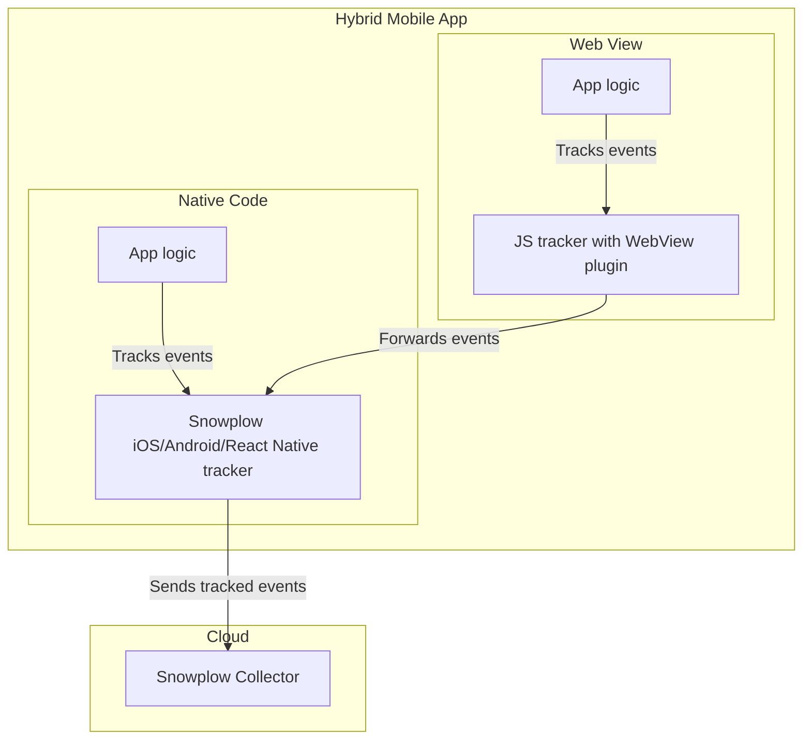

# WebView integration for mobile

```mdx-code-block
import Tabs from '@theme/Tabs';
import TabItem from '@theme/TabItem';
```

This plugin provides integration for hybrid apps using the Snowplow native mobile ([Android and iOS v6.1+](/docs/sources/trackers/mobile-trackers/hybrid-apps/index.md)) or [React Native v4.2+](docs/sources/trackers/react-native-tracker/hybrid-apps/index.md) trackers. Hybrid apps are mobile apps that in addition to a native interface, provide part of the UI through an embedded Web view.

If your webapp will run both separately and as part of a hybrid app, with this plugin you only need one tracking implementation for your webapp (you still have to implement the mobile trackers too).

When the plugin is active, for every event the web tracker checks if it is running in a WebView with at least one of the mobile interfaces available. If it is, the event is forwarded to the mobile tracker, and not tracked by the web tracker. If not, the event is tracked as normal.

:::note
The plugin is available since version 4.3 of the tracker.
:::

The WebView integration is **automatic** once configured.


The diagram below shows the interaction of the WebView plugin and mobile trackers in hybrid apps.



To use the WebView plugin, you must have a mobile tracker initialized and configured.

The supported trackers are:
* Android v6.1+
* iOS v6.1+
* React Native v4.2+

How to set up hybrid app tracking:
1. Implement the Snowplow [iOS, Android](/docs/sources/trackers/mobile-trackers/index.md), or [React Native](docs/sources/trackers/react-native-tracker/index.md) tracker in your mobile codebase.
2. Create a WebView based on your web app, with Snowplow Web tracking and WebView plugin instrumented.
3. Subscribe to the WebView. Read how to do this for [native mobile](/docs/sources/trackers/mobile-trackers/hybrid-apps/index.md) or [React Native](docs/sources/trackers/react-native-tracker/hybrid-apps/index.md).
4. Track events from web and mobile.

This plugin uses the [Snowplow WebView tracker](/docs/sources/trackers/webview-tracker/index.md) as a dependency.

## What do the forwarded events look like?

The forwarded hybrid events will have all the information tracked by the web tracker. This includes all context entities, whether configured by the tracker [automatically](/docs/sources/trackers/javascript-trackers/web-tracker/tracking-events/index.md#auto-tracked-entities) or by you as a global context. Baked-in (non-entity) properties such as useragent or URL are also included.

Additionally, any configured mobile context entities will also be added. Again, this includes [autotracked entities](/docs/sources/trackers/mobile-trackers/tracking-events/index.md#auto-tracked-events-and-entities) such as the screen, session, or platform entities, as well as any global context entities.

The forwarded events will have the web tracker version, e.g. "js-4.3.0", but the namespace and appId from the mobile tracker.

Hybrid events are still compatible with our [Unified Digital dbt model](/docs/modeling-your-data/modeling-your-data-with-dbt/dbt-models/dbt-unified-data-model/index.md).

## Install plugin

<Tabs groupId="platform" queryString>
  <TabItem value="js" label="JavaScript (tag)" default>

| Tracker Distribution | Included |
| -------------------- | -------- |
| `sp.js`              | ❌        |
| `sp.lite.js`         | ❌        |

**Download:**

<table><tbody><tr><td>Download from GitHub Releases (Recommended)</td><td><a href="https://github.com/snowplow/snowplow-javascript-tracker/releases">Github Releases (plugins.umd.zip)</a></td></tr><tr><td>Available on jsDelivr</td><td><a href="https://cdn.jsdelivr.net/npm/@snowplow/browser-plugin-webview@latest/dist/index.umd.min.js">jsDelivr</a> (latest)</td></tr><tr><td>Available on unpkg</td><td><a href="https://unpkg.com/@snowplow/browser-plugin-webview@latest/dist/index.umd.min.js">unpkg</a> (latest)</td></tr></tbody></table>

```javascript
window.snowplow(
    'addPlugin',
    'https://cdn.jsdelivr.net/npm/@snowplow/browser-plugin-webview@latest/dist/index.umd.min.js',
    ['snowplowWebViewTracking', 'WebViewPlugin']
);
```

  </TabItem>
  <TabItem value="browser" label="Browser (npm)">

- `npm install @snowplow/browser-plugin-webview@webview_plugin`
- `yarn add @snowplow/browser-plugin-webview@webview_plugin`
- `pnpm add @snowplow/browser-plugin-webview@webview_plugin`

```javascript
import { newTracker } from '@snowplow/browser-tracker';
import { WebViewPlugin } from '@snowplow/browser-plugin-webview';

newTracker('sp1', '{{collector_url}}', {
   appId: 'my-app-id',
   plugins: [ WebViewPlugin() ],
});
```

</TabItem>
</Tabs>

## Configuration

By default, the plugin will forward events to the default initialized Snowplow tracker on each platform. To specify a different tracker instance, or multiple trackers, pass in a list of tracker namespaces at setup.

<Tabs groupId="platform" queryString>
  <TabItem value="js" label="JavaScript (tag)" default>

```javascript
window.snowplow(
    'addPlugin',
    'https://cdn.jsdelivr.net/npm/@snowplow/browser-plugin-webview@latest/dist/index.umd.min.js',
    ["snowplowWebViewTracking", "WebViewPlugin"],
    [
      {
        trackerNamespaces: ["sp1", "sp2"],
      }
    ]
);
```

  </TabItem>
  <TabItem value="browser" label="Browser (npm)">

```javascript
import { newTracker } from '@snowplow/browser-tracker';
import { WebViewPlugin } from '@snowplow/browser-plugin-webview';

newTracker('sp1', '{{collector_url}}', {
   appId: 'my-app-id',
   plugins: [ WebViewPlugin({ trackerNamespaces: ['sp1', 'sp2'] }) ],
});
```

</TabItem>
</Tabs>

:::warning Take care when specifying namespaces
If there is no mobile tracker with the specified namespace(s), the event will not be tracked.
:::
