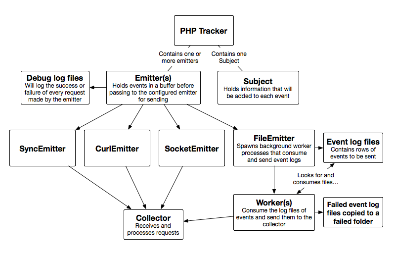

```mdx-code-block
import Badges from '@site/src/components/Badges';

<Badges badgeType="Early Release"></Badges>&nbsp;<Badges badgeType="Snowplow Tracker Release"></Badges>&nbsp;<Badges badgeType="Snowplow Tracker PHP Release"></Badges><br/>
```

The Snowplow PHP Tracker allows you to track Snowplow events from your PHP apps and scripts.

There are three basic types of object you will create when using the Snowplow PHP Tracker: Trackers, Subjects and Emitters.

A subject represents a user whose events are tracked. A tracker constructs events and sends them to one or more emitters. Each emitter then sends the event to the endpoint you configure, a Snowplow collector.

The current flow of the PHP Tracker is illustrated below:


