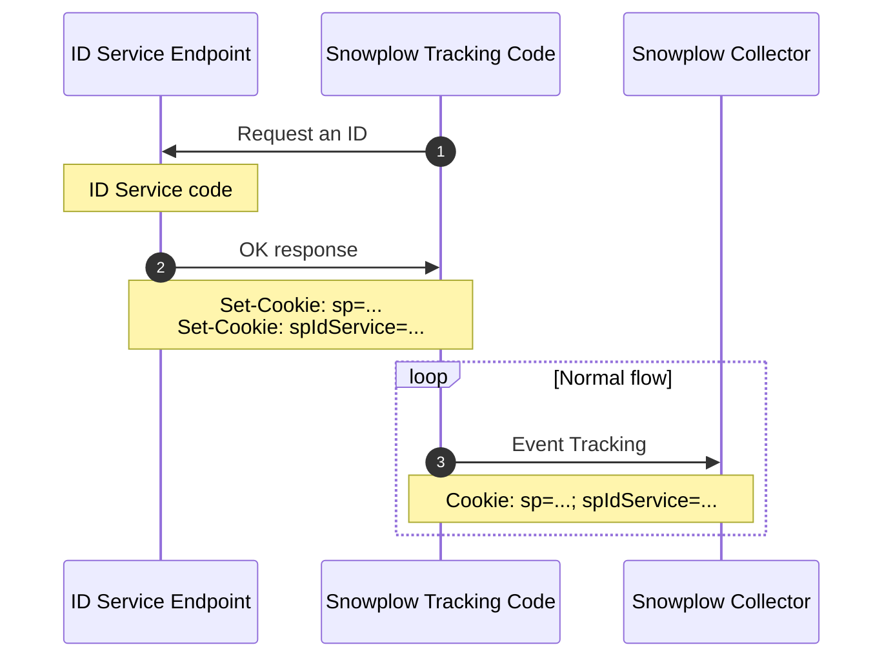

```mdx-code-block
import Tabs from '@theme/Tabs';
import TabItem from '@theme/TabItem';
import ReleaseBadge from '@site/docs/reusable/javascript-tracker-release-badge-v3/_index.md';

<ReleaseBadge/>
```

The Snowplow web tracker supports tracking in all modern browsers, including new browser features such as [Privacy Sandbox](../tracking-events/privacy-sandbox/index.md) and [Client Hints](../tracking-events/client-hints/index.md).

## Browser context entity

Add a context entity to every tracked event that records information about the user's browser. Configure it using the `"contexts"` object within the [tracker configuration object](../tracker-setup/initialization-options/index.md).

<details>
    <summary>Browser entity properties</summary>

The [browser](https://github.com/snowplow/iglu-central/tree/master/schemas/com.snowplowanalytics.snowplow/browser_context/jsonschema) context entity consists of the following properties:

| Attribute | Description | Required? |
| : ------: | :--------: | :-----: |
| `viewport` | Viewport dimensions of the browser. Arrives in the form of WidthxHeight e.g. 1200x900. | Yes  |
| `documentSize` | Document dimensions. Arrives in the form of WidthxHeight e.g. 1200x900. | Yes  |
| `resolution` | Device native resolution. Arrives in the form of WidthxHeight e.g. 1200x900. | Yes |
| `colorDepth` | The number of bits allocated to colors for a pixel in the output device, excluding the alpha channel. | Yes |
| `devicePixelRatio` | Ratio of the resolution in physical pixels to the resolution in CSS pixels for the current display device. | No  |
| `cookiesEnabled` | Indicates whether cookies are enabled or not. More info and caveats at the official [documentation](https://developer.mozilla.org/en-US/docs/Web/API/Navigator/cookieEnabled). | Yes |
| `online` | Returns the online status of the browser. Important caveats are described in [documentation](https://developer.mozilla.org/en-US/docs/Web/API/Navigator/onLine). | Yes |
| `browserLanguage` | The preferred language of the user, usually the language of the browser UI. Defined in [RFC 5646](https://datatracker.ietf.org/doc/html/rfc5646). | No  |
| `documentLanguage` | The language of the HTML document. Defined in [RFC 5646](https://datatracker.ietf.org/doc/html/rfc5646). | No  |
| `webdriver` | Indicates whether the user agent is controlled by automation. | No  |
| `deviceMemory` | Approximate amount of device memory in gigabytes. | No  |
| `hardwareConcurrency` | Number of logical processors available to run threads on the user's computer. | No  |
| `tabId` | A UUID identifier for the client browser tab the event is sent from. | No  |

:::note
Please note that the browser context entity is only available since version 3.9 of the tracker.
:::
</details>

## ITP mitigation

As of Safari 16.4 released in April 2023, Safari sets the [lifetime of server-set first-party cookies](https://webkit.org/tracking-prevention/#cname-and-third-party-ip-address-cloaking-defense) to a maximum of 7 days in the following cases:

1. The server setting the cookie is behind a CNAME that resolves (at any point) to a host that is third-party to the website the user is currently browsing.
2. The server setting the cookie is set with A/AAAA records that resolve to an IP address (IP4 or IP6) where the first half of the address does not match the first half of the IP address for the server on the website the user is currently browsing. (e.g. 203.52.1.2 and 203.52.56.22 are okay, 201.55.1.2 is not).

This greatly limits the effectiveness of tracking a customer journey where users are not regularly returning to your website.  Without a strong understanding of your customers, downstream use cases including marketing attribution, product analytics and personalized recommendations are difficult to achieve.

**The ID service can help enhance the confidence in persistent browser identifiers that Snowplow tracking provides and specifically for this guide, the `network_userid`.**

### What is an ID service ?

An _ID service_, as we chose to call it, is a process that allows for generating a unique browser identifier and enhancing the Snowplow tracking capabilities in environments where the Intelligent Tracking Prevention (ITP) feature is enabled such as on iOS browsers (Safari, Chrome, Firefox) and desktop Safari.

### Developing and deploying an ID service

An ID service is code that needs to be deployed on and executed from the same IP space that serves the main web document of your application. This is probably the web application system or the CDN in front of the application.

This code has minimal functionality and based on our experience can either be:

- An **API endpoint** that is part of the main web application.
- **A function running in an edge worker.** Almost all modern CDNs allow the addition of ‘middleware’ code which runs on requests at edge nodes in front of the client’s application domain.
- **A custom middleware based on the customer’s framework**. E.g. ExpressJS middleware, Next.js middleware, Play custom action etc. which can run on every document request.
- **A low-footprint application with a single endpoint**. A Go web server or something along these lines.

#### Developing the ID service code

The responsibilities of this service are:
1. Create a unique identifier (UUID v4) for this browser, set it in a cookie and return it in a `Set-Cookie` response header on a domain accessible by the service at all times.
2. Increase the expiry for the cookie used as the network_userid identifier (by default, a cookie named sp, configured via collector.config.name) which should have the same value as the first cookie.

_The new unique identifier cookie for sake of simplicity in this document will have the name `spIdService`._

#### ID service business logic

The ID service code should include the following logic:

- If the ID service new identifier cookie already exists on the request, then it should re-set the cookies with the same values and updated expiration for both the `spIdService` and `sp` cookies.
- If `spIdService` does not exist, but the collector's `sp` cookie does exist, then the it should set `spIdService value = sp cookie value`. _This will make sure we keep old identifiers in place and not lose any data._
- If `spIdService` and `sp` are both missing, then it generates a new ID in the `spIdService` and `sp` cookies with the same unique identifier generation algorithm with the Snowplow pipeline, currently UUID v4.
- The HTTP response should have a 200 OK status code but any additional payload is not necessary.

### Code examples

Below we showcase a couple of code samples for ID service API endpoints:

<Tabs groupId="id-service" queryString>
<TabItem value="nextjs" label="Next.js TypeScript" default>

```ts reference
https://github.com/snowplow-industry-solutions/id-service-examples/blob/main/examples/typescript/Next.js/api-route.ts
```

</TabItem>
<TabItem value="php" label="PHP">

```php reference
https://github.com/snowplow-industry-solutions/id-service-examples/blob/main/examples/php/wordpress/api-route.php
```

</TabItem>

</Tabs>

### Using the ID service on the Snowplow browser tracker

When the ID service has been deployed on a system with the same resolved IP as the main document, the tracker can then be configured to orchestrate the required ID service API calls.

This process is opt-in by using the `idService` option during tracker initialization:

<Tabs groupId="platform" queryString>
  <TabItem value="js" label="JavaScript (tag)" default>

```tsx
window.snowplow("newTracker", "sp", "{{collector_url_here}}", {
  /* ...Rest of the tracker options */
  idService: "/id-service-endpoint"
});
```

  </TabItem>
  <TabItem value="browser" label="Browser (npm)">

```tsx
newTracker('sp1', 'c.customer.com', {
  idService: "/id-service-endpoint",
  /* ...Rest of the tracker options */
 });
```

  </TabItem>
</Tabs>

When the tracker detects this option it will send an HTTP request during initialization on this endpoint to have the service set the required identifiers before sending any event.


