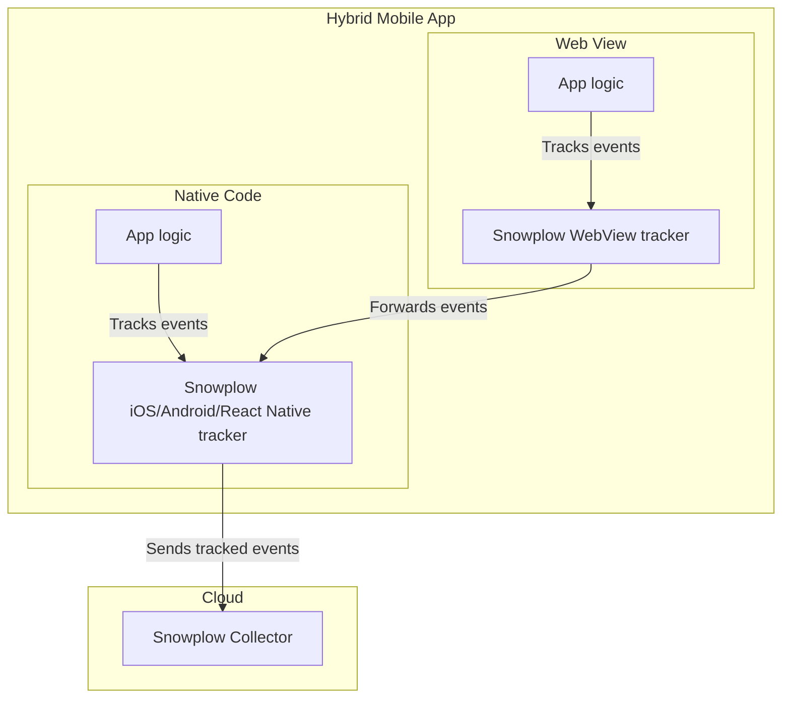

```mdx-code-block
import Badges from '@site/src/components/Badges';
import Tabs from '@theme/Tabs';
import TabItem from '@theme/TabItem';
import {versions} from '@site/src/componentVersions';

<Badges badgeType="Early Release"></Badges>
```

<p>The <a href="https://github.com/snowplow-incubator/snowplow-webview-tracker">Snowplow WebView Tracker</a> allows you to track Snowplow events from web views in <strong>mobile hybrid apps</strong>. The current tracker version is {versions.webViewTracker}.</p>

Hybrid apps are mobile apps that in addition to a native interface, provide part of the UI through an embedded web view.
Snowplow events are tracked from both the native code (e.g. written in Swift or Kotlin) as well as the web view (in JavaScript).
The goal is to have events that are tracked from the native code and web view share the same session, and appear as tracked with the same tracker.

:::tip
We recommend using the [Snowplow web tracker](/docs/sources/trackers/web-trackers/index.md) with [WebView plugin](/docs/sources/trackers/web-trackers/tracking-events/webview/index.md) (which uses the WebView tracker as a dependency), rather than using this tracker directly.

The WebView plugin automatically forwards all tracked events to the mobile tracker. Events must be manually tracked when using the WebView tracker by itself.
:::

The WebView tracker forwards tracked events to the native app code to be tracked by the Snowplow mobile trackers ([iOS, Android tracker](/docs/sources/trackers/mobile-trackers/hybrid-apps/index.md), or [React Native](/docs/sources/trackers/react-native-tracker/hybrid-apps/index.md)). The mobile trackers must be subscribed to the WebView messages.

The mobile trackers will continue processing the events as if they were tracked from the native app code. For example, adding any configured context entities, and timestamps.


The diagram below shows the interaction of the WebView and mobile trackers in hybrid apps.



## Installation

You may choose to install the tracker as an npm package or by loading it through an HTML script tag.

<Tabs groupId="installation" queryString>
  <TabItem value="npm" label="Using npm" default>

To install the WebView tracker in your JavaScript or TypeScript app, add the npm package:

```bash
npm install --save @snowplow/webview-tracker
```

You will then be able to use the functions provided by the WebView tracker as follows:

```typescript
import { trackSelfDescribingEvent } from '@snowplow/webview-tracker';
```

  </TabItem>
  <TabItem value="tag" label="Using Snowplow tag">

You may download the `sp.js` file from the [Releases section on GitHub](https://github.com/snowplow-incubator/snowplow-webview-tracker/releases), self-host it, and load to your page using the following tag:

```html
<script type="text/javascript" async=1>
;(function(p,l,o,w,i,n,g){if(!p[i]){p.GlobalSnowplowNamespace=p.GlobalSnowplowNamespace||[]; p.GlobalSnowplowNamespace.push(i);p[i]=function(){(p[i].q=p[i].q||[]).push(arguments) };p[i].q=p[i].q||[];n=l.createElement(o);g=l.getElementsByTagName(o)[0];n.async=1; n.src=w;g.parentNode.insertBefore(n,g)}}(window,document,"script","{{URL to sp.js}}","snowplow"));
</script>
```

:::note

Replace the `{{URL to sp.js}}` with the URL to the `sp.js` file in the snippet.

:::

  </TabItem>
</Tabs>

In addition, you will need to implement the [iOS, Android](/docs/sources/trackers/mobile-trackers/hybrid-apps/index.md), or [React Native](/docs/sources/trackers/react-native-tracker/hybrid-apps/index.md) tracker and subscribe to WebView messages.

## Tracking events

To track events, simply call their corresponding functions given the event data. The events will be processed based on the equivalent mobile event types after forwarding.

The following functions are available:

| Method                     | Event type tracked                                                                                                                       |
| -------------------------- | ---------------------------------------------------------------------------------------------------------------------------------------- |
| `trackSelfDescribingEvent` | Track a custom event based on "self-describing" JSON schema                                                                              |
| `trackStructEvent`         | Track a semi-custom structured event                                                                                                     |
| `trackScreenView`          | Track a view of a screen in the app                                                                                                      |
| `trackPageView`            | Track a Web page visit                                                                                                                   |
| `trackWebViewEvent`        | Track any Snowplow event (used internally by the [WebView plugin](/docs/sources/trackers/web-trackers/tracking-events/webview/index.md)) |

All the methods share common features and parameters. Every type of event can have optional entities added.

### Self-describing (custom)

Use the `trackSelfDescribingEvent` function to track a [fully custom event](/docs/fundamentals/events/index.md).

| Argument  | Description                                                | Required? |
| --------- | ---------------------------------------------------------- | --------- |
| `event`   | Self-describing event, with `schema` and `data` properties | Yes       |
| `context` | List of context entities as self-describing JSON           | No        |

<Tabs groupId="installation" queryString>
  <TabItem value="npm" label="Installed using npm" default>

```javascript
trackSelfDescribingEvent({
    event: {
schema: "TechArticle"
        data: {
            targetUrl: 'http://a-target-url.com'
        }
    }
});
```

  </TabItem>
  <TabItem value="tag" label="Installed using Snowplow tag">

```javascript
window.snowplow('trackSelfDescribingEvent', {
    event: {
schema: "TechArticle"
        data: {
            targetUrl: 'http://a-target-url.com'
        }
    }
});
```
  </TabItem>
</Tabs>

### Screen views

Use `trackScreenView` to track a user viewing a screen (or similar) within your app. This is the page view equivalent for apps that are not web pages.


| Argument         | Description                                                | Required? |
| ---------------- | ---------------------------------------------------------- | --------- |
| `name`           | The human-readable name of the screen viewed               | Yes       |
| `id`             | The id (UUID v4) of screen that was viewed                 | Yes       |
| `type`           | The type of screen that was viewed                         | No        |
| `previousName`   | The name of the previous screen that was viewed            | No        |
| `previousType`   | The type of screen that was viewed                         | No        |
| `previousId`     | The id (UUID v4) of the previous screen that was viewed    | No        |
| `transitionType` | The type of transition that led to the screen being viewed | No        |
| `context`        | List of context entities as self-describing JSON           | No        |

<Tabs groupId="installation" queryString>
  <TabItem value="npm" label="Installed using npm" default>

```javascript
trackScreenView({
    id: '2c295365-eae9-4243-a3ee-5c4b7baccc8f',
    name: 'home',
    type: 'full',
    transitionType: 'none'
});
```

  </TabItem>
  <TabItem value="tag" label="Installed using Snowplow tag">

```javascript
window.snowplow('trackScreenView', {
    id: '2c295365-eae9-4243-a3ee-5c4b7baccc8f',
    name: 'home',
    type: 'full',
    transitionType: 'none'
});
```
  </TabItem>
</Tabs>

### Page views

The `PageViewEvent` may be used to track page views on the web.
The event is designed to track web page views and automatically captures page title, referrer, and URL.

| Argument  | Description                                      | Required? |
| --------- | ------------------------------------------------ | --------- |
| `title`   | Override the page title                          | No        |
| `context` | List of context entities as self-describing JSON | No        |

<Tabs groupId="installation" queryString>
  <TabItem value="npm" label="Installed using npm" default>

```javascript
trackPageView();
```

  </TabItem>
  <TabItem value="tag" label="Installed using Snowplow tag">

```javascript
window.snowplow('trackPageView', {});
```
  </TabItem>
</Tabs>

### Structured

Track a semi-custom Structured event.

| Argument   | Description                                                    | Required? |
| ---------- | -------------------------------------------------------------- | --------- |
| `category` | The grouping of structured events which this action belongs to | Yes       |
| `action`   | Defines the type of user interaction which this event involves | Yes       |
| `label`    | Often used to refer to the "object" the action is performed on | No        |
| `property` | Describing the "object", or the action performed on it         | No        |
| `value`    | Provides numerical data about the event                        | No        |
| `context`  | List of context entities as self-describing JSON               | No        |

<Tabs groupId="installation" queryString>
  <TabItem value="npm" label="Installed using npm" default>

```javascript
trackStructEvent({
    category: 'shop',
    action: 'add-to-basket',
    label: 'Add To Basket',
    property: 'pcs',
    value: 2.00,
});
```

  </TabItem>
  <TabItem value="tag" label="Installed using Snowplow tag">

```javascript
window.snowplow('trackStructEvent', {
    category: 'shop',
    action: 'add-to-basket',
    label: 'Add To Basket',
    property: 'pcs',
    value: 2.00,
});
```
  </TabItem>
</Tabs>

### Web view

:::info
This method is available since v0.3.0.
:::

This method is used internally by the WebView plugin. We recommend implementing the web tracker with WebView plugin rather than using this directly.

Use this method to track any kind of Snowplow event e.g. a page ping. You will need to define the event name yourself, e.g. "pp" for page ping. It also allows you to set a tracker version, to help distinguish between native and WebView events (e.g. "webview-0.3.0" while the native tracker version might be something like "ios-6.1.0").

| Argument     | Description                                                                                               | Required? |
| ------------ | --------------------------------------------------------------------------------------------------------- | --------- |
| `properties` | Event properties that are ["baked-in"](/docs/fundamentals/canonical-event/index.md#out-of-the-box-fields) | Yes       |
| `event`      | An optional self-describing event, with `schema` and `data` properties                                    | No        |
| `context`    | List of context entities as self-describing JSON                                                          | No        |

| Event type                 | `eventName`    |
| -------------------------- | -------------- |
| Page view                  | `pv`           |
| Page ping                  | `pp`           |
| Structured                 | `se`           |
| Ecommerce transaction      | `tr`           |
| Ecommerce transaction item | `ti`           |
| All other events           | `ue` (default) |

<Tabs groupId="installation" queryString>
  <TabItem value="npm" label="Installed using npm" default>

```javascript
trackWebViewEvent({
      properties: {
        eventName: 'pp',
        trackerVersion: 'webview-0.3.0',
        url: 'https://test.com/test',
        referrer: 'https://test.com',
      },
    });
```

  </TabItem>
  <TabItem value="tag" label="Installed using Snowplow tag">

```javascript
window.snowplow('trackWebViewEvent', {
      properties: {
        eventName: 'pp',
        trackerVersion: 'webview-0.3.0',
        url: 'https://test.com/test',
        referrer: 'https://test.com',
      },
    });
```
  </TabItem>
</Tabs>

## Adding context entities

You can add a list of entities to any event. In this example, two entities are added.

<Tabs groupId="installation" queryString>
  <TabItem value="npm" label="Installed using npm" default>

```javascript
trackScreenView({
      id: '2c295365-eae9-4243-a3ee-5c4b7baccc8f',
      context: [
        {
schema: "TechArticle"
          data: {
            movie_name: 'Solaris',
            poster_country: 'JP',
            poster_date: '1978-01-01',
          },
        },
        {
schema: "TechArticle"
          data: {
            p_buy: 0.23,
            segment: 'young_adult',
          },
        },
      ],
    });
```
  </TabItem>
  <TabItem value="tag" label="Installed using Snowplow tag">

```javascript
window.snowplow('trackScreenView', {
    id: '2c295365-eae9-4243-a3ee-5c4b7baccc8f',
    context: [
        {
schema: "TechArticle"
          data: {
            movie_name: 'Solaris',
            poster_country: 'JP',
            poster_date: '1978-01-01',
          },
        },
        {
schema: "TechArticle"
          data: {
            p_buy: 0.23,
            segment: 'young_adult',
          },
        },
      ],
});
```
  </TabItem>
</Tabs>

## Specifying a tracker namespace

You can specify tracker namespaces for the event. If not specified, the default tracker will be used.

All of the `trackXYZ()` methods accept two arguments:

| Argument   | Description                                                                                 | Required? |
| ---------- | ------------------------------------------------------------------------------------------- | --------- |
| `event`    | Event body, depends on the event being tracked                                              | Yes       |
| `trackers` | Optional list of tracker namespaces to track the event with (undefined for default tracker) | No        |

For instance, the following tracks a page view event using a tracker initialized with the namespace `ns1`:

<Tabs groupId="installation" queryString>
  <TabItem value="npm" label="Installed using npm" default>

```javascript
trackPageView({}, ['ns1']);
```

  </TabItem>
  <TabItem value="tag" label="Installed using Snowplow tag">

```javascript
window.snowplow('trackPageView', {}, ['ns1']);
```
  </TabItem>
</Tabs>

:::warning Specifying namespaces
If you specify namespaces in the configuration, and no mobile trackers actually exist with those namespaces, the event will be lost.
:::
