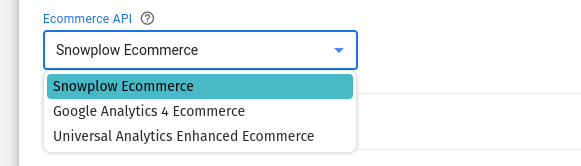
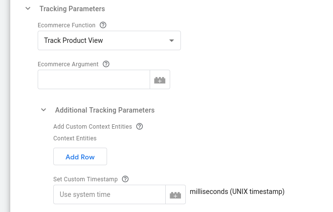
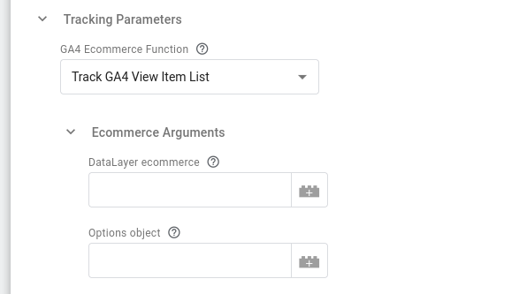
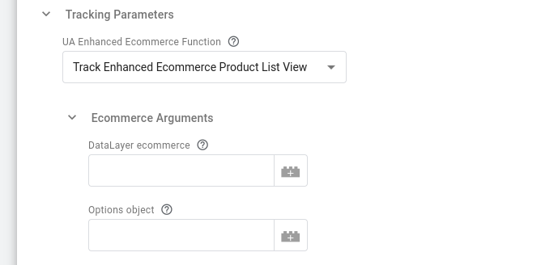

```mdx-code-block
import Tabs from '@theme/Tabs';
import TabItem from '@theme/TabItem';
```

## Ecommerce API

Use the native Snowplow Ecommerce API or [transitional GA4/UA ecommerce adapter APIs](../../../../../tracking-events/ecommerce/index.md) for existing dataLayer implementations using those formats. To get full value from the [Snowplow Ecommerce plugin](../../../../../tracking-events/ecommerce/index.md) we recommend using the native API when possible.



## Tracking Parameters

<Tabs groupId="ecommerceAPI" queryString>
  <TabItem value="sp" label="Snowplow Ecommerce" default>



#### Snowplow Ecommerce Function

In this section you can select the [Snowplow Ecommerce function](../../../../../tracking-events/ecommerce/index.md) to use.

#### Snowplow Ecommerce Argument

In this textbox you can specify the argument to the ecommerce function. This can be a Variable that evaluates to a corresponding object.

#### Additional Tracking Parameters

**Add Custom Context Entities**

Use this table to attach [custom context entities](../../../../../custom-tracking-using-schemas/index.md) to the Snowplow event. Each row can be set to a Google Tag Manager variable that returns an array of custom contexts to add to the event hit.

**Set Custom Timestamp**

Set this to a UNIX timestamp in case you want to [override the default timestamp](../../../../../tracking-events/index.md#adding-custom-timestamps-to-events) used by Snowplow.

  </TabItem>
  <TabItem value="ga4" label="GA4 Ecommerce">



#### GA4 Ecommerce Function

In this section you can select the [Google Analytics 4 Ecommerce function](../../../../../tracking-events/ecommerce/index.md) to use.

#### GA4 Ecommerce Arguments

**DataLayer ecommerce**

Here you can specify the dataLayer ecommerce variable to use, i.e. a variable that returns the `ecommerce` object itself.

**Options object**

Here you can specify a variable returning an object holding additional information for the ecommerce event (e.g. including `currency`, `finalCartValue`, `step`, etc).

  </TabItem>
  <TabItem value="ua" label="Universal Analytics Enhanced Ecommerce">



#### Universal Analytics Enhanced Ecommerce Function

In this section you can select the [Universal Analytics Enhanced Ecommerce function](../../../../../tracking-events/ecommerce/index.md) to use.

#### Universal Analytics Enhanced Ecommerce Arguments

**DataLayer ecommerce**

Here you can specify the dataLayer ecommerce variable to use.

**Options object**

Here you can specify a variable returning an object holding additional information for the ecommerce event (e.g.including currency, finalCartValue, step etc).

  </TabItem>
</Tabs>

## Snowplow Tracker and Ecommerce Plugin Settings


### Tracker Settings

The Snowplow v3 Ecommerce tag template **requires** a Snowplow v3 Settings Variable to be setup. In this section you can select the Google Tag Manager variable of type [Snowplow v3 Settings](../../../v3-settings-variable/index.md) to use.

### Plugin Settings

In this section you can select how the plugin will be added. The available options are:

- **jsDelivr**: To get the plugin URL from jsDelivr CDN. Choosing this option allows you to specify the plugin version to be used.
- **unpkg**: To get the plugin URL from unpkg CDN. Choosing this option allows you to specify the plugin version to be used.
- **Self-hosted**: To get the plugin library from a specified URL. This option requires a [Permission](https://developers.google.com/tag-platform/tag-manager/templates/permissions) change to allow injecting the plugin script from the specified URL.
- **Do not add**: To not add the plugin (e.g. when using a [Custom Bundle](../../../../../plugins/configuring-tracker-plugins/index.md) with the plugin already included)
