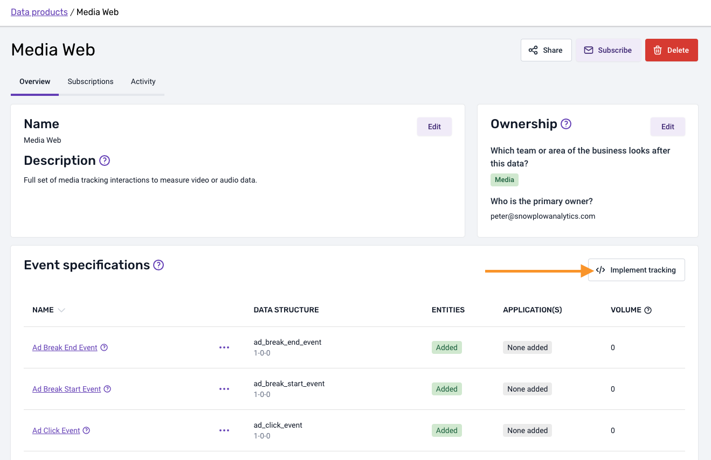

import Tabs from '@theme/Tabs'
import TabItem from '@theme/TabItem'
import SchemaProperties from "@site/docs/reusable/schema-properties/_index.md"


This plugin allows you to integrate with [Media Web](/docs/event-studio/tracking-plans/tracking-plan-templates/#media-web) event specifications. The plugin will add an event specification entity to the matching [Snowplow media](/docs/events/ootb-data/media-events/index.md) events.

Retrieve the configuration directly from your [tracking plan](https://docs.snowplow.io/docs/fundamentals/tracking-plans/) in [Snowplow Console](https://console.snowplowanalytics.com).

:::note
The plugin is available since version 3.23 of the tracker. It's only available for tracking plans created using the [Media Web template](/docs/event-studio/tracking-plans/tracking-plan-templates/#media-web).
:::

The event specification entity is **automatically tracked** once configured.

## Install plugin

<Tabs groupId="platform" queryString>
  <TabItem value="js" label="JavaScript (tag)">

| Tracker Distribution | Included |
| -------------------- | -------- |
| `sp.js`              | ❌        |
| `sp.lite.js`         | ❌        |

**Download:**

<table><tbody><tr><td>Download from GitHub Releases (Recommended)</td><td><a href="https://github.com/snowplow/snowplow-javascript-tracker/releases">Github Releases (plugins.umd.zip)</a></td></tr><tr><td>Available on jsDelivr</td><td><a href="https://cdn.jsdelivr.net/npm/@snowplow/browser-plugin-event-specifications@latest/dist/index.umd.min.js">jsDelivr</a> (latest)</td></tr><tr><td>Available on unpkg</td><td><a href="https://unpkg.com/@snowplow/browser-plugin-event-specifications@latest/dist/index.umd.min.js">unpkg</a> (latest)</td></tr></tbody></table>

```javascript
window.snowplow(
    'addPlugin',
    'https://cdn.jsdelivr.net/npm/@snowplow/browser-plugin-event-specifications@latest/dist/index.umd.min.js',
    ['eventSpecifications', 'EventSpecificationsPlugin']
);
```

  </TabItem>
  <TabItem value="browser" label="Browser (npm)" default>

- `npm install @snowplow/browser-plugin-event-specifications`
- `yarn add @snowplow/browser-plugin-event-specifications`
- `pnpm add @snowplow/browser-plugin-event-specifications`


```javascript
import { newTracker } from '@snowplow/browser-tracker';
import { EventSpecificationsPlugin } from '@snowplow/browser-plugin-event-specifications';

newTracker('sp1', '{{collector_url}}', {
   appId: 'my-app-id',
   plugins: [ EventSpecificationsPlugin(/* plugin configuration */) ],
});
```

  </TabItem>
</Tabs>

## Configuration

You can retrieve the configuration for your event specifications directly from your tracking plan after clicking on the `Implement tracking` button.



Configure the plugin by mapping each tracked event to the event specification ID from your tracking plan. For example:

<Tabs groupId="platform" queryString>
  <TabItem value="js" label="JavaScript (tag)">

```javascript
// Initialize tracker
window.snowplow('newTracker', 'sp1', '{{collector_url}}', {
  appId: 'my-app-id'
});

// Add the Media plugin
window.snowplow(
  'addPlugin',
  'https://cdn.jsdelivr.net/npm/@snowplow/browser-plugin-media@latest/dist/index.umd.min.js',
  ['snowplowMedia', 'SnowplowMediaPlugin']
);

// Add the Event Specifications plugin with configuration
window.snowplow(
  'addPlugin',
  'https://cdn.jsdelivr.net/npm/@snowplow/browser-plugin-event-specifications@latest/dist/index.umd.min.js',
  ['eventSpecifications', 'EventSpecificationsPlugin'],
  [
    {
      SnowplowMediaPlugin: {
        // Map event names to your event specification IDs from Console
        "ad_break_end_event": "abb057a9-eb05-41b8-8d13-0a020f5f9960",
        "ad_break_start_event": "896fc117-aad9-4ef1-ab52-13fcf9156a08",
        "ad_click_event": "df27c1dd-b7e6-4d4a-8ba1-613d859594c4",
        "ad_complete_event": "a382f36b-39ed-46b4-9e6f-ac9bd1d65360",
        "ad_pause_event": "6bd62180-37ab-4a9c-9aa4-580aa39d7888",
        "ad_quartile_event": "7d946906-80eb-4ca0-bf7d-4a0f04ae3598",
        "ad_resume_event": "d5ae264a-3983-478b-b9d5-bcf46c66cab1",
        "ad_skip_event": "5f79e53b-9318-4644-b4e8-8bf7804c244b",
        "ad_start_event": "442a8e75-4884-434e-8e1d-d80bc35c4157",
        "buffer_end_event": "8951ce07-b497-45b0-81c3-49962d36fa6a",
        "buffer_start_event": "c53f4ea7-e7c3-44d9-97a8-1edf5a61d898",
        "error_event": "594bd013-8e6b-4ec4-9828-e5e609b4297c",
        "fullscreen_change_event": "3780c3e5-17ed-4e39-b22c-c0568c486bf3",
        "ping_event": "a4870ad5-e028-42ae-bfca-603a3d6837f1",
        "pause_event": "bf90af15-840d-4a76-a7f0-ccc8865a9c5c",
        "percent_progress_event": "6684eea3-82e6-4c2e-98db-ab0be61fdf0d",
        "picture_in_picture_change_event": "2e8be82e-11fb-4aa3-a5a2-7f49efc29abb",
        "end_event": "aaac78f1-8ee4-42a6-8e3c-46f660c32709",
        "play_event": "1094455c-4e99-4e1f-8445-f4fb12b4eccc",
        "quality_change_event": "bdf91319-c5f0-476f-922f-9215b76186af",
        "ready_event": "c1f9f850-dc68-47d8-9fd1-0db10328858c",
        "seek_end_event": "d748d09f-a361-4620-8651-f883b1502a23",
        "seek_start_event": "5fb03fae-3f0f-4538-908b-a55a6f7e69cb",
        "volume_change_event": "972836c4-73b8-45c3-abcf-22e3bd7eae6c"
      }
    }
  ]
);
```

 </TabItem>
 <TabItem value="browser" label="Browser (npm)" default>

```javascript
import { newTracker } from '@snowplow/browser-tracker';
import { SnowplowMediaPlugin, enableMediaTracking } from '@snowplow/browser-plugin-media';
import { EventSpecificationsPlugin } from '@snowplow/browser-plugin-event-specifications';

// Initialize tracker with both plugins
newTracker('sp1', '{{collector_url}}', {
  appId: 'my-app-id',
  plugins: [
    SnowplowMediaPlugin(),
    EventSpecificationsPlugin({
      SnowplowMediaPlugin: {
        // Map event names to your event specification IDs from Console
        "ad_break_end_event": "abb057a9-eb05-41b8-8d13-0a020f5f9960",
        "ad_break_start_event": "896fc117-aad9-4ef1-ab52-13fcf9156a08",
        "ad_click_event": "df27c1dd-b7e6-4d4a-8ba1-613d859594c4",
        "ad_complete_event": "a382f36b-39ed-46b4-9e6f-ac9bd1d65360",
        "ad_pause_event": "6bd62180-37ab-4a9c-9aa4-580aa39d7888",
        "ad_quartile_event": "7d946906-80eb-4ca0-bf7d-4a0f04ae3598",
        "ad_resume_event": "d5ae264a-3983-478b-b9d5-bcf46c66cab1",
        "ad_skip_event": "5f79e53b-9318-4644-b4e8-8bf7804c244b",
        "ad_start_event": "442a8e75-4884-434e-8e1d-d80bc35c4157",
        "buffer_end_event": "8951ce07-b497-45b0-81c3-49962d36fa6a",
        "buffer_start_event": "c53f4ea7-e7c3-44d9-97a8-1edf5a61d898",
        "error_event": "594bd013-8e6b-4ec4-9828-e5e609b4297c",
        "fullscreen_change_event": "3780c3e5-17ed-4e39-b22c-c0568c486bf3",
        "ping_event": "a4870ad5-e028-42ae-bfca-603a3d6837f1",
        "pause_event": "bf90af15-840d-4a76-a7f0-ccc8865a9c5c",
        "percent_progress_event": "6684eea3-82e6-4c2e-98db-ab0be61fdf0d",
        "picture_in_picture_change_event": "2e8be82e-11fb-4aa3-a5a2-7f49efc29abb",
        "end_event": "aaac78f1-8ee4-42a6-8e3c-46f660c32709",
        "play_event": "1094455c-4e99-4e1f-8445-f4fb12b4eccc",
        "quality_change_event": "bdf91319-c5f0-476f-922f-9215b76186af",
        "ready_event": "c1f9f850-dc68-47d8-9fd1-0db10328858c",
        "seek_end_event": "d748d09f-a361-4620-8651-f883b1502a23",
        "seek_start_event": "5fb03fae-3f0f-4538-908b-a55a6f7e69cb",
        "volume_change_event": "972836c4-73b8-45c3-abcf-22e3bd7eae6c"
      }
    })
  ]
});
```

 </TabItem>
</Tabs>

## Event specification entity

When an event is tracked that matches one of the configured event names, the plugin will automatically add an event specification entity to it.

<SchemaProperties
  overview={{event: false}}
  example={{
    id: "abb057a9-eb05-41b8-8d13-0a020f5f9960",
  }}
  schema={{ "$schema": "http://iglucentral.com/schemas/com.snowplowanalytics.self-desc/schema/jsonschema/1-0-0#", "description": "Entity schema for referencing an event specification", "self": { "vendor": "com.snowplowanalytics.snowplow", "name": "event_specification", "format": "jsonschema", "version": "1-0-0" }, "type": "object", "properties": { "id": { "type": "string", "description": "Identifier for the event specification that the event adheres to", "minLength": 1, "maxLength": 254 } }, "required": ["id"], "additionalProperties": false }} />
