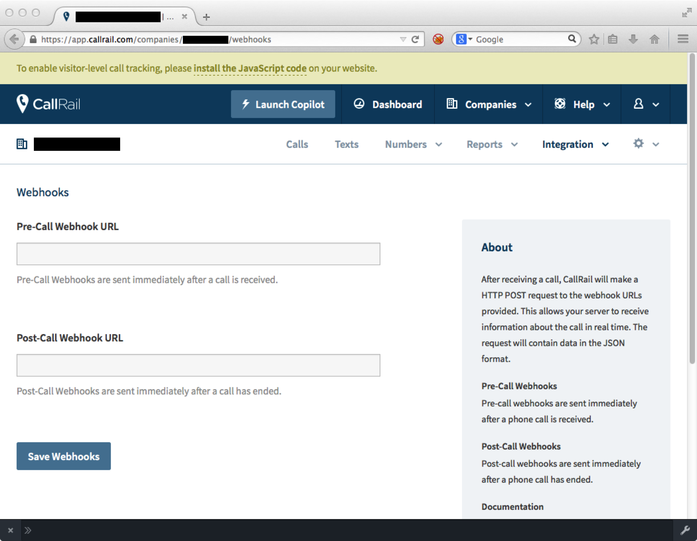

## Overview

This webhook integration lets you track completed telephone calls logged by [CallRail](http://www.callrail.com/).

### Compatibility

- [Snowplow 0.9.11](https://github.com/snowplow/snowplow/releases/tag/0.9.11)+
- [CallRail webhook API](https://support.callrail.com/hc/en-us/articles/201211133-Webhooks) as of 1 November 2014

## Setup

Integrating CallRail's webhooks into Snowplow is a two-stage process:

1. Configure CallRail to send events to Snowplow
2. (Optional) Create the CallRail event table into Amazon Redshift

## CallRail

Configuration in CallRail is on a per-company basis, therefore you will need to configure the CallRail webhook for each company that you want to track calls for.

First login to CallRail. Now select a **Company** from the dropdown list in the CallRail UI.

Select **Integrations** -> **Webhooks** in the submenu and you should see a screen like this:



You can safely ignore the **Pre-Call Webhook URL** input box; we are only going to track call complete events.

For the **Post-Call Webhook URL**, you need to provide the URI to your Snowplow Collector. We use a special path to tell Snowplow that these events are generated by CallRail, thus:

```markup
http://<collector host>/com.callrail/v1?aid=<company code>
```

The `&aid=` name-value pair in your URI's querystring is optional; this is the `app_id` parameter taken from the [Snowplow Tracker Protocol](/docs/events/index.md). You can use it to specify which company in CallRail these call complete events belong to. Putting it all together, our setup screen now looks like this:


If you want, you can also manually override the event's `platform` parameter like so:

```markup
http://<collector host>/com.callrail/v1?aid=<company code>&p=<platform code>
```

Supported platform codes can again be found in the [Snowplow Tracker Protocol](/docs/events/index.md); if not set, then the value for `platform` will default to `srv` for a server-side application.
