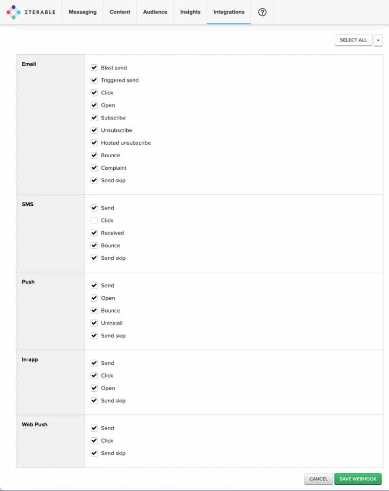

This webhook integration lets you track a variety of events provided by Iterable through their [System Webhooks](https://support.iterable.com/hc/en-us/articles/208013936-System-Webhooks). The event types include email opens and clicks, sent SMS or push notifications, and more.

## Configure Iterable to send events to Snowplow

First, login to Iterable. Under **Integrations** in the top toolbar, click on **System webhooks**.

Then select **Create webhook** above the list of webhooks on the right and enter the endpoint URL. The endpoint URL field is the URI to your Snowplow Collector. We use a special path to tell Snowplow that these events are generated by Iterable:

```markup
https://<collector host>/com.snowplowanalytics.iglu/v1?schema=iglu%3Acom.iterable%2Fsystem_webhook%2Fjsonschema%2F1-0-0
```

You may want to set the snowplow `aid=` parameter in your URL query string to the company for which this webhook has been configured; this is the `app_id` parameter taken from the [Snowplow Tracker Protocol](/docs/events/index.md), however this is optional. The company is also contained in the received messages.

If you want, you can also manually override the event's `platform` parameter by appending a query string to the end of the URL, in combination or separately with aid above. Here is what the final URL would look like for a configured aid and platform:

```markup
https://<collector host>/com.snowplowanalytics.iglu/v1?schema=iglu%3Acom.iterable%2Fsystem_webhook%2Fjsonschema%2F1-0-0&aid=<company>&p=<platform code>
```

Supported platform codes can again be found in the [Snowplow Tracker Protocol](/docs/fundamentals/canonical-event/index.md#application-fields); if not set, then the value for `platform` will default to `srv` for a server-side application.

Having entered the endpoint URL, click on **Create**. This will open a form where you can set up authentication of the callbacks – leave that to "None". In the bottom part of the page, you will be able to select which events to subscribe to as shown in this screenshot:



That’s it – when you save the configuration, Iterable events should automatically flow through into your data warehouse.
