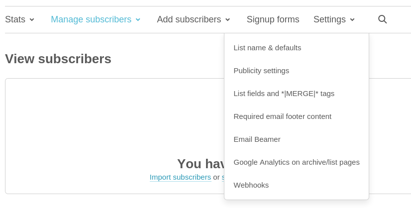
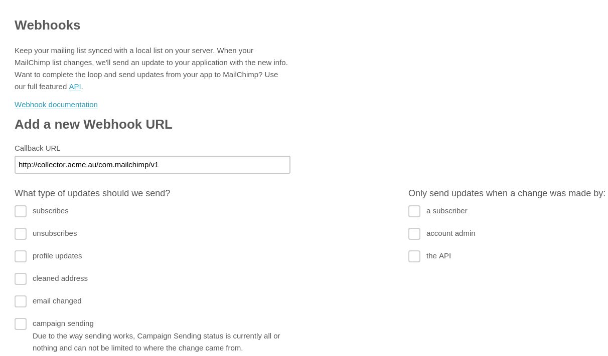

## Overview

This webhook integration lets you track a variety of events logged by [MailChimp](http://mailchimp.com/).

Available events are:

- Subscribes
- Unsubscribes
- Profile Updates
- Email Address Changes
- Cleaned Emails
- Campaign Sending Status

### Compatibility

- [Snowplow 0.9.11](https://github.com/snowplow/snowplow/releases/tag/0.9.11)\+ (`POST`\-capable collectors for event processing, will require `GET` for initial webhook validation)
- [MailChimp webhook API](https://mailchimp.com/developer/transactional/docs/webhooks/)

## Setup

Integrating MailChimp's webhooks into Snowplow is a two-stage process:

1. Configure MailChimp to send events to Snowplow
2. (Optional) Create the MailChimp events tables into Amazon Redshift

## MailChimp

First login to MailChimp. Select **Lists** from the menu panel along the left handside of the screen.

Then select **Create List** in the top right hand corner and fill in the required fields to create a new list.

Once we have a new list navigate to the **Settings** dropdown option and select **Webhooks** from the menu.



For the **Callback URL** field you will need to provide the URI to your Snowplow Collector. We use a special path to tell Snowplow that these events are generated by MailChimp:

```markup
http://<collector host>/com.mailchimp/v1
```

Our Webhooks setup page should look like this after we have added our **Callback URL**:



If you want, you can also manually override the event's `platform` parameter by appending a query string to the end of the URL so:

```markup
http://<collector host>/com.mailchimp/v1?p=<platform code>
```

Supported platform codes can again be found in the [Snowplow Tracker Protocol](/docs/events/index.md#application-parameters); if not set, then the value for `platform` will default to `srv` for a server-side application.

Before we save our MailChimp webhook we can configure what types of events MailChimp will send to our webhook and what channels will trigger these events. Simply select the boxes that are applicable to you and MailChimp will send these events to our webhook.

That's it - with this table deployed, your MailChimp events should automatically flow through into your data warehouse.
