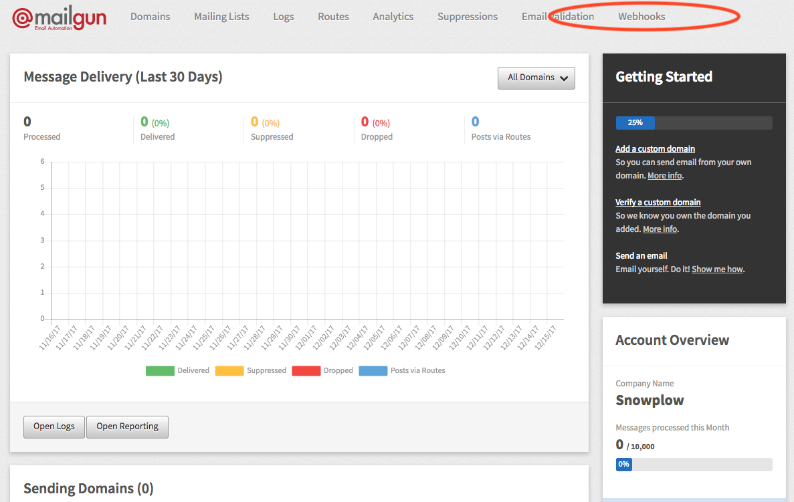
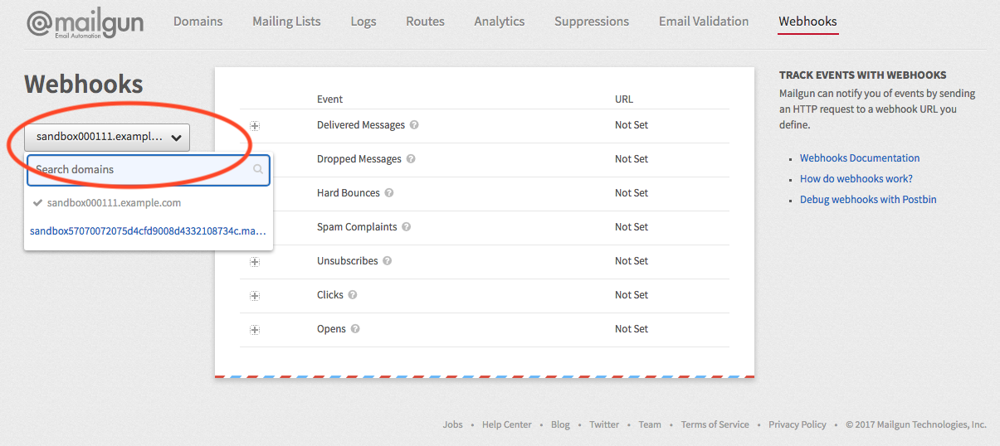
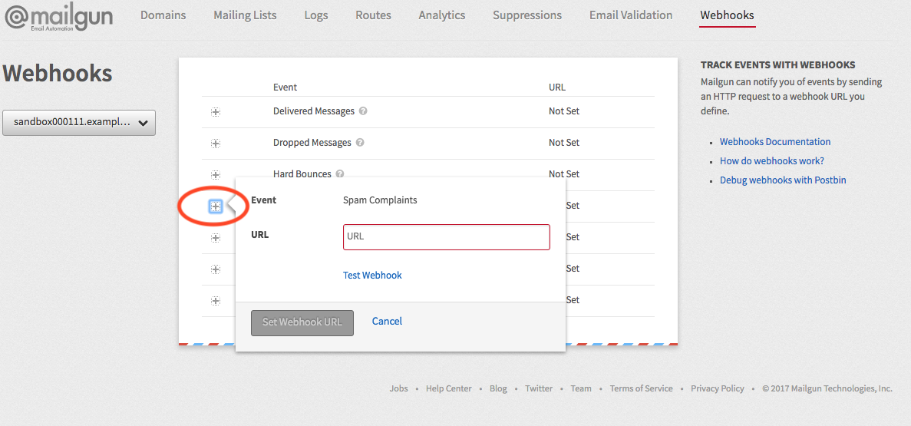

This webhook integration lets you track a variety of events logged by [Mailgun](https://www.mailgun.com/).

Available events are:

- Delivered Messages
- Dropped Messages
- Hard Bounces
- Spam Complaints
- Unsubscribes
- Clicks
- Opens

## Compatibility

- [R97 Knossos](https://github.com/snowplow/snowplow/releases/tag/r97-knossos)\+ (`POST`\-capable collectors only)
- [Mailgun webhook API](https://documentation.mailgun.com/en/latest/user_manual.html#webhooks)

## Setup

Integrating Mailgun's webhooks into Snowplow is a two-stage process:

1. Configure Mailgun to send events to Snowplow
2. (Optional) Create the Mailgun events tables into Amazon Redshift

## Mailgun

First login to Mailgun. Select **Webhooks** from the top panel.



Then select the domain for which you want to configure snowplow.



Once you have the desired domain selected, you can configure snowplow for the type of events that interest you.

Following is an example configuring the "Spam Complaints" event. The process is identical for all events.

Click on the cross next to the event type you woudl like to configure. In this case "Spam Complaints":



Then set the collector URL:

```markup
http://<collector host>/com.mailgun/v1
```

Finally click on **Set Webhook URL**. You can optionally click on **Test Webhook** to verify that your collector instance is reachable from Mailgun's servers.

You may want to set the snowplow `aid=` parameter in your URL query string to the company for which this webhook has been configured; this is the `app_id` parameter taken from the [Snowplow Tracker Protocol](/docs/events/index.md), however this is optional. The company is also contained in the received messages.

If you want, you can also manually override the event's `platform` parameter by appending a query string to the end of the URL, in combination or separately with aid above. Here is what the final URL would look like for a configured aid and platform:

```markup
http://<collector host>/com.mailgun/v1?aid=<company>&p=<platform code>
```

Supported platform codes can again be found in the [Snowplow Tracker Protocol](/docs/events/index.md); if not set, then the value for `platform` will default to `srv` for a server-side application.
