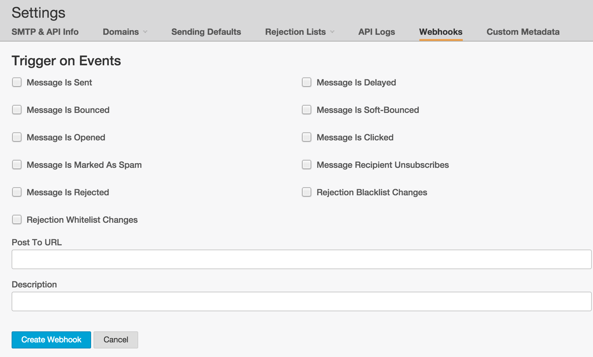
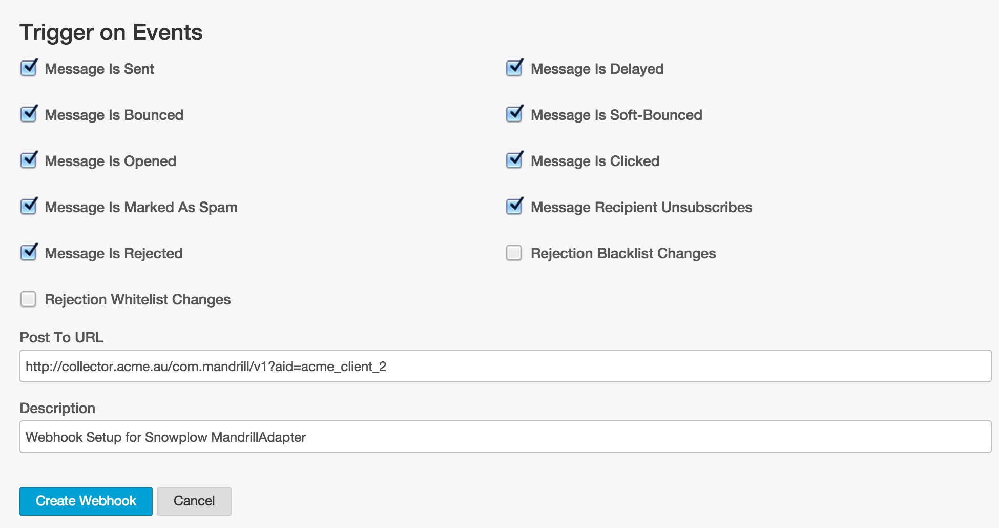

This webhook integration lets you track a variety of events logged by [Mandrill](https://mandrill.com/).

Available events are:

- Message sent
- Message hard bounced
- Message soft bounced
- Message opened
- Message marked as spam
- Message rejected
- Message delayed
- Message clicked
- Recipient unsubscribed

## Compatibility

- [Snowplow 0.9.14](https://github.com/snowplow/snowplow/releases/tag/0.9.14)\+ (`POST`\-capable collectors only)
- [Mandrill webhook API](http://help.mandrill.com/entries/21738186-Introduction-to-Webhooks)

## Setup

Integrating Mandrill's webhooks into Snowplow is a two-stage process:

1. Configure Mandrill to send events to Snowplow
2. (Optional) Create the Mandrill events tables into Amazon Redshift

## Mandrill

First login to Mandrill and click on the **Settings** button which will be on the left hand side of the screen.

Once in the Settings menu click on **Webhooks** and then click the **Add a Webhook** button.

Now we can start to setup the webhook by selecting what events we want our Mandrill Webhook to trigger!

- Please note: 'Rejection Whitelist Changes' & 'Rejection Blacklist Changes' are not supported by the Snowplow MandrillAdapter.



Once we have selected what events we want to record we need to fill in the **Post To URL** field:

- For the this field you will need to provide the URI to your Snowplow Collector. We use a special path to tell Snowplow that these events are generated by Mandrill:

```markup
http://<collector host>/com.mandrill/v1?aid=<company code>
```

The `aid=` name-value pair in your URI's querystring is optional; this is the `app_id` parameter taken from the [Snowplow Tracker Protocol](/docs/events/index.md). You can use it to specify which company in Mandrill these call complete events belong to. Putting it all together, our setup screen now looks like this:



If you want, you can also manually override the event's `platform` parameter like so:

```markup
http://<collector host>/com.mandrill/v1?aid=<company code>&p=<platform code>
```

Supported platform codes can again be found in the [Snowplow Tracker Protocol](/docs/events/index.md); if not set, then the value for `platform` will default to `srv` for a server-side application.

Once you click the **Create Webhook** button it will attempt to authenticate that the Collector actually exists and is ready to receive events. If everything is setup correctly it will return to the previous page and you will now see your new Webhook listed!

That's it - with this table deployed, your Mandrill events should automatically flow through into Redshift.
