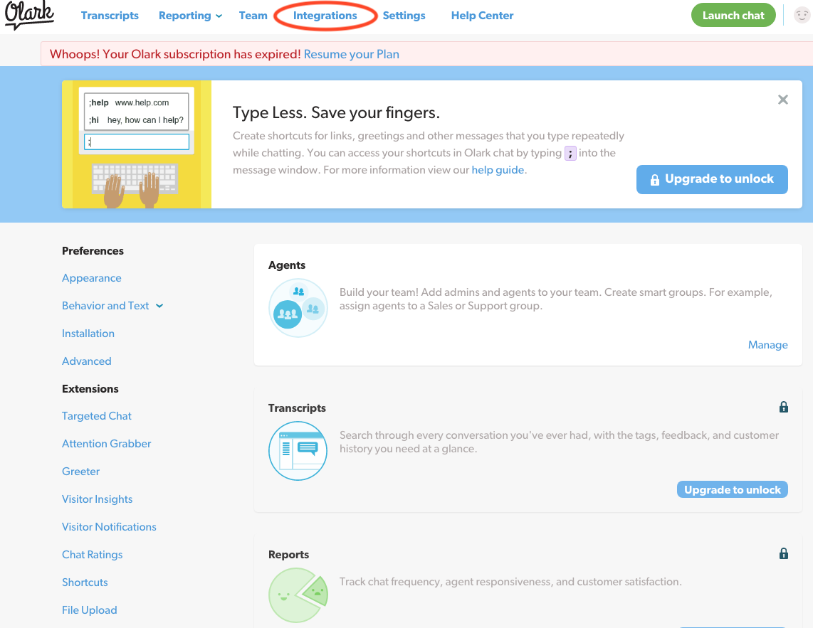
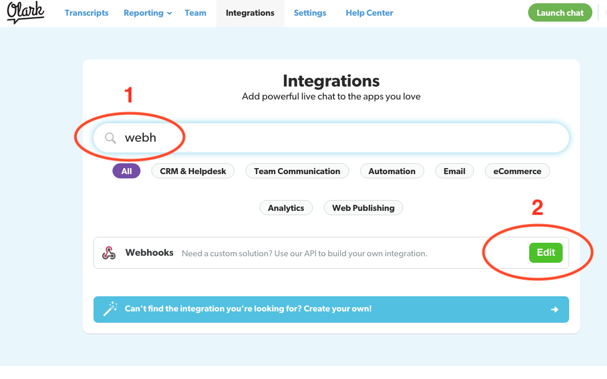

## Overview

This webhook integration lets you receive [Olark](https://www.olark.com/) events.

Supported events are:

- Transcripts
- Offline messages

### Compatibility

- [R97 Knossos](https://github.com/snowplow/snowplow/releases/tag/r97-knossos)\+ (`POST`\-capable collectors only)
- [Olark webhook API](https://www.olark.com/help/webhooks)

## Setup

Integrating Olark's webhooks into Snowplow is a two-stage process:

1. Configure Olark to send events to Snowplow
2. (Optional) Create the Olark events tables into Amazon Redshift

## Configure Olark

First login to Olark and click on **Integrations**:



In integrations search start typing `webhooks` (1) until the Webhooks integration is visible, then click **Edit** (2):



On the webhooks integration page select the **URL to post to** field (1)

- For the this field you will need to provide the URL to your Snowplow Collector. We use a special path to tell Snowplow that these events are generated by Olark:

```markup
http://<collector host>/com.olark/v1
```

- Then select the **Send all transcripts automatically** and/or **Send offline messages** according to your needs (2). As of the time of writing (15.12.2017) no other events are directly supported so **do not tick Send all events**.

If you want, you can also manually override the event's `platform` parameter like so:

```markup
http://<collector host>/com.olark/v1?p=<platform code>
```

Supported platform codes can again be found in the [Snowplow Tracker Protocol](/docs/events/index.md); if not set, then the value for `platform` will default to `srv` for a server-side application.

Once you click the **Save** button you are ready to receive events about your client chat interactions from olark.
