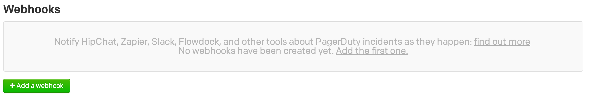
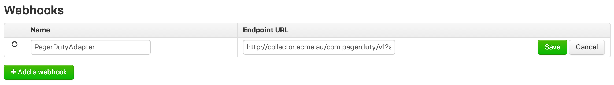

## Overview

This webhook integration lets you track a variety of events logged by [PagerDuty](http://www.pagerduty.com/).

Available events are:

- Trigger
- Acknowledge
- Unacknowledge
- Resolve
- Assign
- Escalate
- Delegate

### Compatibility

- [Snowplow 0.9.13](https://github.com/snowplow/snowplow/releases/tag/0.9.13)\+ (`POST`\-capable collectors for event processing)
- [PagerDuty webhook API](https://developer.pagerduty.com/documentation/rest/webhooks)

## Setup

Integrating PagerDuty's webhooks into Snowplow is a two-stage process:

1. Configure PagerDuty to send events to Snowplow
2. (Optional) Create the PagerDuty events table into Amazon Redshift

## Configure PagerDuty

First login into to your PagerDuty account and select the **Services** button from the top of the screen.

Select which service you would like to add a Webhook endpoint to then click the **Add a webhook** button.



Fill in the name of your Webhook and the Endpoint URL.

For the Endpoint URL field, you will need to provide the URI to your Snowplow Collector. We use a special path to tell Snowplow that these events are generated by PagerDuty:

```markup
http://<collector host>/com.pagerduty/v1?aid=<company code>
```

The `aid=` name-value pair in your URI's querystring is optional; this is the `app_id` parameter taken from the [Snowplow Tracker Protocol](/docs/events/index.md). You can use it to specify which company in PagerDuty these call complete events belong to. Putting it all together, our setup screen now looks like this:



If you want, you can also manually override the event's `platform` parameter like so:

```markup
http://<collector host>/com.pagerduty/v1?aid=<company code>&p=<platform code>
```

Supported platform codes can again be found in the [Snowplow Tracker Protocol](/docs/events/index.md); if not set, then the value for `platform` will default to `srv` for a server-side application.

Click save and from now on when any of the seven available events are triggered an event will also be sent to the Webhook!

That's it - with this table deployed, your PagerDuty events should automatically flow through into Redshift.
