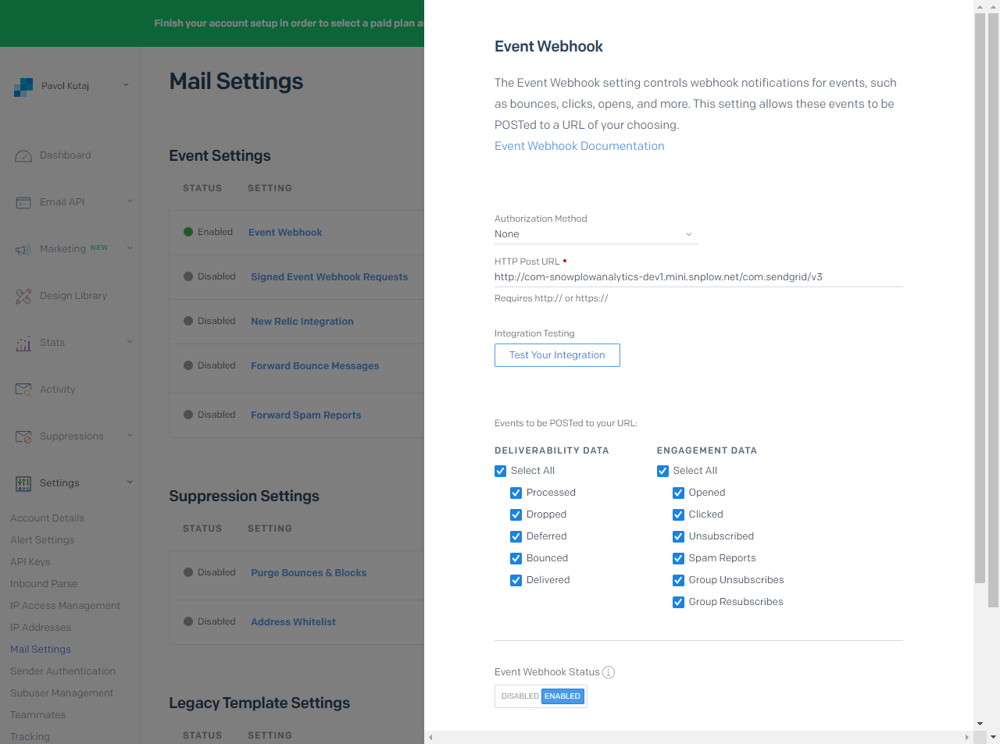

## Overview

This webhook integration lets you track a variety of events logged by [SendGrid](http://sendgrid.com/).

Available events are:

- Processed
- Dropped
- Delivered
- Deferred
- Bounce
- Open
- Click
- Spam Report
- Unsubscribe
- Group Unsubscribe
- Group Resubscribe

### Compatibility

- The support of the latest version of Sendgrid webhook has been introduced in [Snowplow R114 Polonnaruwa](https://github.com/snowplow/snowplow/releases/tag/r114-polonnaruwa)
- [SendGrid webhook API](https://docs.sendgrid.com/for-developers/tracking-events/event)

## Setup

Integrating SendGrid's webhooks into Snowplow is a two-stage process:

1. Configure SendGrid to send events to Snowplow
2. (Optional) Create the SendGrid events tables for Amazon Redshift

## Configure SendGrid

First login to SendGrid. Select **Settings** from the menu panel along the left-hand side of the screen. You should then navigate in the expanded list to the **Mail Settings** page.

Select **Event Notification** from the list by clicking the row. Ensure it's switched **ON** in order to send events to Snowplow.

Click **edit** on the top right-hand side of the **Event Notification** dropdown.

For the **HTTP POST URL** field you will need to provide the URI to your Snowplow Collector. We use a special path to tell Snowplow that these events are generated by SendGrid:

```markup
http://<collector host>/com.sendgrid/v3
```

Our Webhooks setup page should look like this after we have added our **HTTP POST URL**:



If you want, you can also manually override the event's `platform` parameter by appending a query string to the end of the URL so:

```markup
http://<collector host>/com.sendgrid/v3?p=<platform code>
```

Supported platform codes can again be found in the [Snowplow Tracker Protocol](/docs/events/index.md); if not set, then the value for `platform` will default to `srv` for a server-side application.

The other values you can set up manually in the similar fashion are `nuid`, `aid`, `cv`, `eid`, `ttm`, and `url`.

Before we save our SendGrid webhook we can configure what types of events SendGrid will send to our webhook and what channels will trigger these events. Simply select the boxes that are applicable to you and SendGrid will send these events to our webhook.
