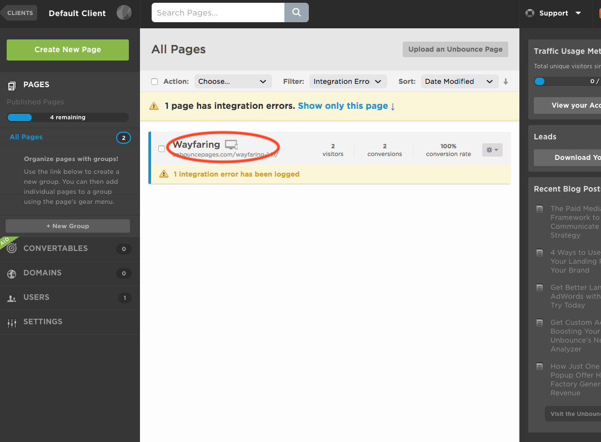
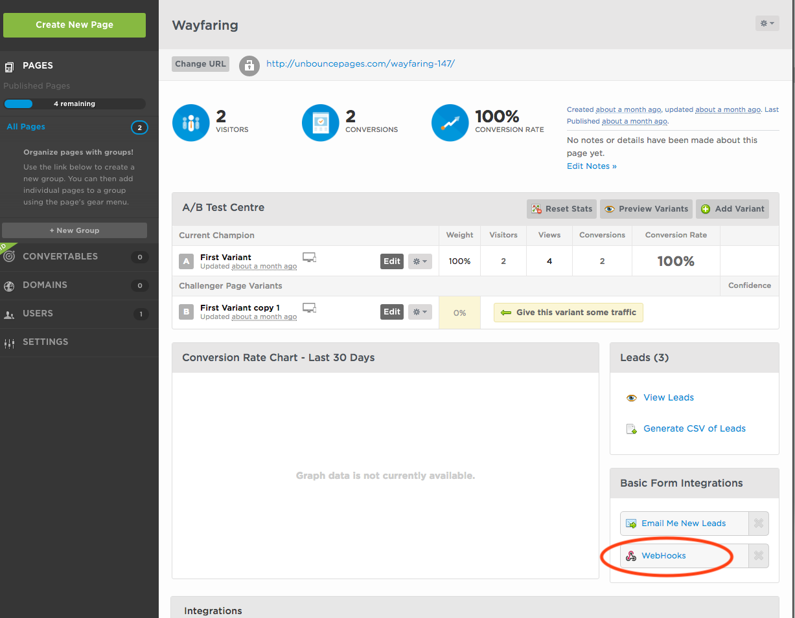
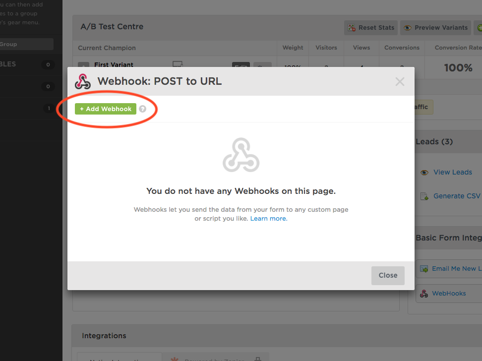
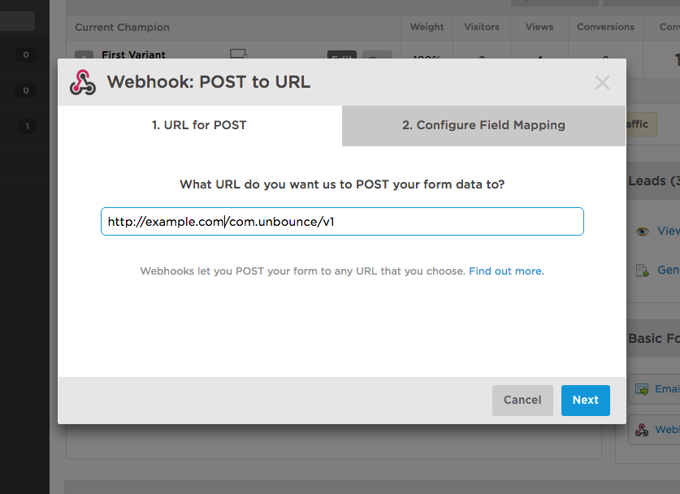
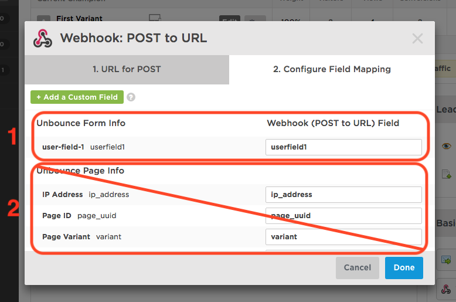

## Overview

This webhook integration lets you receive [Unbounce](https://unbounce.com/) form submit events.

### Compatibility

- [R97 Knossos](https://github.com/snowplow/snowplow/releases/tag/r97-knossos)\+ (`POST`\-capable collectors only)
- [Unbounce webhook API](https://documentation.unbounce.com/hc/en-us/articles/203510044-Using-a-Webhook)

## Setup

First login to Unbounce and click on the title the landing page for which you want to configure the webhook (in this example "Wayfaring"):



In the page configuration click **Webhooks**:



..and then click **Add Webhook**:



- For the this field you will need to provide the URL to your Snowplow Collector. We use a special path to tell Snowplow that these events are generated by unbounce:

```markup
http://<collector host>/com.unbounce/v1
```

- Then select the **Send all transcripts automatically** and/or **Send offline messages** according to your needs (2). As of the time of writing (15.12.2017) no other events are directly supported so **do not tick Send all events**.

If you want, you can also manually override the event's `platform` parameter like so:

```markup
http://<collector host>/com.unbounce/v1?p=<platform code>
```

Supported platform codes can again be found in the [Snowplow Tracker Protocol](/docs/events/index.md); if not set, then the value for `platform` will default to `srv` for a server-side application.

Once the URL has been configured click **Next**:



If you decide to **Configure Field Mapping** in the webhook dialog, configure only fields in **Unbounce Form Info** (1), not in **Unbounce Page Info** (2):



Once you click the **Done** button you are ready to receive events about your client chat interactions from Unbounce.
