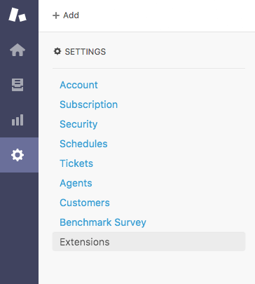
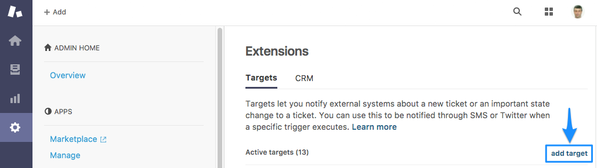
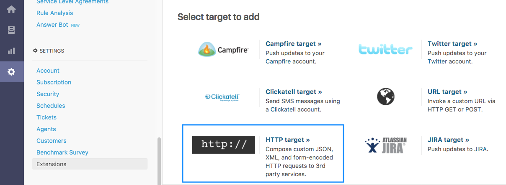
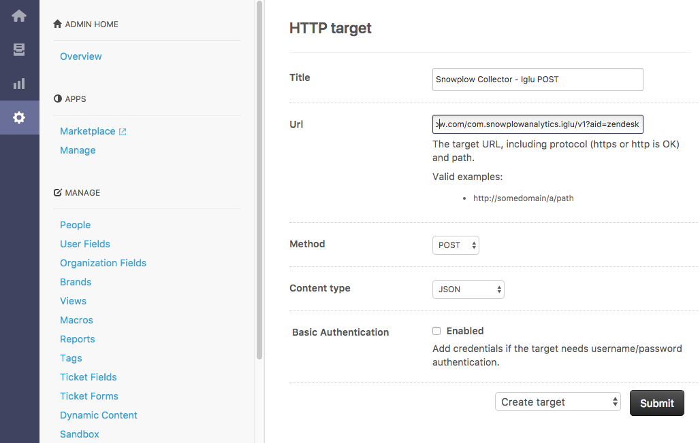
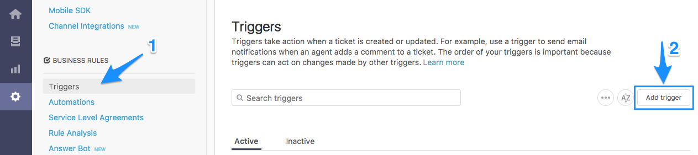
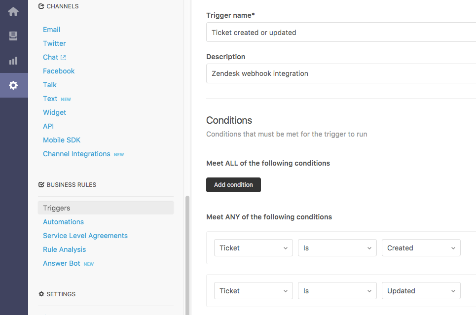
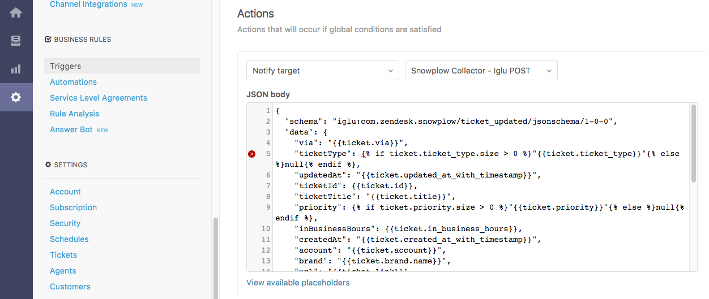
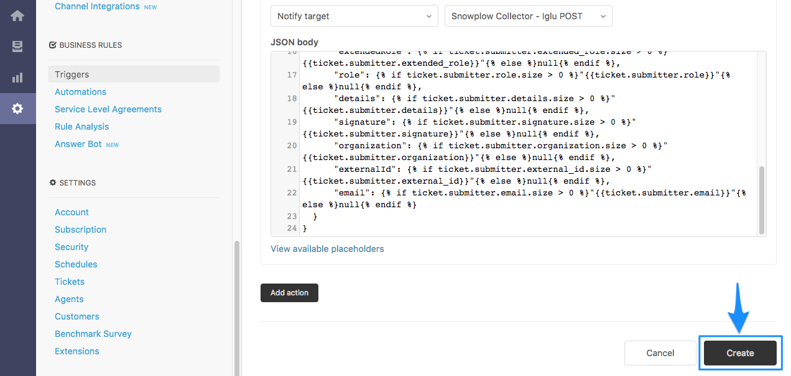

You can configure Zendesk to automatically send `POST` requests to a (Clojure or Scala) collector. The first step is to set up a Zendesk "extension" pointing at the collector.

Log in to Zendesk. Click the cogwheel-shaped "Admin" icon located at the bottom-left corner of the Dashboard page to take you to the _Admin_ page.

In the "SETTINGS" menu, click on "Extensions":



Click "add target":



Choose "HTTP target" from the list of target types to add:



Name the new extension something like "Snowplow Collector - Iglu POST". The "Iglu POST" here represents the fact we will be sending Zendesk events and contexts to [Iglu webhook adapter](/docs/sources/webhooks/iglu-webhook/index.md) via `POST` request.

In the **URL** field, enter `https://{{collector_domain}}/com.snowplowanalytics.iglu/v1?aid=zendesk`, replacing `{{collector_domain}}` with your collector domain.

You can optionally have `?aid={{my_zendesk_namespace}}` added to this URL, where `{{my_zendesk_namespace}}` is a label for the application (here: "zendesk"). This label will be attached to all events fired by the extension, so you can later check where a given event came from (useful if you have more than one Zendesk account).

Set the **Method** field to "POST" and the **Content type** to "JSON" from the drop-down lists.

Select "Create Target" and click the _**Submit**_ button.



We have set up our collector as a Zendesk extension. We can now add a trigger which sends `POST` requests to the collector whenever certain events occur.

## 2. Setting up a trigger for Zendesk event

### Setting up trigger conditions

From the _Admin_ page, select "Triggers" from the "BUSINESS RULES" menu and click "add trigger":



Name the trigger something like "Ticket created or updated" to reflect Zendesk data will be send on ticket creation and update events.

Under "Meet ANY of the following conditions" header click _**Add condition**_ button to add 2 "Ticket: Is..." conditions and set them to "Created" and "Updated" respectively.



### Setting up body for ticket event

In the "Actions" section, click on _**Add action**_ button and select "Notify target" and "Snowplow Collector - Iglu POST" (the extension you set up in [Setting up a collector as a Zendesk extension](#setting-up-a-collector-as-a-zendesk-extension) section above).

In the _**JSON body**_ box, paste the following:

```json
{
  "schema": "iglu:com.zendesk.snowplow/ticket_updated/jsonschema/1-0-0",
  "data": {
    "via": "{{ticket.via}}",
    "ticketType": "{{ticket.ticket_type}}"null,
    "updatedAt": "{{ticket.updated_at_with_timestamp}}",
    "ticketId": {{ticket.id}},
    "ticketTitle": "{{ticket.title}}",
    "priority": "{{ticket.priority}}"null,
    "inBusinessHours": {{ticket.in_business_hours}},
    "createdAt": "{{ticket.created_at_with_timestamp}}",
    "account": "{{ticket.account}}",
    "brand": "{{ticket.brand.name}}",
    "url": "{{ticket.link}}",
    "externalId": "{{ticket.external_id}}"null,
    "organizationName": "{{ticket.organization.name}}",
    "organizationId": {{ticket.requester.organization.id}}null,
    "status": "{{ticket.status}}",
    "dueDate": "{{ticket.due_date_with_timestamp}}"null,
    "tags": "{{ticket.tags}}"null,
    "ccNames": "{{ticket.cc_names}}",
    "groupAssigned": "{{ticket.group.name}}",
    "latestCommentAuthorName": "{{ticket.latest_comment.author.name}}",
    "latestComment": "{{ticket.latest_comment.value}}",
    "latestCommentIsPublic": {{ticket.latest_comment.is_public}}
  }
}
```



_NOTE:_ Ignore the warning on the left-hand side of the _**JSON body**_ textbox. It is due to usage of [Liquid markup](https://shopify.github.io/liquid/) in JSON.

### Setting up user contexts

#### Setting up body for ticket requester

In the "Actions" section, select the 2nd "Notify target" and "Snowplow Collector - Iglu POST" extension.

In the _**JSON body**_ box, paste the following:

```json
{
  "schema": "iglu:com.zendesk.snowplow/user/jsonschema/1-0-0",
  "data": {
      "ticketId": {{ticket.id}},
      "updatedAt": "{{ticket.updated_at_with_timestamp}}",
      "type": "requester",
      "firstName": "{{ticket.requester.first_name}}"null,
      "lastName": "{{ticket.requester.last_name}}"null,
      "language": "{{ticket.requester.language}}"null,
      "tags": "{{ticket.requester.tags}}"null,
      "locale": "{{ticket.requester.locale}}"null,
      "notes": "{{ticket.requester.notes}}"null,
      "timeZone": "{{ticket.requester.time_zone}}"null,
      "userId": {{ticket.requester.id}}null,
      "phone": "{{ticket.requester.phone}}"null,
      "extendedRole": "{{ticket.requester.extended_role}}"null,
      "role": "{{ticket.requester.role}}"null,
      "details": "{{ticket.requester.details}}"null,
      "signature": "{{ticket.requester.signature}}"null,
      "organization": "{{ticket.requester.organization}}"null,
      "externalId": "{{ticket.requester.external_id}}"null,
      "email": "{{ticket.requester.email}}"null
  }
}
```

#### Setting up body for ticket assignee

In the "Actions" section, select the 3nd "Notify target" and "Snowplow Collector - Iglu POST" extension.

In the _**JSON body**_ box, paste the following:

```json
{
  "schema": "iglu:com.zendesk.snowplow/user/jsonschema/1-0-0",
  "data": {
      "ticketId": {{ticket.id}},
      "updatedAt": "{{ticket.updated_at_with_timestamp}}",
      "type": "assignee",
      "firstName": "{{ticket.assignee.first_name}}"null,
      "lastName": "{{ticket.assignee.last_name}}"null,
      "language": "{{ticket.assignee.language}}"null,
      "tags": "{{ticket.assignee.tags}}"null,
      "locale": "{{ticket.assignee.locale}}"null,
      "notes": "{{ticket.assignee.notes}}"null,
      "timeZone": "{{ticket.assignee.time_zone}}"null,
      "userId": {{ticket.assignee.id}}null,
      "phone": "{{ticket.assignee.phone}}"null,
      "extendedRole": "{{ticket.assignee.extended_role}}"null,
      "role": "{{ticket.assignee.role}}"null,
      "details": "{{ticket.assignee.details}}"null,
      "signature": "{{ticket.assignee.signature}}"null,
      "organization": "{{ticket.assignee.organization}}"null,
      "externalId": "{{ticket.assignee.external_id}}"null,
      "email": "{{ticket.assignee.email}}"null
  }
}
```

#### Setting up body for ticket submitter

In the "Actions" section, select the 4th "Notify target" and "Snowplow Collector - Iglu POST" extension.

In the _**JSON body**_ box, paste the following:

```json
{
  "schema": "iglu:com.zendesk.snowplow/user/jsonschema/1-0-0",
  "data": {
      "ticketId": {{ticket.id}},
      "updatedAt": "{{ticket.updated_at_with_timestamp}}",
      "type": "submitter",
      "firstName": "{{ticket.submitter.first_name}}"null,
      "lastName": "{{ticket.submitter.last_name}}"null,
      "language": "{{ticket.submitter.language}}"null,
      "tags": "{{ticket.submitter.tags}}"null,
      "locale": "{{ticket.submitter.locale}}"null,
      "notes": "{{ticket.submitter.notes}}"null,
      "timeZone": "{{ticket.submitter.time_zone}}"null,
      "userId": {{ticket.submitter.id}}null,
      "phone": "{{ticket.submitter.phone}}"null,
      "extendedRole": "{{ticket.submitter.extended_role}}"null,
      "role": "{{ticket.submitter.role}}"null,
      "details": "{{ticket.submitter.details}}"null,
      "signature": "{{ticket.submitter.signature}}"null,
      "organization": "{{ticket.submitter.organization}}"null,
      "externalId": "{{ticket.submitter.external_id}}"null,
      "email": "{{ticket.submitter.email}}"null
  }
}
```

#### Setting up body for current user

In the "Actions" section, select the 5th (final) "Notify target" and "Snowplow Collector - Iglu POST" extention.

In the _**JSON body**_ box, paste the following:

```json
{
  "schema": "iglu:com.zendesk.snowplow/user/jsonschema/1-0-0",
  "data": {
      "ticketId": {{ticket.id}},
      "updatedAt": "{{ticket.updated_at_with_timestamp}}",
      "type": "current_user",
      "firstName": "{{current_user.first_name}}"null,
      "lastName": "{{current_user.last_name}}"null,
      "language": "{{current_user.language}}"null,
      "tags": "{{current_user.tags}}"null,
      "locale": "{{current_user.locale}}"null,
      "notes": "{{current_user.notes}}"null,
      "timeZone": "{{current_user.time_zone}}"null,
      "userId": {{current_user.id}}null,
      "phone": "{{current_user.phone}}"null,
      "extendedRole": "{{current_user.extended_role}}"null,
      "role": "{{current_user.role}}"null,
      "details": "{{current_user.details}}"null,
      "signature": "{{current_user.signature}}"null,
      "organization": "{{current_user.organization}}"null,
      "externalId": "{{current_user.external_id}}"null,
      "email": "{{current_user.email}}"null
  }
}
```

Submit the new trigger by clicking _**Create**_ button. It should look something like this:


