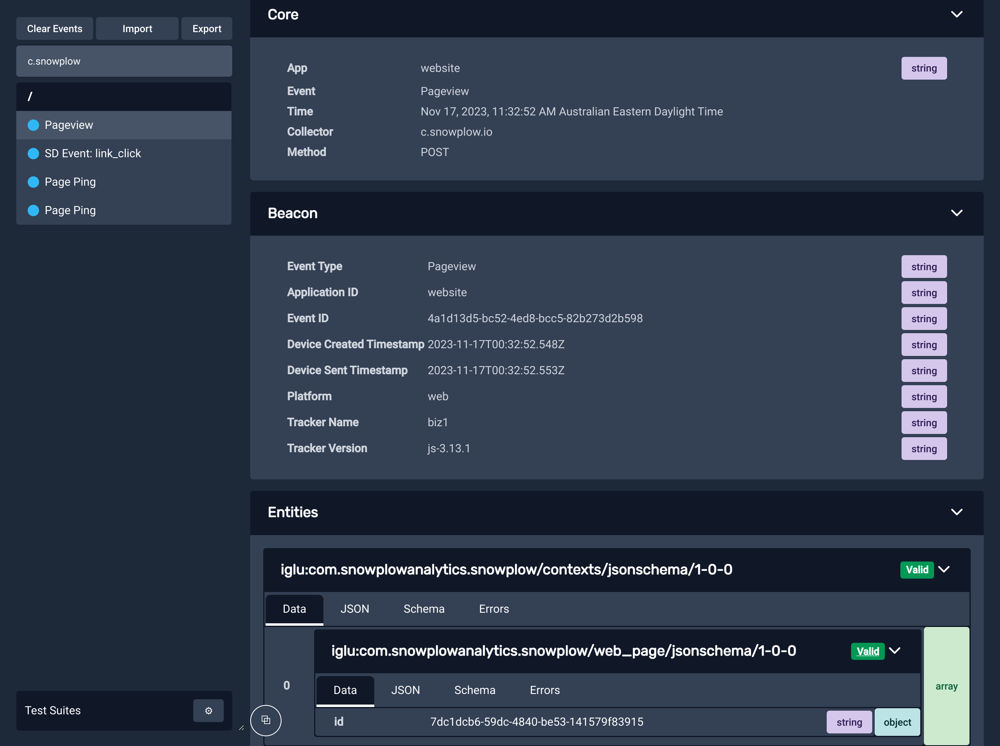

We highly recommend using the [Snowplow Inspector Chrome extension](https://chrome.google.com/webstore/detail/snowplow-inspector/maplkdomeamdlngconidoefjpogkmljm?hl=en) for validating your tracking code.

This extension is an [Open Source project](https://github.com/poplindata/chrome-snowplow-inspector) by [Poplin Data](https://poplindata.com/), one of our partners operating in Australia and New Zealand.
In 2023, Poplin Data [was acquired by Snowplow](https://snowplow.io/blog/snowplow-acquires-poplin-data/) and became Snowplow Australia.

Once you add the extension to Chrome, you can view it by [opening Developer Tools](https://developer.chrome.com/docs/devtools/open/) (usually <kbd>Ctrl</kbd>+<kbd>Shift</kbd>+<kbd>I</kbd> or on Mac <kbd>Cmd</kbd>+<kbd>Option</kbd>+<kbd>I</kbd>), where it has its own tab named ‘Snowplow’ (look for the tab adjacent to ‘Elements’, ‘Console’, ‘Network’, etc. - it may be necessary to expand the list of tabs using the `»` button). 

## How it works

As a user browses a webpage they can perform different actions that may be tracked as Snowplow events.
These events are sent as HTTP requests to the Snowplow collector that the tracker on the webpage is pointed towards.
Simply put, what the Snowplow Inspector extension does is parse these HTTP requests into a more easily readable format.
This allows anyone with the extension to more easily see what actions on a webpage with Snowplow tracking trigger events to be sent to a Snowplow pipeline. 

In the example below two events were fired as HTTP post requests from a test webpage: a [**page_view**](/docs/understanding-your-pipeline/canonical-event/index.md#page-views) event and a ([self-describing](/docs/understanding-your-pipeline/events/index.md#self-describing-events)) [**link_click**](/docs/collecting-data/collecting-from-own-applications/javascript-trackers/web-tracker/plugins/link-click-tracking/index.md) event. 

Within the parsed out HTTP requests that comprise the event payload are a variety of [Snowplow canonical event](/docs/understanding-your-pipeline/canonical-event/index.md) fields such as unique `event_id`, timestamps, and user and session identifiers, as well as any custom [Event](/docs/understanding-your-pipeline/events/index.md#self-describing-events) or [Entity](/docs/understanding-your-pipeline/entities/index.md) fields.

## The role of Snowplow Inspector in event QA

The Snowplow Inspector extension is an invaluable tool for anyone who is pushing tracking live as it gives real time - easy to access - information on which events are being emitted and what the contents of these events are.
This makes the tool a good first port of call when trying to answer questions such as “why is X event not appearing in my data warehouse” by showing whether or not the event is actually firing on a chosen webpage.  

Additionally, you can configure the extension to show whether or not an event has passed validation according to any event validation rules codified in the corresponding [schema](/docs/understanding-your-pipeline/schemas/index.md).

For events that failed validation in production historically that you are unable to replicate in your own browser, see our guides on [how to query failed events](/docs/managing-data-quality/exploring-failed-events/querying/index.md) from their respective destinations.
These failed events have a [specific format](/docs/understanding-your-pipeline/failed-events/index.md) that includes an array of helpful, detailed error messages that explain the exact reasons why the event failed validation.
These events can also [be imported](/docs/testing-debugging/snowplow-inspector/importing-events/index.md#importing-failed-events) into the extension to view as if your browser had generated them itself.
