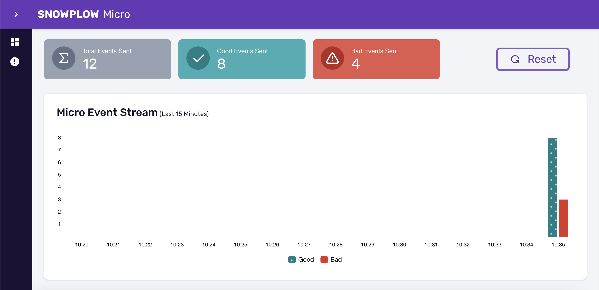

```mdx-code-block
import {versions} from '@site/src/componentVersions';
import CodeBlock from '@theme/CodeBlock';
import Badges from '@site/src/components/Badges';
```

## Running

The easiest way to run Micro is through [Docker](https://www.docker.com/). <Badges badgeType="Docker Pulls" repo="snowplow/snowplow-micro" />

Run the following command:

<CodeBlock language="bash">{
`docker run -p 9090:9090 snowplow/snowplow-micro:${versions.snowplowMicro}`
}</CodeBlock>

You should see output like this:
```
[INFO] akka.event.slf4j.Slf4jLogger - Slf4jLogger started
[INFO] com.snowplowanalytics.snowplow.micro.Main$ - No enrichments enabled.
[INFO] com.snowplowanalytics.snowplow.micro.Main$ - REST interface bound to /0.0.0.0:9090
```

<details>
<summary>A note on ports...</summary>

The command above will route port `9090` on your machine to Micro.
If that port is already taken, you will want to change it, like so:

<CodeBlock language="bash">{
`docker run -p 5000:9090 snowplow/snowplow-micro:${versions.snowplowMicro}
              ↑↑↑↑`
}</CodeBlock>

Note that Micro will still log `REST interface bound to /0.0.0.0:9090` — `9090` here refers to the port _inside_ the container.

We will use `9090` in the examples below, but remember to substitute the port of your choosing.

</details>

:::tip

We also provide a _distroless_ image of Micro. Because it only includes the bare minimum, it’s smaller and more secure. However, the downside of using the distroless image is that basic utilities (such as a shell) are not available.

To use this image, add `-distroless` to the tag:

<CodeBlock language="bash">{
`docker run -p 9090:9090 snowplow/snowplow-micro:${versions.snowplowMicro}-distroless`
}</CodeBlock>

:::

## Sending events to Micro

Follow the documentation for one of [our trackers](/docs/collecting-data/collecting-from-own-applications/index.md) to implement some tracking code on your website or application.

You can then point it to `localhost:9090` where Micro is listening. For example, using the [Browser tracker](/docs/collecting-data/collecting-from-own-applications/javascript-trackers/web-tracker/index.md):

```js
import { newTracker, trackPageView, enableActivityTracking } from '@snowplow/browser-tracker';

// highlight-next-line
newTracker('snowplow', 'localhost:9090', {
  appId: 'my-app-id',
  plugins: [],
});

trackPageView();
enableActivityTracking({
  heartbeatDelay: 10,
  minimumVisitLength: 10,
});
```

## Checking the results

Once you have the tracking code and the events are flowing in, you should see something like this in the Micro logs:

```
[INFO] EventLog - GOOD id:4bfd5b32-d02a-4f83-a731-4339898437e1 app_id:test type:page_view (iglu:com.snowplowanalytics.snowplow/page_view/jsonschema/1-0-0)
[INFO] EventLog - GOOD id:e7a5c64d-d0f7-48d9-9a50-be044db7d2f6 app_id:test type:page_ping (iglu:com.snowplowanalytics.snowplow/page_ping/jsonschema/1-0-0)
[INFO] EventLog - GOOD id:1608ca85-f5f9-4948-898a-728aa8f1131b app_id:test type:page_ping (iglu:com.snowplowanalytics.snowplow/page_ping/jsonschema/1-0-0)
```

This means your tracking is set up correctly and your events are valid (`GOOD`).

Would you rather see the events visually? Open [http://localhost:9090/micro/ui](http://localhost:9090/micro/ui) in your browser. You might want to check [a few tips on how to use the UI](/docs/testing-debugging/snowplow-micro/ui/index.md).



Alternatively, you can inspect the events via [the API](/docs/pipeline-components-and-applications/snowplow-micro/api/index.md). For example, try:

```bash
curl localhost:9090/micro/good
```

## Exporting events to TSV

Snowplow pipelines output data in the [_enriched TSV format_](/docs/understanding-your-pipeline/canonical-event/understanding-the-enriched-tsv-format/index.md). Typically, this is picked up by one of our [loaders](/docs/storing-querying/storage-options/index.md) or by tools such as [Snowbridge](/docs/destinations/forwarding-events/snowbridge/index.md).

With Micro, you can see what your data would look like in this format — useful if you want to test any logic that is parsing this data. 

<CodeBlock language="bash">{
`docker run -p 9090:9090 snowplow/snowplow-micro:${versions.snowplowMicro} --output-tsv`
}</CodeBlock>

<details>
<summary>Output vs logs</summary>

The TSV data will be printed to the [standard output](https://en.wikipedia.org/wiki/Standard_streams#Standard_output_(stdout)). As you saw above, Micro also prints logs, which go into the [standard error stream](https://en.wikipedia.org/wiki/Standard_streams#Standard_error_(stderr)).

Depending on how you are running Micro, you might find the logs distracting. If so, you can turn off event logs with an extra option:

<CodeBlock language="bash">{
`docker run -p 9090:9090 snowplow/snowplow-micro:${versions.snowplowMicro} --output-tsv \\
  -Dorg.slf4j.simpleLogger.log.EventLog=off`
}</CodeBlock>

Or just discard the standard error stream entirely using the syntax appropriate for your shell:

<CodeBlock language="bash">{
`# for bash
docker run -p 9090:9090 snowplow/snowplow-micro:${versions.snowplowMicro} --output-tsv \\
  2>/dev/null`
}</CodeBlock>

</details>

You can also save the TSV output to a file:

<CodeBlock language="bash">{
`docker run -p 9090:9090 snowplow/snowplow-micro:${versions.snowplowMicro} --output-tsv > output.tsv`
}</CodeBlock>

:::tip

If you prefer CSV to TSV, you can use the `csvformat` utility that comes with [csvkit](https://csvkit.readthedocs.io/en/latest/):

<CodeBlock language="bash">{
`docker run -p 9090:9090 snowplow/snowplow-micro:${versions.snowplowMicro} --output-tsv | csvformat -t > output.csv`
}</CodeBlock>

:::
