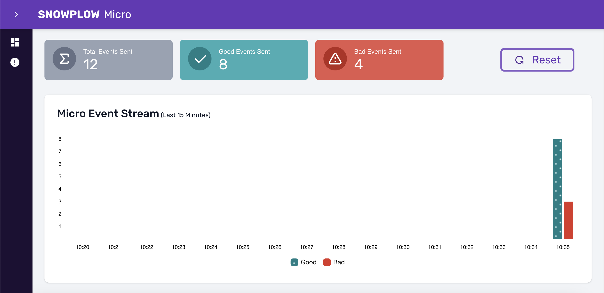

[Snowplow Micro](https://github.com/snowplow-incubator/snowplow-micro) is a lightweight version of the Snowplow pipeline. It’s great for:
* Getting familiar with Snowplow
* Debugging and testing, including [automated testing](/docs/managing-data-quality/testing-and-qa-workflows/set-up-automated-testing-with-snowplow-micro/index.md)

Just like a real Snowplow pipeline, Micro receives, validates and enriches events sent by your [tracking code](/docs/collecting-data/collecting-from-own-applications/index.md).

Unlike a real pipeline, Micro is missing a few features:
* It does not store the events in a data warehouse or database, although a [UI](/docs/testing-debugging/snowplow-micro/ui/index.md) and an [API](/docs/pipeline-components-and-applications/snowplow-micro/api/index.md) are available to look at the data.
* It’s not meant for production traffic.

Follow [these instructions](/docs/testing-debugging/snowplow-micro/basic-usage/index.md) to get started in minutes.
