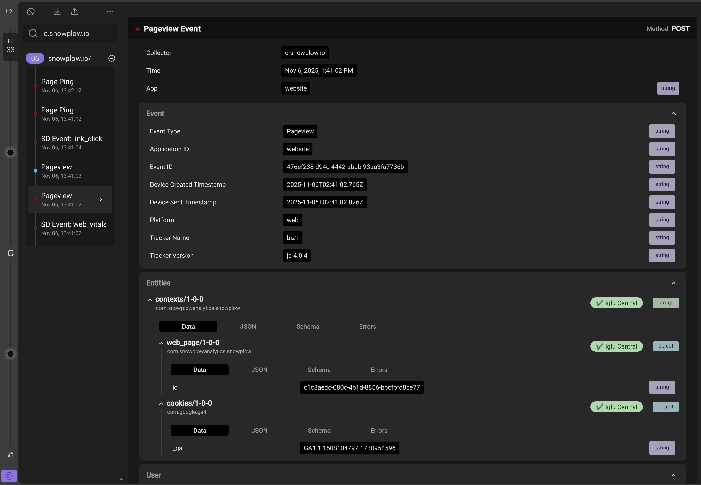

```mdx-code-block
import AvailabilityBadges from '@site/src/components/ui/availability-badges';

<AvailabilityBadges
  available={['cloud', 'pmc', 'selfHosted']}
  helpContent="Snowplow Inspector is included with all Snowplow platforms."
/>
```

Snowplow recommends using the Snowplow Inspector browser extension for validating your tracking code.
To install in Chrome, Edge and other Chromium-based browsers, find [Snowplow Inspector on the chrome web store](https://chromewebstore.google.com/detail/snowplow-inspector/maplkdomeamdlngconidoefjpogkmljm).

:::note Browser support
Firefox users can install the extension manually using an `.xpi` file from the [GitHub Releases page](https://github.com/snowplow/chrome-snowplow-inspector/releases).

The Snowplow Inspector is not supported on Safari at this time.
:::

The code for the Snowplow Inspector is available on [GitHub](https://github.com/snowplow/chrome-snowplow-inspector).

Once you add the extension to your browser, you can view it by [opening Developer Tools](https://developer.chrome.com/docs/devtools/open/), where it has its own tab named **Snowplow** (look for the tab adjacent to **Console**, **Network**, etc. It may be necessary to expand the list of tabs using the `»` button).

:::tip Opening DevTools
Common keyboard shortcuts to open Developer Tools include:

- PC: <kbd>Ctrl</kbd>+<kbd>Shift</kbd>+<kbd>I</kbd>
- Mac: <kbd>Cmd</kbd>+<kbd>Option</kbd>+<kbd>I</kbd>
:::

## How it works

As you browse a webpage you can perform different actions that you can track as Snowplow events.
These events get sent as HTTP requests to the Snowplow Collector that's configured for the tracker on each webpage.
The Snowplow Inspector extension observes and parses these HTTP requests for display in a more easily readable format.
This allows anyone with the extension to more easily see which actions on a webpage trigger Snowplow events to send to a Snowplow pipeline.

You can debug standard Snowplow events, and [Signals attributes and interventions](/docs/testing/snowplow-inspector/signals-integration/index.md) using the Inspector. Choose which data type you want to look at using the vertical tabs on the left-hand side of the extension: **Events**, **Attributes**, and **Interventions**.

The **Events** tab shows the usual event debugging functionality. The inspector shows a list of all the events received in the order they were fired, with more recent events at the top. Click on each event to see its details.

In the example below, events fired as HTTP POST requests from the Snowplow homepage:

- An automatic [self-describing](/docs/fundamentals/events/index.md#self-describing-events) [`web_vitals`](/docs/events/ootb-data/app-performance/index.md#web-vitals) event.
- A [`page_view`](/docs/fundamentals/canonical-event/index.md#page-views) event.
- A second `page_view` event from an embedded iframe on the page. It has a blue dot because its App ID and Collector combination are distinct from the other events, which have red dots because they share an App ID/Collector.
- A self-describing [`link_click`](/docs/sources/web-trackers/tracking-events/link-click/index.md) event.
- Two [`page_ping`](/docs/events/ootb-data/page-activity-tracking/index.md#page-engagement) events.



Within the parsed HTTP request bodies that contain event payloads are a variety of [Snowplow canonical event](/docs/fundamentals/canonical-event/index.md) fields, such as unique `event_id`, timestamps, user and session identifiers, as well as any custom [event](/docs/fundamentals/events/index.md#self-describing-events) or [entity](/docs/fundamentals/entities/index.md) fields.

## Try it out

Once you've installed the extension, you can try it out immediately by visiting a webpage with Snowplow tracking. For example, the [Snowplow website](https://snowplow.io/), or this documentation site. You don't need a Snowplow account to use the extension.

## Use in event QA

The Snowplow Inspector extension is useful for debugging any web tracking implementation. For questions such as "why is X event not appearing in the data warehouse", the extension allows you to see if the event is actually firing.

Additionally, you can configure the extension to show whether or not an event has passed validation according to any event validation rules codified in the corresponding [schema](/docs/fundamentals/schemas/index.md).

For events that failed validation in production historically that you are unable to replicate in your own browser, see the guides on [how to query failed events](/docs/monitoring/exploring-failed-events/file-storage/index.md).
These failed events have a [specific format](/docs/fundamentals/failed-events/index.md) that includes an array of helpful, detailed error messages that explain the exact reasons why the event failed validation.
You can also [import bad events](/docs/testing/snowplow-inspector/importing-events/index.md#importing-failed-events) into the extension to view as if your browser had generated them itself.
