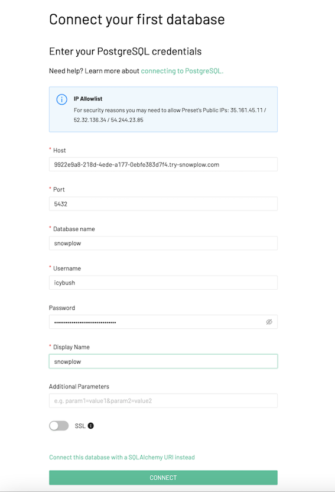
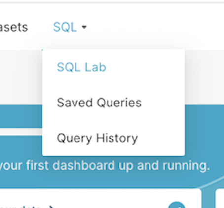

## Accessing your data

Try Snowplow creates a Postgres database where any events you capture are stored. This database contains the standard Snowplow schemas:

* atomic for raw data
* bad_rows for data that has failed pipeline validation
* derived for modeled tables.

Connection details for accessing this data are available in the Try Snowplow console. You will also need to request the password from within the UI.


## Querying your data

Like Snowplow BDP, Try Snowplow encourages you to connect your data visualization or query tool of choice to access the database and query your data.

You can either copy a sample query from the console tutorial, [check out the Recipes](/docs/recipes/index.md) or start exploring your data with your own queries.

### Example: Querying your data in Supersest / Preset

You can access the PostgreSQL trial database using your preferred data visualization or SQL query tool.
If you don’t have permissions to create a new connection in your data visualization tool, you can use [Preset](https://preset.io/) which is built on the popular open source project, Superset and has a 14 day free trial.

The steps to connect, access and visualize data are below.

1. Select [“Try for Free”](https://preset.io/) on the Preset homepage and enter your details to create an account
2. Select ‘Yes’ to connect to your team’s database


3. Select PostgreSQL as your database


4. Enter the connection details provided in the [Try Snowplow UI](https://try.snowplowanalytics.com/access-data): Hostname, Port, Database, Username and Password (request credentials on Try UI if you haven’t done so)



5. Continue with default settings and finalize set up


6. On the top bar, select the “SQL” section and “SQL lab” subsection



7. Copy SQL query from the [Try Snowplow UI](https://try.snowplowanalytics.com/access-data)

```sql
SELECT *
FROM atomic.events
LIMIT 10
```
8. In Preset, select the Snowplow database, and the “atomic” schema on the left sidenav and, paste the query from the previous step and run it


You should now see Snowplow atomic data which you can [explore](/docs/understanding-your-pipeline/canonical-event/index.md).


### Example: Create a simple time-series chart
From the query results, select “Create chart” and select “Bar chart”, set these values and click “Update chart”:

* X-axis: `derived_tstamp`
* Metrics:
  * Column: `event_id`
  * Aggregate: `COUNT`


