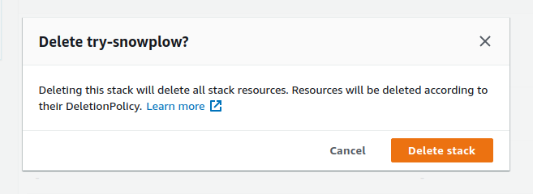

When you have finished with the Try Snowplow experience, you will want to shut down your pipeline to release infrastructure and to avoid paying further costs.

Navigate to [the Cloud Formation console](https://console.aws.amazon.com/cloudformation/home) in your AWS account, and select your pipeline stack. There is a delete button at the top of the page.

When you click the delete button you are shown a warning:

Make sure you understand the implications of going ahead at this stage:

- Your database will be deleted, and you will lose all Snowplow events that you have collected during your trial experience. You might want to export some of the data first if it is important to you.
- Your collector endpoint will no longer accept new events.
- If you are still running trackers on your website then they will fail to send events to this endpoint. You might want to remove or disable trackers on your website before you delete the pipeline.

If you are happy with these implications then go ahead and click the orange button. Your trial pipeline is gone, but we hope this is not the end of your data journey with Snowplow.
