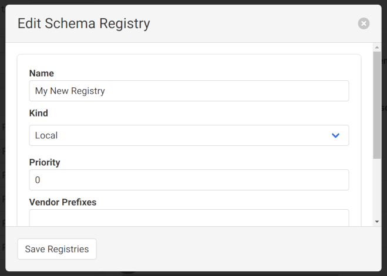

At Snowplow we frequently use the [Snowplow Inspector chrome extension](https://chrome.google.com/webstore/detail/snowplow-inspector/maplkdomeamdlngconidoefjpogkmljm?hl=en) to check for event emission on a web page - and we also recommend that our clients do the same when in the process of validating their tracking code.
This extension is an [Open Source project](https://github.com/poplindata/chrome-snowplow-inspector) by [Poplin Data](https://poplindata.com/), one of our partners operating in Australia and New Zealand.
In 2023, Poplin Data [was acquired by Snowplow](https://snowplow.io/blog/snowplow-acquires-poplin-data/) and became Snowplow Australia.

Once you add the extension to Chrome, you can view it by [opening Developer Tools](https://developer.chrome.com/docs/devtools/open/) (usually <kbd>Ctrl</kbd>+<kbd>Shift</kbd>+<kbd>I</kbd> or on Mac <kbd>Cmd</kbd>+<kbd>Option</kbd>+<kbd>I</kbd>), where it has its own tab named ‘Snowplow’ (look for the tab adjacent to ‘Elements’, ‘Console’, ‘Network’, etc. - it may be necessary to expand the list of tabs using the chevrons button (»)). 

## How it works

As a user browses a webpage they can perform different actions that may be tracked as Snowplow events.
These events are sent as HTTP requests to the Snowplow collector that the tracker on the webpage is pointed towards.
Simply put, what the Snowplow Inspector extension does is parse these HTTP requests into a more easily readable format.
This allows anyone with the extension to more easily see what actions on a webpage with Snowplow tracking trigger events to be sent to a Snowplow pipeline. 

In the example below two events were fired as HTTP post requests from a test webpage: a [**page_view**](/docs/understanding-your-pipeline/canonical-event/index.md#page-views) event and a ([Self Describing](/docs/understanding-your-pipeline/canonical-event/index.md#custom-unstructured-events)) [**link_click**](/docs/collecting-data/collecting-from-own-applications/javascript-trackers/javascript-tracker/javascript-tracker-v3/plugins/link-click-tracking/index.md) event. 

Within the parsed out HTTP requests that comprise the event payload are a variety of [Snowplow canonical event](/docs/understanding-your-pipeline/canonical-event/index.md) fields such as unique `event_id`, timestamps, and user and session identifiers, as well as any custom [Event](/docs/understanding-your-pipeline/glossary-of-terms/index.md#self-describing-event) or [Entity](/docs/understanding-your-pipeline/glossary-of-terms/index.md#entity) fields.

## The role of Snowplow Inspector in event QA

The Snowplow Inspector extension is an invaluable tool for anyone who is pushing tracking live as it gives real time - easy to access - information on which events are being emitted and what the contents of these events are.
This makes the tool a good first port of call when trying to answer questions such as “why is X event not appearing in my data warehouse” by showing whether or not the event is actually firing on a chosen webpage.  

Additionally, you can configure the extension to show whether or not an event has passed validation according to any event validation rules codified in the corresponding JSON Schema stored in an [Iglu](/docs/understanding-your-pipeline/glossary-of-terms/index.md#iglu) registry. 

For events that failed validation in production historically that you are unable to replicate in your own browser, see our guides on [how to query failed events](/docs/managing-data-quality/failed-events/failed-events-in-athena-and-bigquery/index.md) from their respective destinations.
These failed events have a [specific format](/docs/managing-data-quality/failed-events/understanding-failed-events/index.md) that includes an array of helpful, detailed error messages that explain the exact reasons why the event failed validation.
These events can also [be imported](#importing-failed-events) into the extension to view as if your browser had generated them itself.

## Event validation with custom registries
By default the extension is able to see Iglu schemas for Events and Entities that are generated by the official Snowplow [trackers](/docs/collecting-data/collecting-from-own-applications/index.md), as they are publicly available on the public [Iglu Central](/docs/pipeline-components-and-applications/iglu/iglu-repositories/iglu-central/index.md) registry.
This registry is configured by default in most Snowplow Pipelines.
By default, the extension will also create a "Local Registry", which lets you iterate on schemas without having to deploy them to a real registry.

However, you can configure the extension to compare events against private schema repositories (that contain your organization's proprietary schemas).
If you skip this step, the extension will not recognize any custom events, and will not be able to validate them.

Clicking on the “Unrecognised” button will present you with the “Edit Schema Registry” dialog (covered in the next section) to configure your own registry:

Alternatively, you can manage your registries and schemas via the ‘Manage Schemas’ button in the top toolbar.

### Registries and schema management
To see a list of all the schemas supported by your currently configured registries, use the ‘Manage Schemas’ button in the top toolbar.
The extension will connect to your registries and request a listing of all available schemas.
The schemas are displayed on the left, and the configured registries on the right.

Selecting registries in the list will filter the schema listing to show only the schemas they contain.
You can also search for schemas using the field at the top of the directory.
Use the ‘Clear Filters’ button to clear these and see the full list of schemas again.

Using the ‘Registries...’ button on the right, you can:

- Add more custom registries
- Edit existing registries you've previously configured
- Remove configured registries so they aren't accessible to the extension any more
- Import a list of registries from an existing [Iglu Resolver configuration](/docs/pipeline-components-and-applications/iglu/iglu-resolver/index.md)

Selecting a "local" registry will activate the ‘Schemas...’ button and allow you to manage the schemas it contains.

When adding or editing a registry, the following types are supported:
1. [Local](#local-registries)
2. [Data Structures API](#data-structures-api-registries)
3. [Iglu Server](#iglu-server-registries)
4. [Static HTTP](#static-registries)

Configuring a registry requires a name and one of these types.
You may also optionally include a priority, and list of vendor prefixes.
Each type of registry may require additional configuration like API keys to function.

Once configured, schemas from the registry should load in the ‘Manage Schemas’ view, and events using those schemas will be checked for validation.

Now that the extension can query your private Iglu repositories the extension will be able to tell you in real time whether your events and entities are failing validation from entirely within the browser.
An example of an event passing validation is shown below:

An example of an event failing validation is shown below, the reason for this event failing validation is that `example_field_1` is specified as allowing only the "string" type, meaning it cannot be null.
Hovering over the "Invalid" warning displays text describing which aspect of the payload failed the validation.
Clicking the warning copies this error to your clipboard.

#### Local registries
Usually used for testing changes of schemas still in development, or quickly including a schema when you don't have the full access required to configure a registry.
These schemas are managed within the extension and stored on your own machine.

The only required configuration is a name, and the schemas themselves.

#### Data Structures API registries
This type is recommended for use with [Snowplow BDP](/docs/getting-started-with-snowplow-bdp/index.md) using the [Data Structures API](/docs/understanding-tracking-design/managing-data-structures-via-the-api-2/index.md).

In order to function, the extension requires:

- Organization ID: This is usually found in the URL when logged into the Snowplow BDP console. See more at [Managing Console API authentication](/docs/using-the-snowplow-console/managing-console-api-authentication/index.md#credentials-ui-v2).
- API Key: When logged into the Snowplow BDP console, should be available in [API keys for managing Snowplow](https://console.snowplowanalytics.com/credentials) (within "Manage organization"). See more at [Managing Console API authentication](/docs/using-the-snowplow-console/managing-console-api-authentication/index.md#credentials-ui-v2).

Optionally you may specify:
- Alternative API Endpoint: To use a Data Structures API-compatible service that is not Snowplow BDP, you may specify its root API endpoint here.

#### Iglu Server registries
[Iglu Server](/docs/pipeline-components-and-applications/iglu/iglu-repositories/iglu-server/index.md) is a more full-featured dedicated service for hosting server that is more flexible than Static Registries.
You may need this if you are integrating with [Snowplow Mini](/docs/pipeline-components-and-applications/snowplow-mini/index.md).

To authenticate with your server, the extension will require:
- Iglu API Endpoint: This is the base URL the extension will use when contacting the API. If you include a path component, the API request will be made as `api/*`, relative to this path; you may need to add or remove trailing slashes if the API is not hosted at the root.
- Iglu API Key: See [API keys and the authentication service](/docs/pipeline-components-and-applications/iglu/iglu-repositories/iglu-server/index.md#5-api-keys-and-the-authentication-service-apiauth) for instructions on generating an Iglu API key.

When logged into the Snowplow BDP console, these details should be available in [API keys for utilities](https://console.snowplowanalytics.com/iglu-keys) (within "Manage organization").

#### Static registries
Most other registries, such as those hosted as websites or via [S3](https://aws.amazon.com/s3/) or [GCS](https://cloud.google.com/products/storage/) buckets will use this  ["static"](/docs/pipeline-components-and-applications/iglu/iglu-repositories/static-repo/index.md) type.

If you can access the schemas directly via a browser, this is probably the right choice.

Because there is no API for listing the contained schemas, the extension will usually attempt to request any referenced schema from static registries to see if it includes it.
To address this imbalance with the other registry types, [`igluctl`](/docs/pipeline-components-and-applications/iglu/igluctl-2/index.md) version 8 added support creating and uploading a file listing all the schemas in a registry.
If the extension detects such a "manifest", it will successfully fetch and display schemas for you without events having to reference the schemas first.

To connect to your static registry, the extension will need:
- Base URI: The base URL to use when requesting schemas. The extension will request schemas relative to this base, expecting a `schemas/{vendor}/{name}/{format/{version}` format.

Optionally you can also provide:
- Manifest URI: The URI to use for the schema manifest (aka [Schema List](https://discourse.snowplow.io/t/igluctl-0-8-0-released/5551#2-uploads-schema-lists-by-default-2)) file that lists the schemas contained in the registry. If not provided, defaults to `schemas`, to match the `igluctl` default.

## Events from other devices
In the main Event Debugger view, the Event Timeline down the side allows you to import events from other devices that you can view as if the were generated by your own browser.
The options are available via the ‘Import’ button, and detailed below.

### Importing from HAR files
[HAR](https://en.wikipedia.org/wiki/HAR_(file_format)) files are JSON representations of HTTP sessions.
They include a list of requests and responses made to servers by a single client, including all the metadata such as headers.
You can export the current contents of the ‘Network’ panel in your DevTools to a HAR file, and then later load them into the extension as a record that events were triggered and successfully validated (or not).
This can be useful for troubleshooting, or as a record of the QA process.

Aside from the browser, other tools like [Charles Proxy](https://www.charlesproxy.com/) or [Fiddler](https://www.telerik.com/fiddler), commonly used as proxies for verifying analytics from mobile applications, can also export to this format.

### Importing failed events
Historical events that have already failed the enrichment process can be imported into the extension to allow you to easily find the errors with the events.

The extension will accept an uncompressed file, which you can paste a selection from, or in total straight from your clipboard.

### Importing events from ElasticSearch / OpenSearch
If you use [ElasticSearch](https://www.elastic.co/) / [OpenSearch](https://opensearch.org/) as a destination for your events (or as used in [Snowplow Mini](/docs/pipeline-components-and-applications/snowplow-mini/index.md)) you can specify a query to use and the extension will load events as they are indexed.

This can be useful for testing many devices at once, e.g. multiple mobile devices that are all sending events to your Snowplow Mini instance.

### Importing events from an ngrok tunnel
[ngrok](https://ngrok.com/) is a service for creating ad-hoc network endpoints that can accept / tunnel requests and offers an API for other services to introspect and act on the requests that were received.
Using ngrok, you can create an endpoint, use that endpoint as a Collector destination for your tracking, and then examine any events sent to it via the extension.

When you attempt to import from ngrok, the extension will attempt to connect to the ngrok tool running on your local machine on port 4040 (`localhost:4040`) to access the [ngrok Agent API](https://ngrok.com/docs/ngrok-agent/api/).
If successful, any Snowplow events sent to the corresponding tunnel endpoint will appear in the extension.

### Remote debugging with Chrome DevTools
Applications using the [Chrome DevTools Protocol](https://chromedevtools.github.io/devtools-protocol/) can be [inspected remotely](https://developer.chrome.com/docs/devtools/remote-debugging/).
This includes some mobile browsers, some mobile applications, WebViews on Android, [Chromium Embedded Framework](https://github.com/chromiumembedded/cef) applications, and more.
You may need to access the remote DevTools via the URL `chrome://inspect/#devices` in order to access DevTools while maintaining your installed extensions.
Network requests made on the remote device should appear in the extension as usual.
