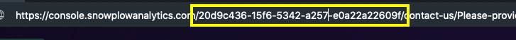

As well as managing [data products](/docs/understanding-tracking-design/defining-the-data-to-collect-with-data-poducts/index.md) through the Snowplow BDP Console, Snowplow BDP customers can also manage them programmatically through an API.

This functionality is key to automating existing processes and frequent manual tasks, including workflows in version control systems like GitHub.

Partnered with other tools like our [CI tool](/docs/managing-data-quality/testing-and-qa-workflows/using-the-data-structures-ci-tool-for-data-quality/index.md) and / or [Snowplow Micro](/docs/testing-debugging/snowplow-micro/what-is-micro/index.md), it's possible to have a very robust and automated data structure workflow that ensures data quality upstream of data hitting your pipeline.

## Getting started

You can have a look at and interact with all available endpoints in the [API documentation](https://console.snowplowanalytics.com/api/msc/v1/docs).

### Authorizing in the API documentation

To be able to post sample requests in the documentation you need to click the `Authorize` button at the top of the document and authorize with your token. The value for the token field in each individual request is overwritten by this authorization.

The endpoints focus on the main operations in the workflow around:

1. Retrieving existing data products and their event specifications, also known as tracking scenarios in the current (v1) API version
2. Creating new or editing existing data products
3. Viewing the data product history
4. Managing subscriptions for change notifications

Each request will need to include your company's `organizationID`, the UUID that can be retrieved from the URL immediately following `snowplowanalytics.com` when visiting the BDP console:



```mdx-code-block
import GetConsoleApiKey from "@site/docs/reusable/get-console-api-key/_index.md"

<GetConsoleApiKey/>
```

## Retrieving Information about Data Products

The following `GET` requests are designed to allow you to access information about data products. These data products could be stored in either your development environment registry or your production environment registry.

### Retrieve a List of All Data Products

To retrieve a comprehensive list of all data products in your organization, you can use the following GET request:

`**GET** ​/api​/msc​/v1​/organizations/{organizationId}/data-products/v1`

Path parameter `organizationId` is required.

### Retrieving Information about a Specific Data Product

`**GET** ​/api​/msc​/v1​/organizations/{organizationId}/data-products/v1/{dataProductId}`

Path parameters `organizationId` and `dataProductId` are required.

When retrieving a data product, it could also contain an array field `data[].tracking_scenarios` that will include the `id` and `url` of the associated tracking scenarios. For example:

```json
"data": [
  ...
  "trackingScenarios": [
    {
      "id": "d1336abc-1b60-46f7-be2d-2105f2daf283",
      "url": "https://next.console.snowplowanalytics.com/api/msc/v1/organizations/f51dada7-4f11-4b6a-bbbd-2cf6a3673035/tracking-scenarios/v1/d1336abc-1b60-46f7-be2d-2105f2daf283"
      }
  ]
  ...
]
```

Under the json path `includes.tracking_scenarios`, the API will also attach the whole tracking scenarios associated:

```json
"includes": {
  ...
  "trackingScenarios": [
    "id": "d1336abc-1b60-46f7-be2d-2105f2daf283",
     ...
  ]
  ...
}
```

### Retrieve History Information for a Data Product

If you wish to retrieve information about a specific data product, you can use the following GET request:

`**GET** ​/api​/msc​/v1​/organizations/{organizationId}/data-products/v1/{dataProductId}/history`

You can pass several parameters to control the result of the response:

- **before**: returns records equal or less than the timestamp in the ISO-8601 format
- **limit**: limits the number of records
- **offset**: skip the first N results
- **order**: order of returned records, `asc` or `desc`. Defaults to `desc`.

Path parameter `organizationId` is required.

## Creating and updating Data Products

### Creating a Data Product

This `POST` request allows you to create a new data product within an organization.

`**POST** ​/api​/msc​/v1​/organizations/{organizationId}/data-products/v1`

The request body is mandatory and should be in JSON format. Here’s an example of how the request body might look:

The request body is mandatory and should be in JSON format. The minimum payload would be a JSON with only the `name` of the data product. There rest of the fields are optional and not required on creation. Example:

```json
{
  "name": "Performance tracking",
  "description": "Tracks performance",
  "domain": "Marketing",
  "owner": "IT department",
  "accessInstructions": "The data can be accessed through company Superset"
}
```

### Updating a Data Product

Use this request to update a data product. The `dataProductId` is required, along with a valid request body.

The minimum payload on update would be the same as on creation but with the addition of the required `status` field. On creation, by default, it will set the `status` to `draft`.

`**POST** ​/api​/msc​/v1​/organizations/{organizationId}/data-products/v1/{dataProductId}`

See the [detailed API documentation](https://console.snowplowanalytics.com/api/msc/v1/docs) for all options.

### Delete a Data Product

Use this request to delete a data product. The `dataProductId` and `organizationId` are both required.

`**POST** ​/api​/msc​/v1​/organizations/{organizationId}/data-products/v1/{dataProductId}`

## Subscription Management for Data Products

### Retrieve All Subscriptions for a Data Product

To retrieve all subscriptions for a data product, use the following request. The `organizationId` and `dataProductId` are required.

`**GET** ​/api​/msc​/v1​/organizations/{organizationId}/data-products/v1/{dataProductId}/subscriptions`

### Add a Subscription

To add a subscription for a data product, use the following request. The `organizationId`, `dataProductId` and a valid request body are required.

`**POST** ​/api​/msc​/v1​/organizations/{organizationId}/data-products/v1/{dataProductId}/subscriptions`

This is the minimum payload that will create a subscription to the data product of the user that the bearer token has been issued:

```json
{
  "reason": "Get notified on breaking changes",
  "receiveNotifications": true
}
```

In case you want to subscribe a third user, you will need to provide another field `recipient` with the email of the user you want to subscribe.

When a subscription is created, it will send a confirmation email to the recipient (default user or third user). When the user clicks the "Confirm button" of the email, it will call the:

`**POST** /organizations/{organizationId}/data-products/v1/{dataProductId}/subscriptions/{subscriptionId}/actions/confirm`

endpoint and will set the `isConfirmed` field to `true`.

Once a subscription is created and the email has been confirmed, the subscriber will start receiving a daily feed email with all the data products that had changes in the last 24 hours.

### Update a Subscription

To update a subscription for a specific data product, use the following request. The `organizationId`, `subscriptionId`, `dataProductId`, and a valid request body are required.

`**PUT** ​/api​/msc​/v1​/organizations/{organizationId}/data-products/v1/{dataProductId}/subscriptions/{subscriptionId}`

### Delete a Subscription

To delete a subscription for a specific data product (unsubscribe action), use the following request. The `organizationId`, `subscriptionId`, `dataProductId`, and a valid request body are required.

`**DELETE** ​/api​/msc​/v1​/organizations/{organizationId}/data-products/v1/{dataProductId}/subscriptions/{subscriptionId}`

### Resend a Subscription Confirmation Email

To resend a subscription confirmation email, use the following request. The `organizationId`, `subscriptionId`, `dataProductId` are required.

`**POST** ​/api​/msc​/v1/organizations/{organizationId}/data-products/v1/{dataProductId}/subscriptions/{subscriptionId}/actions/resend-confirmation`

### Integration with the SDK Generator

To send emails with instructions for the SDK generator, use the following request. The `organizationId` amd `dataProductId` and a valid request body are required.

`**POST** /organizations/{organizationId}/data-products/v1/{dataProductId}/share-instructions`
