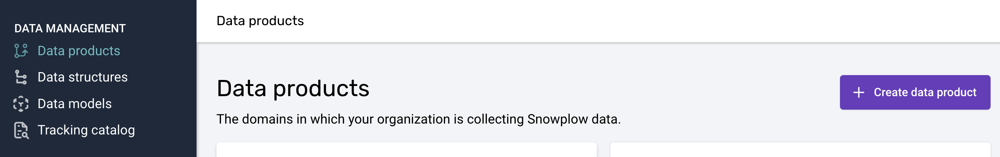
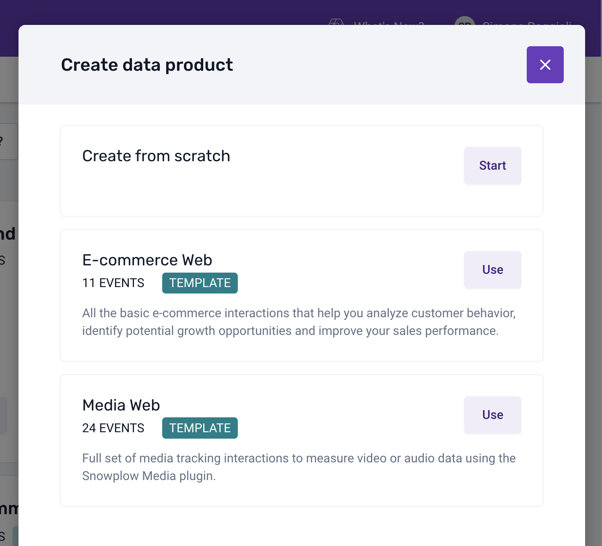
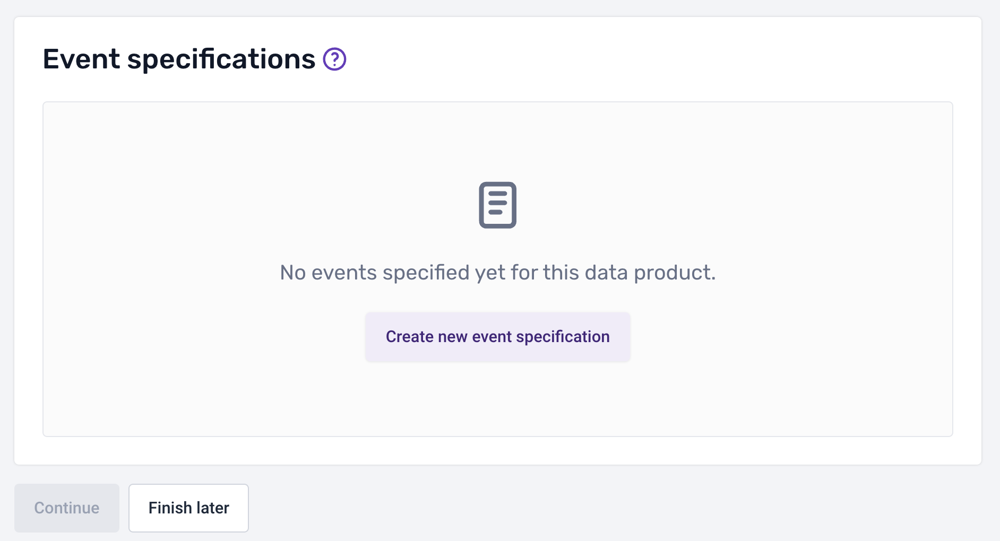

## Creating and editing a new Data Product using Console

To create a new data product, navigate to the "Data products" section from the navigation bar and click the "Create data product" button.

A modal will appear on the page, giving you the possibility to quickly create a data product by using one of the existing templates or create one from scratch.

After selecting "Create from scratch" a form will appear on the page. Enter your data product information and click "Create and continue" to navigate to the event specification page.

This page allows you to create multiple event specifications. You can click on any row to enter the details on this screen, or you can complete the information later.

When clicking on a event specification row, a page will allow you to enter additional information into separate modals:

- **Event information**; describes information such as which applications the event fires in
- **Event data structure**; determines how your data is structured and define the types of properties of the event
- **Entity data structures**; describes which entities to attach to the event when it is triggered
- **Event triggers**; specify the places and circumstances under which the event is triggered
- **Properties**; specify instructions about how each schema property should be set for this event specification

The breadcrumb navigation allows you to quickly navigate to the data product overview as well as to the list of data products. Alternatively, you can access the list of available data products by clicking `Data products` prominently displayed in the navigation bar on the left.

In the image below, you can see an example of a data product. It not only provides an overview of all the event specifications but also allows you to access three important pieces of functionality.

- **Share**; allow other members of your organization to access the data product
- **Subscribe**; receive notifications of any changes in the data product
- **Implement tracking**; automatically generate the code for your data product to be included in your application (to learn more visit [Code Generation - automatically generate code for Snowplow tracking SDKs](/docs/collecting-data/code-generation/index.md))

*Notes: sharing and subscribing is only available for users registered in Snowplow BDP Console.*

If you need to edit a data product at any time, simply select it from the data products listing accessible from the main menu.

#### Updating existing Data Products following the release of Source Applications

Data Products created prior to the release of [Source Applications](../organize-data-sources-with-source-applications/index.md) will need to be updated to assign Source Applications in which the events will be tracked on. The selected Source Applications will add the relevant application IDs to each of the event specifications in the data product. 

Event specifications which contain previously added application IDs will need to be updated to use the identifiers inherited from the Source Applications selected at Data Product level. This process can be done manually or you can [reach out to our team](#submitting-a-support-request) to help you with that.

