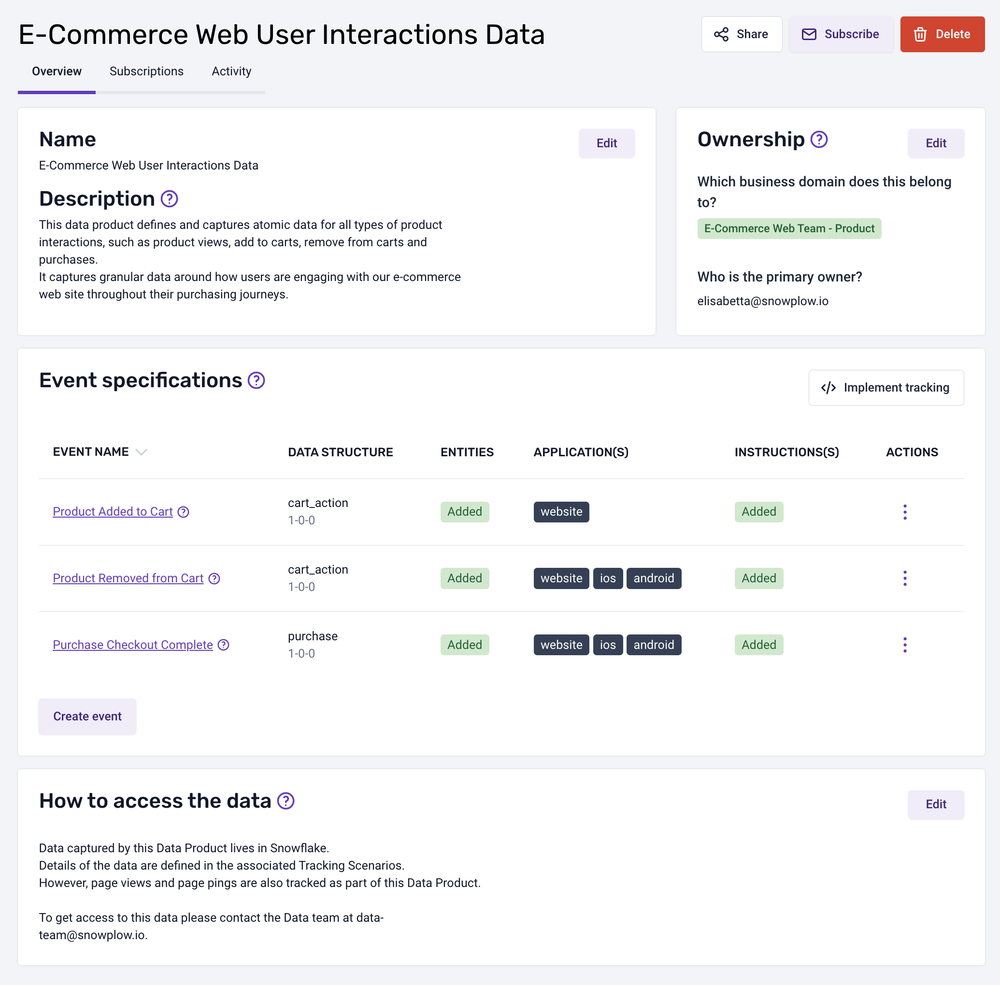

## Creating and editing a new Data Product using Console

To create a new Data Product, navigate to the 'Data products' option in the left main menu and click the 'Create data product' button. 

A form will appear on the page. Please enter your data product information into the form.

Cliking on the 'Create and continue' will brig you to the definition of 'Event specifications' page:

This page allows you to create multiple 'Event specifications'. You can click on any row to enter the details on this screen, or you can complete the information later.

When clicking on a 'Event specification' row, a page will allow you to enter additional information into separate modals:

- **Event information**: describes information such as which applications the event fires in
- **Event data structure**: determines how your data is structured and define the types of properties of the event
- **Entity data structures**: describes which entities to attach to the event when it is triggered
- **Event triggers**: specify the places and circumstances under which the event is triggered
- **Implementation instructions**: specify instructions about how each schema property should be set for this scenario

It is possible to have an overview of a data product by selecting the name in the breadcrumb navigation or by selecting in the data product listing always visible in the left menu.

In the image below you can see an example of data product, over than provide an overview about all the event specifications allow you to reach three important functionalities:

- **Share**: allow other members of your organization to access the data product
- **Subscribe**: allow other members to being notified of any changes in the data product
- **Implement tracking**: allow to automatically generate the code for your data product to be included in your application

If you need to edit a data product at any time, simply select it from the data products listing accessible from the main menu.