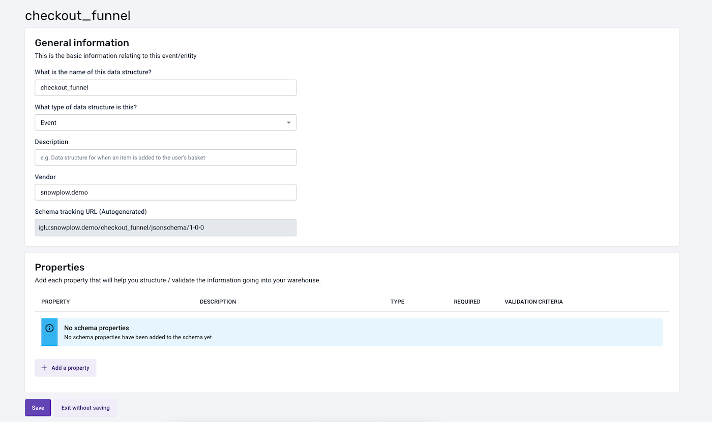

:::info
The Data Structures Builder is only available for BDP Cloud Customers
:::

To create a new Data Structure, first navigate to **Data Structures** in the menu and click the **'Create a Data Structure'** button.

Populate the general information, such as *Name,* and a *Description* and *Vendor*. *Vendor* allows you to organise your data structures, for example, by teams. Snowplow will automatically generate the Tracking Url to be referenced in your tracking code.

You can then add one or multiple properties. For each property, you can set a name, description, its type, a possible enumeration of allowed values. You can also set additional constraints to define if this property should be optional or mandatory, and if *null* values are allowed.

Click save on the Property modal and this will save your property changes.

Clicking Save on the Data Structure page will publish your Data Structure to your Iglu Server.

For information about editing and versioning your Data Structure please see the [Versioning in BDP Cloud section](/docs/understanding-tracking-design//versioning-your-data-structures/cloud/index.md).
