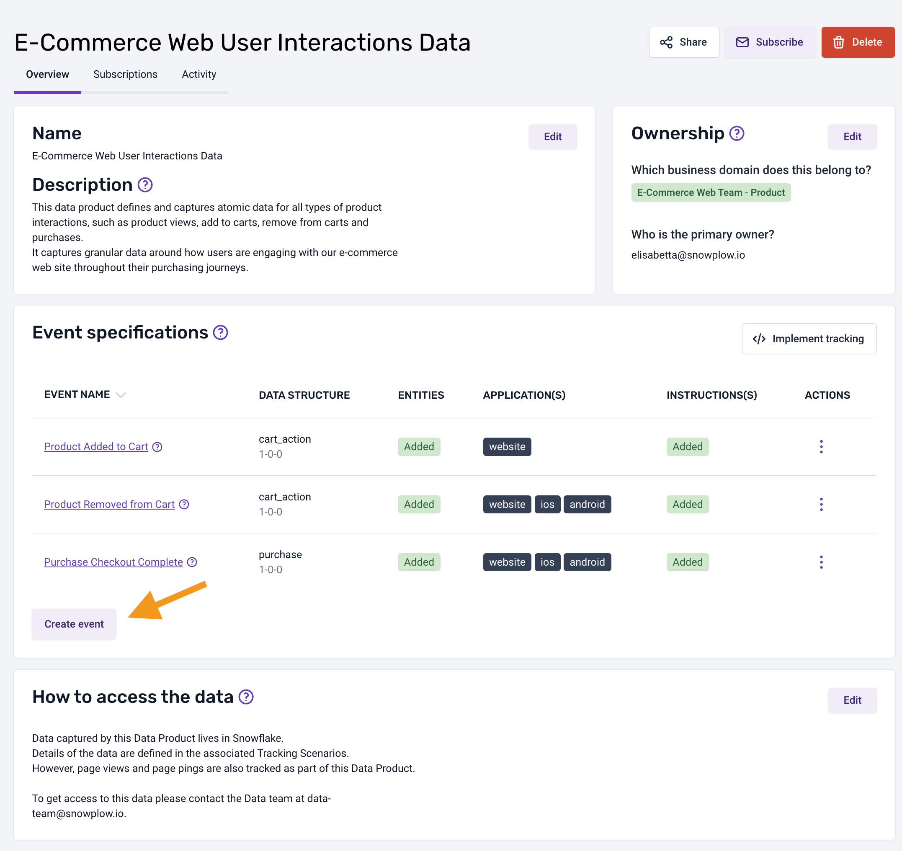
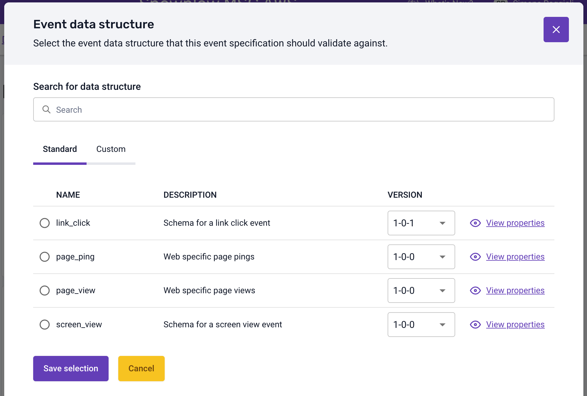
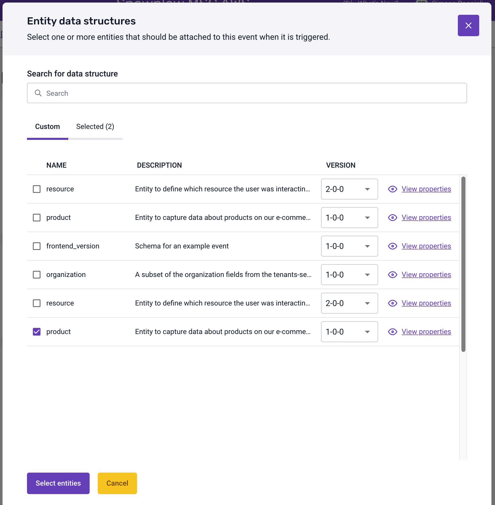
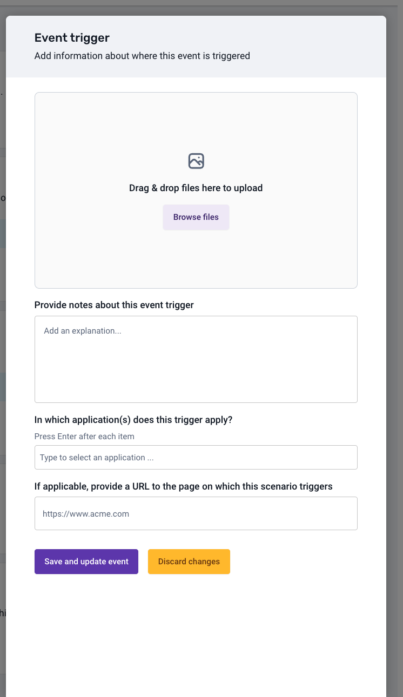

## Crafting a New Event Specification through the Console

Event specifications serve as direct counterparts to [data structures](/docs/understanding-tracking-design/managing-your-data-structures/ui/index.md) and encapsulate the documented events within a data product.

:::info
Please note that the creation of event specifications is exclusive to data products.
:::

Create event specifications in tandem with the latest deployed data structure version in production. This ensures tracking implementation instructions align with the validation criteria in the event specification.

Your event specification guarantees compatibility with the associated data structure version. This ensures events tracked using specified instructions pass validation for the associated data structure.

If a newer event specification version is deployed, consider upgrading event specification and tracking to the latest data structure, ensuring ongoing compliance with validation requirements.

## Creating and Editing Event Specifications

To create a new event specification, follow these steps:

1. Select a data product
2. Click the "Create event" button
3. A dialog will appear, prompting you to enter a name for your event specification and click "Save and continue"
4. Your first event specification will be displayed on the page

To add more information or modify an existing event specification, follow these steps:

1. Navigate to the appropriate data product
2. Select the desired event specification
3. This action will open on overview of the selected event specification containing the details that have been added to date.

This interface is divided into focused sections; explore each section below for more details.

### Event Information

This section provides essential meta-information for your event specification, including the event name, description, and the applications in which this event is tracked.

### Event Data Structure

This section defines the structure of your data and specifies the types of properties associated with this event, along with its version.

You can choose from two types of data structures:

- **Standard**; Provided by the Snowplow tracker by default
- **Custom**; Provided by your organization

## Entity Data Structures

Within this section, you have the flexibility to define the entities that should be associated with the event when it is triggered.

To facilitate making an informed selection of your entities, you are able to view a detailed breakdown of the properties associated with your chosen entity for a specific version.

### Event Triggers

This section defines the locations and circumstances under which this event is triggered.

To create your first trigger, simply select the "Add trigger" button. You can edit or delete an existing trigger by clicking the dedicated buttons beside each entry in the triggers list.

A dialog will appear, allowing you to upload an image and provide additional context, such as the URL to the page on which this trigger applies.

### Properties

This section allows you to specify how each property for a selected event data structure should be populated.

The dialog displays the list of properties defined in the data structure associated with this event specification.

You can configure detailed instructions for any of the properties shown in the list by clicking the "Add" or "Edit" buttons. Once you have selected the type of instruction you wish to add and have filled in the required input fields, you are then able to click 'Add instruction' and return to the properties list. Following that, you can continue adding instructions for the remaining properties or you can submit your selection by clicking "Save and update instructions".

*Notes: instructions for required properties are added by default and can be edited but they cannot be deleted.*

