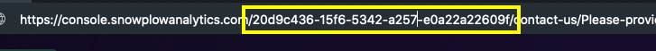
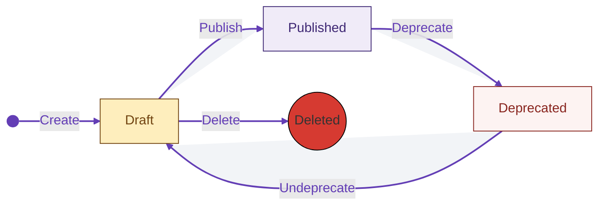
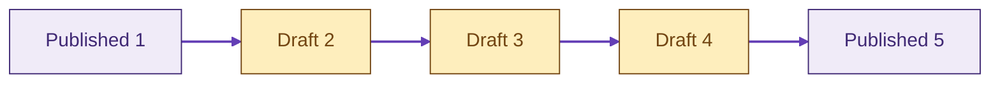
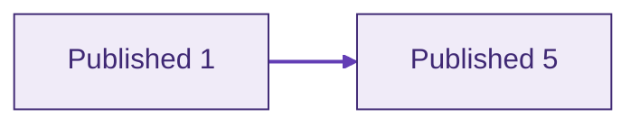

With the [**Tracking Scenarios API**](https://console.snowplowanalytics.com/api/msc/v1/docs), you can efficiently manage tracking scenarios programmatically. Whether you want to retrieve, create, edit, publish, deprecate, or delete tracking scenarios, the API provides the necessary endpoints and functionalities.

## Getting Started
For detailed information about each request, including query parameters and response formats, refer to the corresponding [API documentation](https://console.snowplowanalytics.com/api/msc/v1/docs).

### Authorizing in the API Documentation

To be able to post sample requests in the documentation you need to click the `Authorize` button at the top of the document and authorize with your token. The value for the token field in each individual requests is overwritten by this authorization.

Each request will need to include your company's `organizationID` which is a UUID that can be retrieved from the URL immediately following `.com` when visiting console:



```mdx-code-block
import Block14551 from "@site/docs/reusable/14551/_index.md"

<Block14551/>
```

## Response Format

The Tracking Scenarios API uses a specific response format for success cases (`2xx`) and for cases where critical and non-critical errors can occur, such as (`422`) **Unprocessable Entity**.

```
{
    "data": [
        // Tracking scenarios
    ],
    "includes": [
        // Additional tracking scenario info
    ],
    "errors": [
        // Warnings or errors
    ]
}
```

- `data`: Contains the scenario or scenarios, depending on the request.
- `includes`: Contains additional information, such as the history of tracking scenario changes.
- `errors`: Contains a list of errors or warnings, depending on the request.

While on `2xx` code responses the errors array can only contain errors of type **Warning**, and it will create or update the tracking scenario. On the other hand, on `422` responses, the errors array will contain at least one **Error** type and won't perform any creation or update.

<details>
Some endpoints perform a validation of the tracking scenario `event`. 

```
...
"event": {
    "source": "iglu:com.example/ui_actions/jsonschema/1-0-0",
    "schema": {
        "$schema": "http://json-schema.org/draft-04/schema#",
        "description": "Event to capture search submit",
        "type": "object",
        "required": [
            "label",
            "action"
        ],
        "properties": {
            "action": {
                "type": "string",
                "enum": [
                    "click"
                ]
            },
            "label": {
                "type": "string",
                "enum": [
                    "Search"
                ]
            }
        },
        "additionalProperties": false
    }
}
...
```

This validation checks the compatibility of a particular tracking scenario version with the source schema version referenced by `event.source`.

Normally, a tracking scenario is compatible with the source schema version when created. However, there could be cases where the schema evolves to a new version and is not backward compatible. In such cases, a **Warning** or **Error** (depending on the endpoint) can be returned in the errors field, providing information about the severity, tracking scenario ID, schema, version, and reason for the incompatibility.

```
...
"errors": [
    {
        "type":"Warning",
        "code":"SchemaIncompatible",
        "title":"Tracking scenario with id: 59b5e250-91c4-45af-a63d-5f8cd39f4b67, event schema is INCOMPATIBLE with schema with name: test_event, vendor: com.snplow.msc.aws, version: 1-0-13",
        "source":"event.schema"
    }
]
...
```
</details>

We will discuss each case, explaining the request type, use case scenarios, and the different content that these fields may have.

## Retrieve a List of Tracking Scenarios

Use this request to retrieve a list of scenarios within an organization, which will be wrapped into the `data` field of the [response](#response-format).

`GET /api/msc/v1/organizations/{organizationId}/tracking-scenarios/v1`

### Query Parameters and Filters

You can filter the results based on the following query parameters:

- `dataStructureId`: Filters the tracking scenarios associated with a particular data structure based on the source schema.
- `dataStructureVersion`: Filters the tracking scenarios associated with a specific data structure version when used with `dataStructureId`.
- `withLatestHistory`: When `true` it will return a list of tracking scenarios in the `data` array of the response and the latest change for each of the tracking scenario in the `includes` array. The relation between tracking scenarios in `data` and history in `includes` can be determined by `id = scenarioId`.
- `status`: Filters the tracking scenarios that match the specified status.

### Compatibility Checks

This request may return warnings within the `errors` field of the response:

- **SchemaIncompatible**: The tracking scenario is not compatible with a specific source schema version. The `type` is always `Warning`.
- **SchemaUndecidable**: It cannot determine the compatibility of the tracking scenario with a specific source schema version due to the use of some advanced JSON-Schema features and that the complexity of checking if the tracking scenario is compatible agains the source schema is very high and would require heavy computations. The `type` in this case will always be `Warning` and it is the user the one that is responsable of making sure the tracking scenario is compatible with the source schema.

## Retrieve a Specific Tracking Scenario

Use this request to retrieve a specific tracking scenario within an organization, which will be wrapped into the `data` field of the response.

`GET /api/msc/v1/organizations/{organizationId}/tracking-scenarios/v1/{trackingScenarioId}`

### Query Parameters and Filters

You can filter the results based on the following query parameters:

- `withHistory`: Returns a list with the history for the tracking scenario in the `includes` field of the response, related to the tracking scenario by its ID.
- `status`: Filters the tracking scenarios that match the specified status.

## Creating a Tracking Scenario

Use this request to create a tracking scenario within an organization.

`POST /api/msc/v1/organizations/{organizationId}/tracking-scenarios/v1`

### Request and Response

The creation form has two fields at the top level, as shown in this example:

```
{
    "scenario": {
        "name": "Search",
        "description": "Tracking the use of the search box",
        "event": {
            "source": "iglu:com.example/ui_actions/jsonschema/1-0-0"
        }
    },
    "message": "initial draft"
}
```

- `message`: An optional field to provide a message.
- `scenario`: The definition of the tracking scenario, which should comply to the given JSON Schema shown on [Validations](#validations).

By default, the tracking scenario will be created with `scenario.status` set to `draft` and `scenario.version` set to `0` if not provided. These values can be changed and managed after creation. Here is an example response:

```
{
    "data": [
        {
            "id": "5a203ef8-939b-4fd1-914e-f12a3dd1a869",
            "version": 0,
            "status": "draft",
            "name": "Search",
            "description": "Tracking the use of the search box",
            "event": {
                "source": "iglu:com.example/ui_actions/jsonschema/1-0-0"
            }
        }
    ],
    "includes": [
        {
            "author": "39b81015-1bd5-4b37-96c7-3296cabaa36f",
            "message": "initial draft",
            "date": "2023-04-26T14:41:48.708191Z",
            "scenarioId": "5a203ef8-939b-4fd1-914e-f12a3dd1a869",
            "version": 0,
            "status": "draft",
            "type": "History"
        }
    ],
    "errors": []
}
```

### Validations

- **Scenario**: The content of the `scenario` field from the request form is validated against a JSON schema:
```
{
    "$schema": "http://iglucentral.com/schemas/com.snowplowanalytics.self-desc/schema/jsonschema/1-0-0#",
    "self": {
        "vendor": "com.snowplowanalytics.snowplow.bdp",
        "version": "1-0-0",
        "format": "jsonschema",
        "name": "tracking-scenario"
    },
    "id": "http://iglucentral.com/schemas/com.snowplowanalytics.snowplow.bdp/tracking-scenario/jsonschema/1-0-0#",
    "type": "object",
    "properties": {
        "id": {
            "type": "string",
            "pattern": "^[0-9a-fA-F]{8}-[0-9a-fA-F]{4}-[0-9a-fA-F]{4}-[0-9a-fA-F]{4}-[0-9a-fA-F]{12}$"
        },
        "version": { "type": "integer", "minimum": 0 },
        "status": { "enum": ["draft", "published", "deprecated"] },
        "name": { "type": "string", "minLength": 1 },
        "description": { "type": "string" },
        "owner": { "type": "string" },
        "triggers": { "type": "array", "items": { "type": "string" } },
        "appIds": { "type": "array", "items": { "type": "string" } },
        "event": {
            "type": "object",
            "properties": {
                "source": { "type": "string", "format": "uri" },
                "schema": {
                    "$ref": "http://json-schema.org/draft-04/schema#"
                }
            },
            "required": ["source"]
        },
        "entities": {
            "type": "object",
            "properties": {
                "tracked": {
                    "type": "array",
                    "items": {
                        "type": "object",
                        "properties": {
                            "source": { "type": "string", "format": "uri" },
                            "minCardinality": {
                                "type": "integer",
                                "minimum": 0,
                                "default": 0
                            },
                            "maxCardinality": { "type": "integer" }
                        },
                        "required": ["source"]
                    }
                },
                "enriched": {
                    "type": "array",
                    "items": {
                        "type": "object",
                        "properties": {
                            "source": { "type": "string", "format": "uri" },
                            "minCardinality": {
                                "type": "integer",
                                "minimum": 0,
                                "default": 0
                            },
                            "maxCardinality": { "type": "integer" }
                        },
                        "required": ["source"]
                    }
                }
            }
        }
    },
    "required": ["name", "event"]
}
```

- **Name**: It validates that the `scenario.name` of a tracking scenario is unique within the data structure context inferred from the source schema `scenario.event.source`.
- **Entities**: If present during creation, it will validate that the entities, `scenario.entities.tracked` and `scenario.entities.enriched`, are not duplicated.

### Compatibility Check

If a `scenario.event` is provided during creation, a compatibility check will be performed between the provided event and the one referenced in the source schema by `scenario.event.source`.

This check is performed for the version indicated by the Iglu URI, referred to as the **current** version. Additionally, the compatibility check is also run for the **latest** version. The compatibility check results in three possible values: **Compatible**, **SchemaIncompatible**, or **SchemaUndecidable**. The different errors will be provided in the `errors` field of the [response](#response-format).

- If **Compatible**, no errors or warnings will be attached to the `errors` response field.
- If **SchemaIncompatible**, an error will be attached to the `errors` response field when the **current** version is incompatible, resulting in a **422 Unprocessable Entity** response without being able to create the tracking scenario. If the **latest** version is incompatible, a warning will be attached to the `errors` field, but a **201 Created** response will still be returned.
- If **SchemaUndecidable**, a warning will be attached to the `errors` response field.

:::info
The algorithm used to perform the compatbility check is based on the [Finding Data Compatibility Bugs with JSON Subschema Checking](https://dl.acm.org/doi/pdf/10.1145/3460319.3464796) paper published by Andrew Habib, Avraham Shinnar and Michael Pradel.
:::

## Editing a Tracking Scenario

Use this request to edit a tracking scenario within an organization. The [request and response](#request-and-response) follow the same format as during creation.

`PUT /api/msc/v1/organizations/{organizationId}/tracking-scenarios/v1/{trackingScenarioId}`

### Publishing a Tracking Scenario

By default, when a tracking scenario is created and no value is provided for `scenario.status`, it is set to **draft**. This suggests a tracking scenario lifecycle that we recommend following, especially when using the API in conjunction with the Console.



In addition to this lifecycle and in conjunction with versioning, we enforce that when a tracking scenario is **published**, the versions between two published versions are **squashed**. For example:

Publish new version, before squash:



After squash:



### Deprecating a Tracking Scenario

Tracking scenarios can also be **deprecated** by changing the `scenario.status` field to `deprecated`. This will essentially be a tag that will tell the users, developers or customers of a tracking scenario to not relly on it anymore.

### Validations

- **Id**: The `scenario.id` cannot be changed.
- **Entities**: Similar to creation, the `scenario.entities.tracked` and `scenario.entities.enriched` fields are checked to ensure they do not contain duplicates.

### Compatibility Check

The same compatibility check performed during [creation](#compatibility-check) will be carried out.

## Deleting a Tracking Scenario

Use this request to delete a tracking scenario within an organization.

`DELETE /api/msc/v1/organizations/{organizationId}/tracking-scenarios/v1/{trackingScenarioId}`

:::warning
Please note that this action is irreversible and will permanently delete the tracking scenario.
:::