Configure specific implementation rules, entities and triggers for your tracking, boosting decision making and collabortation among team members through BDP Console.

## Creating a New Tracking Scenario draft

To create a new Tracking Scenario, first navigate to **Data Structures** in the menu. From there, select a data structure from the list.

:::info
Tracking Scenarios can only be created from Data Strucutres that have been set as **Event**.
:::

After selecting a data structure, click on the **Tracking Scenarios** tab as shown in the image.

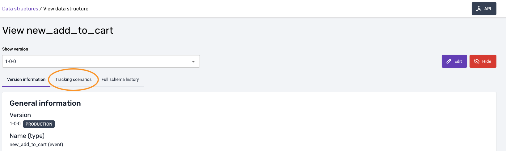

Next, click the **'Add new scenario'** button. A new modal will appear with fields for basic information that can be defined during creation, as shown.

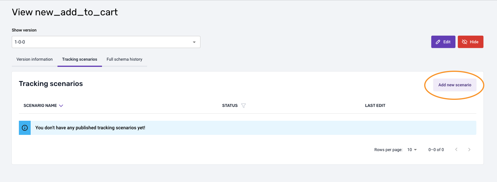

Be aware of the **Show version** of the data structure againsta which the Tracking Scenario will be created. This means that the tracking will be compatible with this specific Data Structure version but may not be compatible against other versions or future versions if they evolve.

The fields available to fill at this stage are:

- A text field with the **Scenario name**. 
- A tag field to indicate which applications this scenario is design to tracked. This will allow to create or reuse existing tags from other defined tracking scenarios.
- A free text field for a **description** of the tracking scenario.

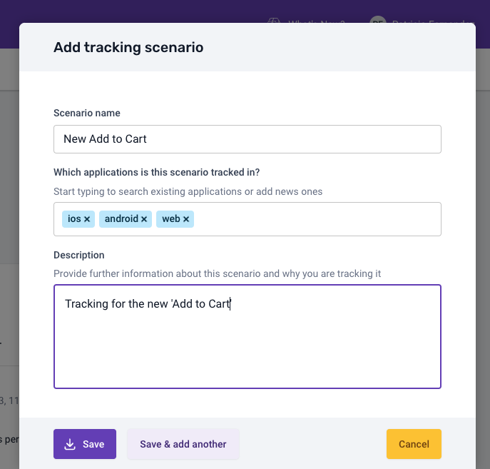

Clicking the **'Save'** button will create the tracking scenario. If you want to create multiple scenearios at once, for example, different scenarios for mobile and web tracking, click the **'Save & add another'** button instead. You can cancel the creation process by clicking **'Cancel'** button.

When you're done creating your first tracking scenario, you will see a list of tracking scenarios on the page.

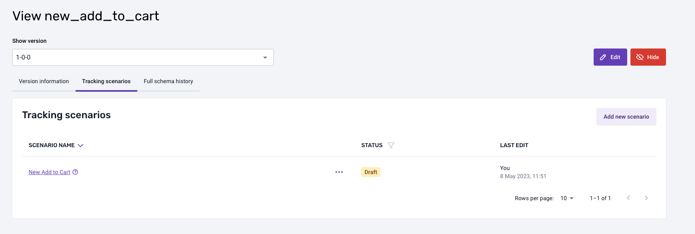

:::info
By default, a newly created tracking scenario will have its status set as **Draft**. We'll explain how this can be changed and its purpose later.
:::

* * *

## Editing a Tracking Scenario

To edit an existing tracking scenario, start at the Data Structure and **Tracking scenarios** tab that contains the tracking scenario you want to edit. Click on the name of the tracking scenario you wish to edit.

A new page will display the details of the tracking scenario. 

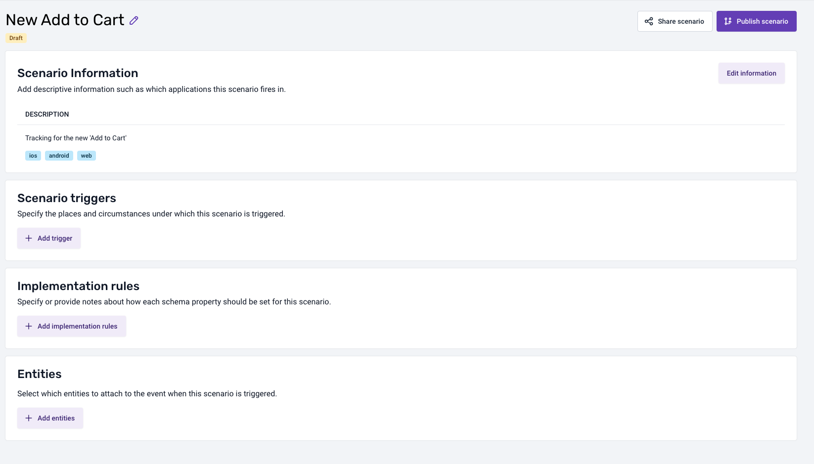

You can edit the following fields in this page.

### Scenario Information

Click the **'Edit information'** button in the **Scenario Information** section or the **pencil icon** at the right side of the tracking scenario name to open a modal view similar to the creation one, but with the current information already filled.

Yo will be able to modify all of the field previously during the creation stage.

To confirm the changes, click **'Save and update scenario'**. To cancel, click the **'Cancel'** button, both at the bottom of the modal.

### Triggers

Add multiple triggers by clicking the **'+ Add trigger'** button on the **Scenario Triggers** section. A new modal view will appear with a text field where you can specificy information about when, where and how the scenario will be triggered.

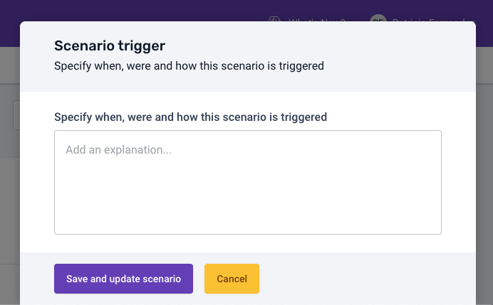

Once completed, you can confirm the changes by clicking the **'Save and update scenario'** button or cancel the changes by clicking the **'Cancel'** button.

You will be able to edit it after adding a trigger.

### Implementation rules

Add multiple implementation rules by clicking the **'+ Add implementation rules'** button in the **Implmentation rules** section. A new modal view will appear.

This modal displays a list of rules for specific properties that can be set. This list of posible rules is populated based on the Data Structure properties from the specific version that the Tracking Scenario was created from. A search bar will also be available to help search and filtering by rule name.

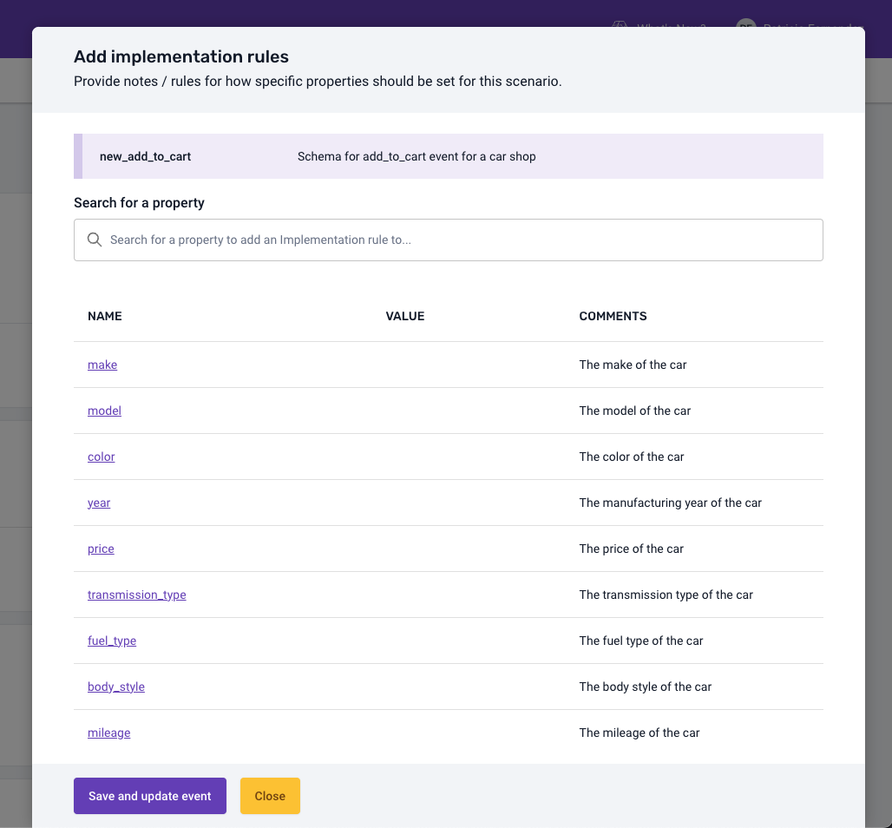

You can click on any of the properties that are shown in the list. A new view inside the modal will show where you'll be able to configure the rule's **Type of condition**, **Value** and **Comments** properties. 

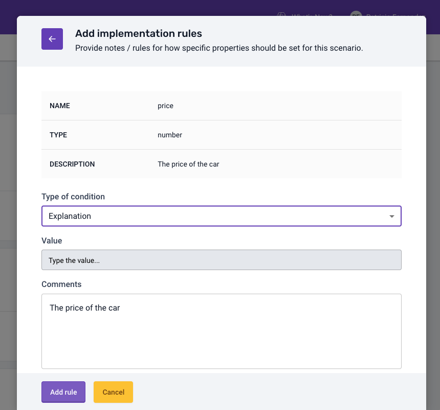

Click **'Add rule'** to add rules or **'Cancel'** button to discard changes.

Once you've configured the rules, click the **'Save and update event'** to confirm the changes or **'Close'** to discard them.

You will see a list of rules in the tracking detail view where you can edit or remove them.

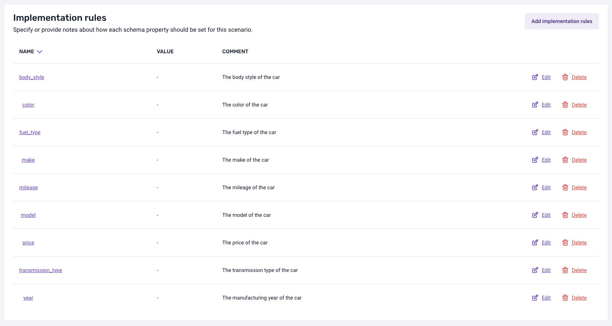

### Entities

Add multiple entites by clicking the **'Add entities'** button. A new modal view for configuring entites will appear.

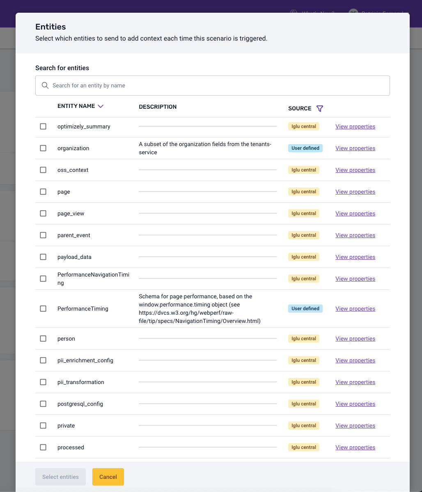

Similar to the **Add implementation rules** modal, you will be able to add multiple entities from the list of entites displayed, sourced from your [Iglu](/docs/understanding-your-pipeline/glossary-of-terms/index.md#iglu). For each of the entities, you can view detailed information about the properties of the entity by clicking **'View properties'**. A search bar will also be available to help search and filter by entity name.

Once you've selected the entities you want to add to the tracking scenario, click the **'Select entities'** button to confirm or the **'Cancel'** button to discard your selections.

Once selected you will be shown with a new view inside the modal where you can select the cardinality of the entities.

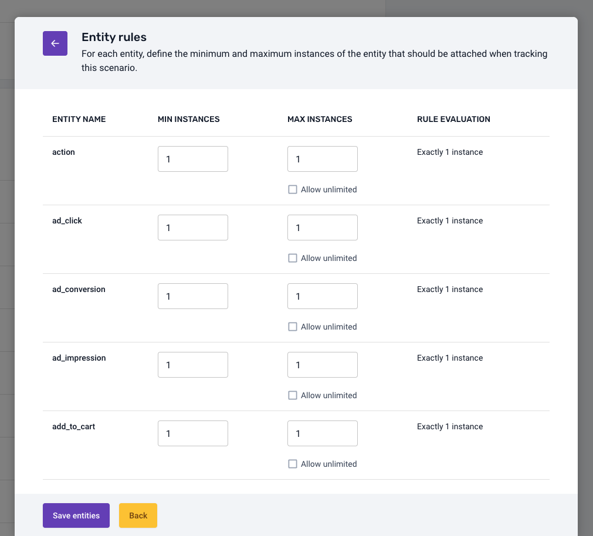

It will save the entites on **'Save entities'** click or back to the previous selection view clicking **'Back'**.

Once saved the entities you will see a list of entities in the tracking detail view where you can edit, add or remove them.

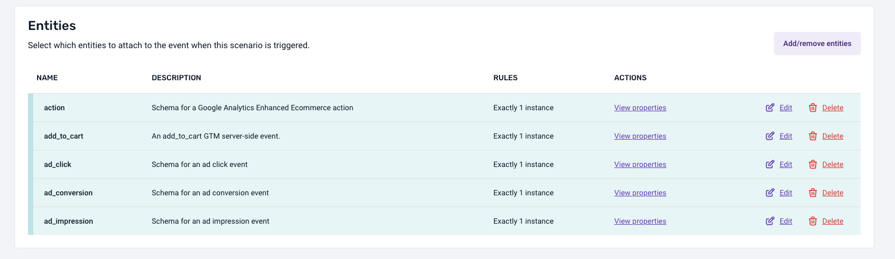

* * *

## Publishing a Tracking Scenario

When you've configured a tracking scenario and you are ready to publish it, go to the **Tracking scenario** tab view, select the scenario by clicking on its name, and then click the **'Publish scenario'** button at the right side of the scenario name from the detailed view.

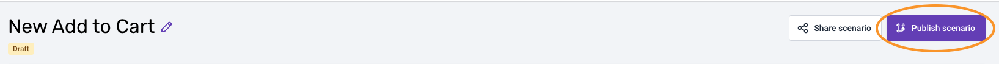

Once the scenario is published, it will no longer appear with the status **Draft** but instead with the status **Published** in the list view. When a scenario is published, you won't be able to edit it anymore unless you create a new **Draft** version. To do this  click on the scenario name from the list of tracking scenarios, and in the detailed view, instead of the previous **'Publish scenario'** button, you will see a **'Create a draft & edit'** button instead of the publish one.

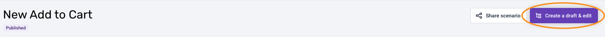

* * *

## Scharing a Tracking Scenario

You may want to share a tracking scenario, whether it is published or still on draft. To do this from the **Tracking scenario** tab, click on the tracking scenario name you want to share, and then from the detailed view, click the **'Share scenario'** button near to the publish button.

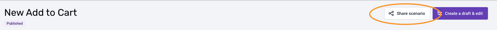

Then a modal view with a link with a **'Copy'** button will appear.

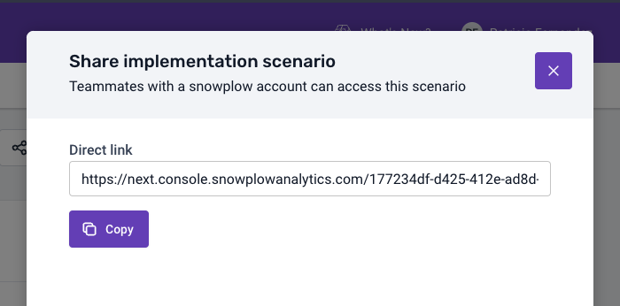

* * *

## Deleting Drafted Tracking Scenarios

You can delete a tracking scenario, but this is only possible for *Draft* versions. To delete a Draft tracking scenario, got to the **Tracking scenarios** tab and click the **'Delete'** button.

A confirmation modal will appear.

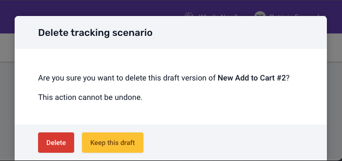

:::warning
This opeartion can't be undo.
:::

## Deprecating Published Tracking Scenarios

You can deprecate a tracking scenario, but this is only possible for *Published* versions. To deprecate a Published tracking scenario, got to the **Tracking scenarios** tab and click the **'Deprecate'** button.

A confiramtion modal will appear where you can add some comments. 

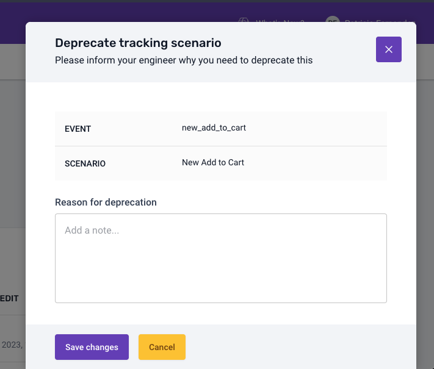

Once you deprecate on a Published scenario you will see the new **Deprecated** status.

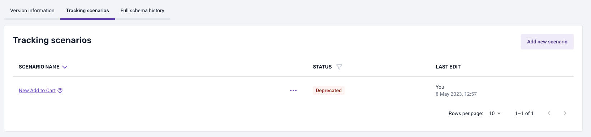

:::info
You can undo this action by clicking on the scenario and on the detail view you will be shown a **'Change status to draft'** button.

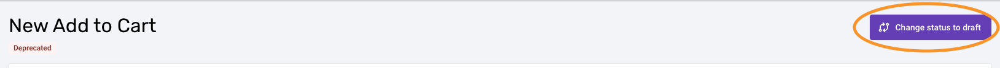
:::

:::info
You can perform some of this actions, **'Publish'**, **'Share'**, **'Delete'**, **'Create a draft & edit'** and **'Deprecate'** on a tracking scenario clicking the triple-dot menu button **'...'** from the **Tracking scenario** tab view.

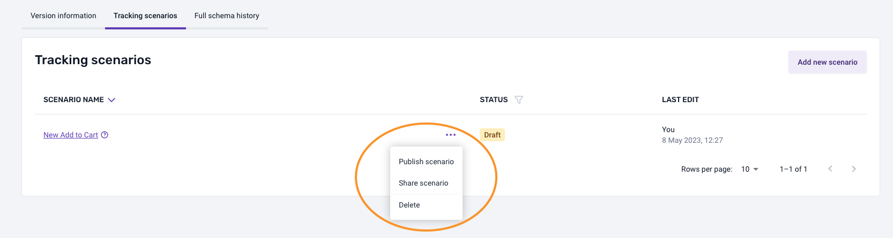
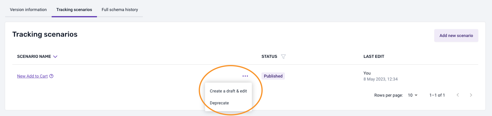
:::
