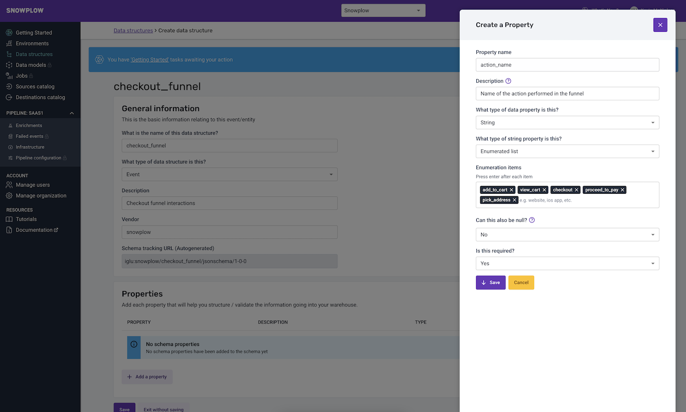
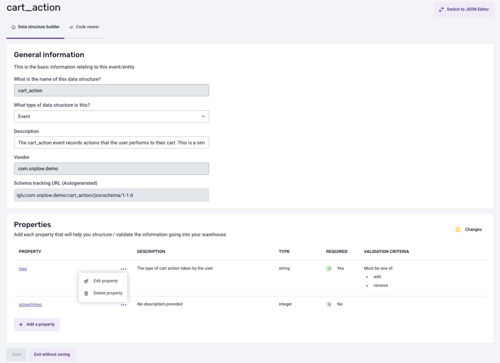
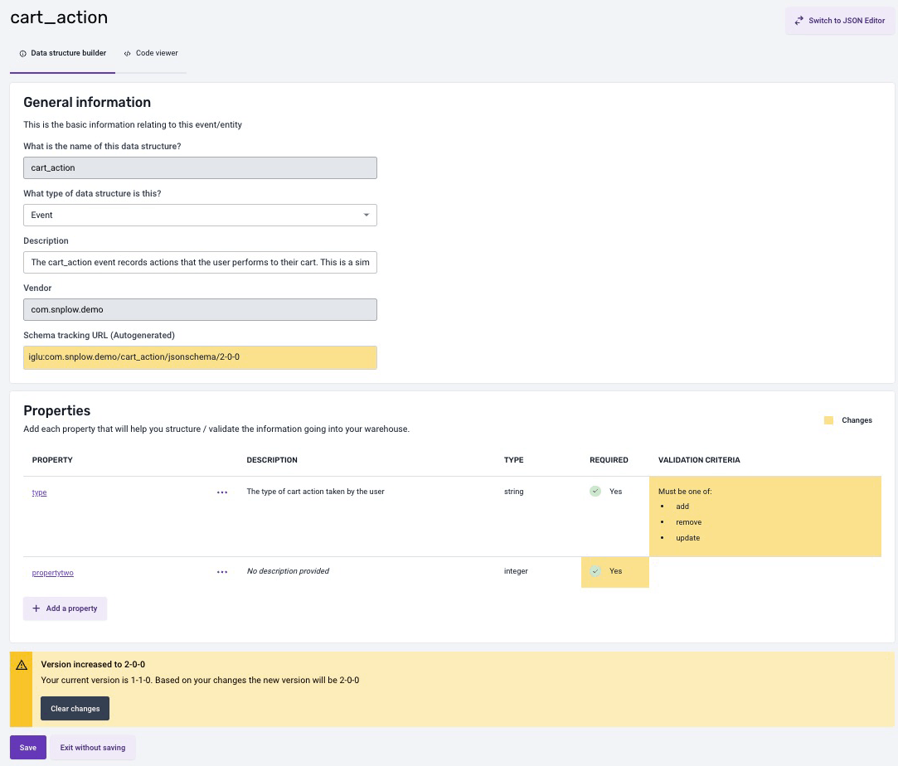

Quickly create an event or entity with our guided setup and automated versioning.

#### Properties supported:
- string
- enumerated list
- integer 
- decimal
- boolean

For more complex data structures that require heavy nesting and more advanced data types use the [JSON Editor](../json-editor/index.md).

***

## Creating a new data structure with the Data Structures Builder

Populate the general information, such as Name, and a Description and Vendor. Vendor allows you to organize your data structures, for example, by teams. Snowplow will automatically generate the Tracking Url to be referenced in your tracking code.

When creating a new [Data Structure](/docs/understanding-your-pipeline/schemas/index.md), you can add one or multiple properties. For each property, you can set a name, description, its type and a possible enumeration of allowed values (for type *string*). You can also set additional constraints to define if this property should be optional or mandatory, and if *null* values are allowed.

Click “Save” on the Property dialog box and this will save your property changes.

Clicking “Save” on the Data Structure page will publish your Data Structure to your Iglu Server.

*** 

## Editing a data structure with the Data Structures Builder

On the edit page, under the General Information panel, you can update the data structure type or its description. To add a new property, cick the 'Add Property' button. To edit or delete an existing property, click the three dots next to the property name to open the action menu, and then select the appropriate option.

When you modify the data structure, the builder will mark your changes in yellow and automatically decide the versioning of your data structure based on these modifications. You can reset the data structure and erase all changes at any moment by clicking the 'Clear Changes' button found in the alert beneath the properties.

If you are satisfied with your changes, click 'Save' and make sure to note the newly updated tracking URL.

