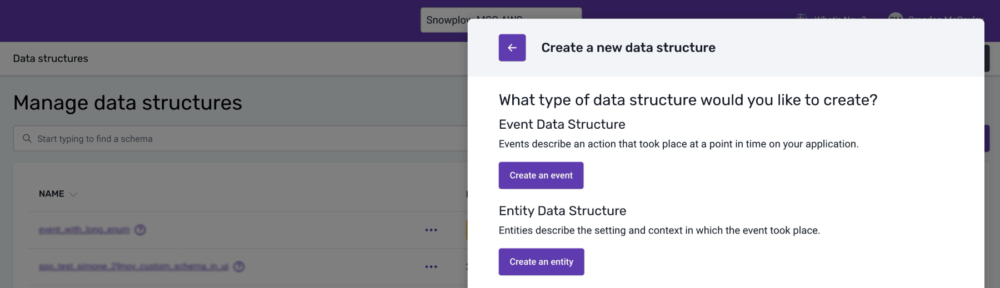
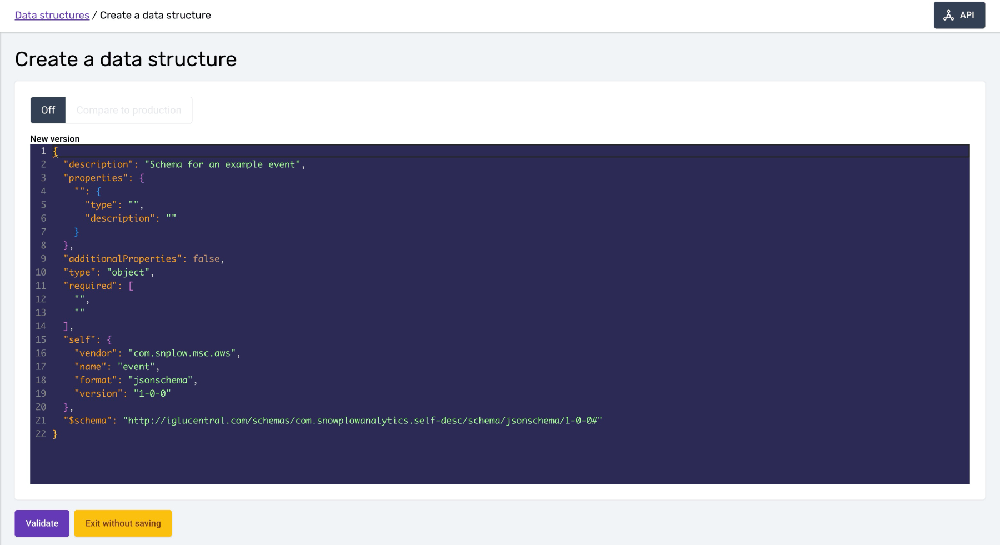
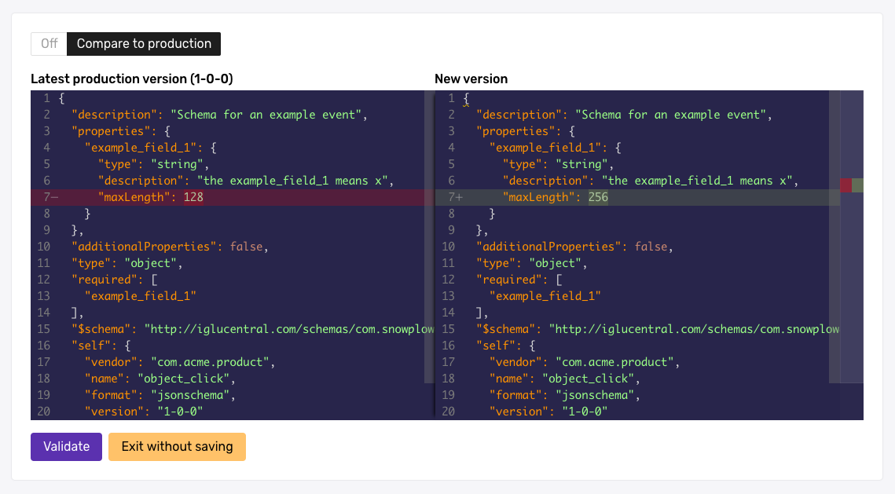
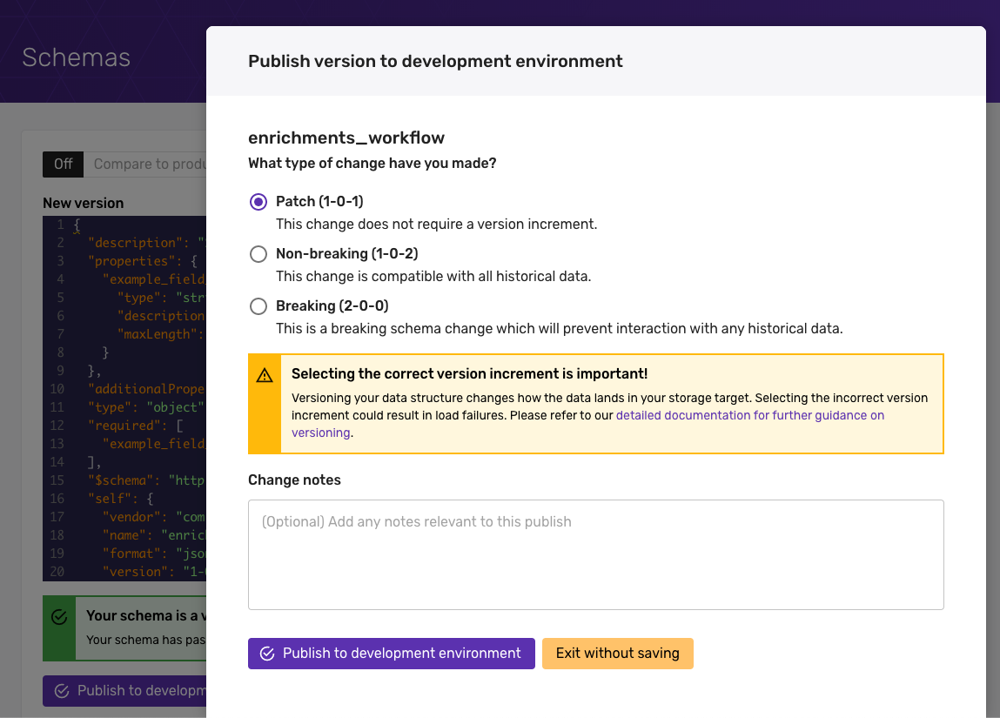

:::info
The JSON editor is ideal for more complex data structures that require heavy nesting and more advanced data types. For simple data structures, use the [Data Structures Builder](/docs/understanding-tracking-design/managing-your-data-structures/ui/builder/index.md).	
:::

## Creating a new data structure

Select whether you'd like to create an [Event](/docs/understanding-your-pipeline/events/index.md) or an [Entity](/docs/understanding-your-pipeline/entities/index.md). You can always change this selection at a later date.    

You can now write the first version of your JSON schema for this Data Structure. Some template JSON is provided in the code window to start you off.

Once you are done, click the **'Validate'** button and we'll validate that your schema is valid JSON markup. Assuming it passes validation the 'Publish' button will activate.

Click **'Publish to development environment'** to publish your Data Structure to your development environment. As this is the first version of your data structure it will be created as version `1-0-0`. Click publish again on the modal dialog to confirm the action.

Your new Data Structure will be published to your development environment ready [for you to test](/docs/managing-data-quality/testing-and-qa-workflows/index.md).

## Editing a data structure

Make the required edits to the JSON schema. You can use the 'Difference' toggle above the editor to see a 'diff' view against the latest Production version of your data structure.

In the example below we have changed the `maxLength` of `example_field_1`.

Once you are happy with your changes, click **'Validate'** to ensure you have valid JSON markup. Then click **'Publish to development environment'** to save your changes to your development environment.

The versioning modal dialog will appear, at this point you have three options:

- Increment a minor version to indicate a non-breaking change to the schema. In our example, this would increment the schema to from `1-0-1` to `1-0-2`.
- Increment a major version to indicate a breaking change to the schema. In our example, this would increment the schema from `1-0-1` to `2-0-0`.
- [Patch the current version](/docs/understanding-tracking-design/versioning-your-data-structures/amending/index.md#patching-the-schema), this will overwrite the existing schema without increasing the version. In our example, this would leave the schema at 1-0-1.

:::caution Selecting the “patch” option

Patching can be useful in development environments, but should be done carefully and should never be done in production. See [amending schemas](/docs/understanding-tracking-design/versioning-your-data-structures/amending/index.md) for an explanation and some suggestions.

:::

For more information see [Versioning your data structures](/docs/understanding-tracking-design/versioning-your-data-structures/index.md).

Once you have selected the appropriate version, click **'Publish to development environment'** and your edits will be published to your development environment ready [for you to test](/docs/managing-data-quality/testing-and-qa-workflows/index.md).

You can identify Data Structures where the Development version is ahead of the Production version by the yellow background on the version number. In this example both `user` and `alert` have been edited on development.

***
