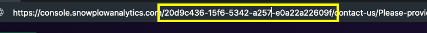

With the [**Tracking Scenarios API**](https://console.snowplowanalytics.com/api/msc/v1/docs), you can efficiently manage tracking scenarios programmatically. Whether you want to retrieve, create, edit, publish, deprecate, or delete tracking scenarios, the API provides the necessary endpoints and functionalities.

## Getting Started
For detailed information about each request, including query parameters and response formats, refer to the corresponding [API documentation](https://console.snowplowanalytics.com/api/msc/v1/docs).

### Authorizing in the API Documentation

To be able to post sample requests in the documentation you need to click the `Authorize` button at the top of the document and authorize with your token. The value for the token field in each individual request is overwritten by this authorization.

Each request will need to include your company's `organizationId` which is a UUID that can be retrieved from the URL immediately following `.com` when visiting console:



```mdx-code-block
import GetConsoleApiKey from "@site/docs/reusable/get-console-api-key/_index.md"

<GetConsoleApiKey/>
```

## Response Format

The Tracking Scenarios API uses a specific response format for success cases (`2xx`) and for cases where critical and non-critical errors can occur, such as (`422`) **Unprocessable Entity**.

```
{
    "data": [
        // Tracking scenarios
    ],
    "includes": [
        // Additional tracking scenario info
    ],
    "errors": [
        // Warnings or errors
    ]
}
```

- `data`: Contains the scenario or scenarios, depending on the request.
- `includes`: Contains additional information, such as the history of tracking scenario changes.
- `errors`: Contains a list of errors that could be of type `Error` or `Warning`. **If the array field contains at least one error of type `Error`, the request will also return a `4xx` status code, meaning that it cannot perform the store operation. Any other severity different to `Error` will return a 2xx status code.**

## Compatibility Checks

Some endpoints will perform a validation that checks the compatibility of a particular tracking scenario event schema, `event.schema`, against the source data structure version referenced by `event.source`. When both `event.schema` and `event.source` are defined in the tracking scenario, the compatibility checks will be performed.

```
...
"event": {
    "source": "iglu:com.example/ui_actions/jsonschema/1-0-0",
    "schema": {
        "$schema": "http://json-schema.org/draft-04/schema#",
        "description": "Event to capture search submit",
        "type": "object",
        "required": [
            "label",
            "action"
        ],
        "properties": {
            "action": {
                "type": "string",
                "enum": [
                    "click"
                ]
            },
            "label": {
                "type": "string",
                "enum": [
                    "Search"
                ]
            }
        },
        "additionalProperties": false
    }
}
...
```

However, the compatibility check will not only be performed against the version specified by the source data structure, `event.source` field, e.g., `1-0-0`, which we will refer to as the **current** version. It will also be conducted against the latest version available in Iglu, referred to as the **latest** version. This approach is because it's common for a new tracking scenario to utilize the latest version of the source data structure. However, as this data structure may evolve over time and become incompatible with the `event.schema` defined in the tracking scenario, we provide a method to detect these compatibility issues. Consequently, customers can update the tracking scenario to ensure compatibility.

In cases where a scenario is incompatible or we cannot determine it, some errors will be provided in the `errors` field of the [response](#response-format). These errors alerting of compatibility issues between the tracking scenario and the source data structure, will take a similar shape to the one below:

```
...
"errors": [
    {
        "type":"Warning",
        "code":"SchemaIncompatible",
        "title":"Tracking scenario with id: 59b5e250-91c4-45af-a63d-5f8cd39f4b67, event schema is INCOMPATIBLE with schema with name: test_event, vendor: com.snplow.msc.aws, version: 1-0-13",
        "source":"event.schema"
    }
]
...
```

Compatibility checks can result in three possible values: **Compatible**, **SchemaIncompatible**, or **SchemaUndecidable**. 

- If **Compatible**, the tracking scenario is compatible and no errors will be append to the `errors` response field.
- If **SchemaIncompatible**, the tracking scenario is incompatible against some version. If the check for **current** version is incompatible, the `type` will be `Error`. For incompatibility with the **latest** version, the `type` will be `Warning`. If the requested operation involves persisting the scenario (create/update) an error of type `Error` will be append to the response, the status code will be **422 Unprocessable Entity**, and the store operation will not persist. When fetching a scenario, the checks will run for both too, **current** and **latest** versions, and if incompatible, the error type will allways be `Warning`, returning status code **200 Ok**.
- If **SchemaUndecidable**, it is indeterminable whether the scenario is compatible with a specific version due to the use of some advanced JSON-Schema features and that the high computational cost of checking the compatibility. The `type` will always be `Warning` and the user is responsible for ensuring that the tracking scenario is compatible with the source data structure. A warning will be attached to the `errors` response field.

:::info
The algorithm used to perform the compatbility check is based on the [Finding Data Compatibility Bugs with JSON Subschema Checking](https://dl.acm.org/doi/pdf/10.1145/3460319.3464796) paper published by Andrew Habib, Avraham Shinnar and Michael Pradel.
:::

## Retrieve a List of Tracking Scenarios

Use this request to retrieve a list of scenarios within an organization, which will be wrapped into the `data` field of the [response](#response-format).

`GET /api/msc/v1/organizations/{organizationId}/tracking-scenarios/v1`

### Query Parameters and Filters

You can filter the results based on the following query parameters:
- `dataProductId`: Filters the tracking scenarios that are associated with a particular data product. (Coming soon)
- `dataStructureId`: Filters the tracking scenarios associated with a particular data structure. This is infered from the `event.source` field.
- `dataStructureVersion`: Filters the tracking scenarios associated with a specific data structure version when used with `dataStructureId`.
- `withLatestHistory`: When `true` it will return a list of tracking scenarios, and the latest change per scenario attached to the `includes` array field. The relation between tracking scenarios in `data` and history in `includes` can be determined by `id = scenarioId`.
- `status`: Filters the tracking scenarios that match the specified status.

:::info
If no query parameters are provided it will return all the tracking scenarios for an organization
:::

## Retrieve a Specific Tracking Scenario

Use this request to retrieve a specific tracking scenario within an organization. The retrieved scenario will be wrapped into the `data` field of the response.

`GET /api/msc/v1/organizations/{organizationId}/tracking-scenarios/v1/{trackingScenarioId}`

:::info
This endpoint will trigger [**compatibility checking**](#compatibility-checks) if `event.source` and `event.schema` are defined.
:::

### Query Parameters and Filters

You can filter the results based on the following query parameters:

- `withHistory`: Returns a list with the history for the tracking scenario in the `includes` array field of the response, related to the tracking scenario by its id.
- `status`: Filters the tracking scenarios that match the specified status.

## Creating a Tracking Scenario

Use this request to create a tracking scenario within an organization.

`POST /api/msc/v1/organizations/{organizationId}/tracking-scenarios/v1`

### Request and Response

The creation form has two fields at the top level, as shown in this example:

```
{
    "scenario": {
        "name": "Search",
        "description": "Tracking the use of the search box",
        "event": {
            "source": "iglu:com.example/ui_actions/jsonschema/1-0-0"
        }
    },
    "message": "initial draft"
}
```

- `message`: An optional field to provide a message.
- `scenario`: The definition of the tracking scenario, which should comply with the [validations](#validations).

By default, the tracking scenario will be created with `scenario.status` set to `draft` and `scenario.version` set to `0` if not provided. These values can be changed and managed after creation. Here is an example response:

```
{
    "data": [
        {
            "id": "5a203ef8-939b-4fd1-914e-f12a3dd1a869",
            "version": 0,
            "status": "draft",
            "name": "Search",
            "description": "Tracking the use of the search box",
            "event": {
                "source": "iglu:com.example/ui_actions/jsonschema/1-0-0"
            }
        }
    ],
    "includes": [
        {
            "author": "39b81015-1bd5-4b37-96c7-3296cabaa36f",
            "message": "initial draft",
            "date": "2023-04-26T14:41:48.708191Z",
            "scenarioId": "5a203ef8-939b-4fd1-914e-f12a3dd1a869",
            "version": 0,
            "status": "draft",
            "type": "History"
        }
    ],
    "errors": []
}
```

### Validations
- `scenario.event.source`: If provided it should match a valid and existing Iglu URI.
- `scenario.name`: It validates that the `scenario.name` of a tracking scenario is unique within the data structure context, inferred from the source data structure `scenario.event.source` if provided.
- `scenario.version`: If provided should be equal or greater than zero.
- `scenario.status`: If provided should match one of `draft`, `published` or `deprecated`.
- `scenario.entities`: If provided it will validate that the entities, `scenario.entities.tracked` and `scenario.entities.enriched`, are not duplicated and that they exist.
- `scneario.dataProductId`: If provided it will validate that the data products exists. (Coming soon)

:::info
This endpoint will trigger [**compatibility checking**](#compatibility-checks) if `event.source` and `event.schema` are defined.
:::

## Editing a Tracking Scenario

Use this request to edit a tracking scenario within an organization. The format of the [request and response](#request-and-response) is the same format as during creation.

`PUT /api/msc/v1/organizations/{organizationId}/tracking-scenarios/v1/{trackingScenarioId}`

### Publishing a Tracking Scenario

When editing a scenario, it can be published by setting the `status` to `published`. Currently, this will indicate to the tracking scenario consumers (for instance, front-end developers) that the tracking design is ready to be implemented or to be consumed.  
By default, when a tracking scenario is created and no value is provided for `scenario.status`, it will be set to `draft`. With this, we suggests a tracking scenario lifecycle that we recommend following, but we allow certain degree of flexibility to accommodate unique customer use cases. Here is the suggested lifecycle: 


In addition to this lifecycle, and in conjunction with versioning, we enforce that when a tracking scenario is **published**, the versions between two published versions are **discarded**. For example:

Publish new version, before squash:


After discarding intermediate versions:


### Deprecating a Tracking Scenario

When editing a scenario, it can be deprecated by setting the `status` to `deprecated`. This will is a way of telling the tracking scenario consumers (for instance, developers) not to relly on the tracking anymore.

### Validations
- `scenario.event.source`: If provided it should match a valid and existing Iglu URI.
- `scenario.name`: It validates that the `scenario.name` of a tracking scenario is unique within the data structure context, inferred from the source data structure `scenario.event.source` if provided.
- `scenario.version`: If provided should be equal or greater than zero, should not exists and be greater than the last published version.
- `scenario.status`: If provided should match one of `draft`, `published` or `deprecated`.
- `scenario.entities`: If provided it will validate that the entities, `scenario.entities.tracked` and `scenario.entities.enriched`, are not duplicated and that they exists.
- `scneario.dataProductId`: If provided it will validate that the data product exists. (Coming soon)

:::info
This endpoint will trigger [**compatibility checking**](#compatibility-checks) if `event.source` and `event.schema` are defined.
:::

## Deleting a Tracking Scenario

Use this request to delete a tracking scenario within an organization.

`DELETE /api/msc/v1/organizations/{organizationId}/tracking-scenarios/v1/{trackingScenarioId}`

:::warning
Please note that this action is irreversible and will permanently delete the tracking scenario.
:::
