## Creating a New Tracking Scenario using the Console

Tracking Scenarios are directly linked to [Data Structures](/docs/understanding-tracking-design/managing-your-data-structures/ui/index.md) and represent the events that are documented and tracked using a certain Data Structure.

To create a new Tracking Scenario, navigate to the **Data Structures** option in the menu. From there, select a data structure from the list.

:::info
Note that Tracking Scenarios can only be created from Data Structures that have been set as **Event**.
:::

After selecting a data structure, click on the **Tracking Scenarios** tab, as shown in the image.

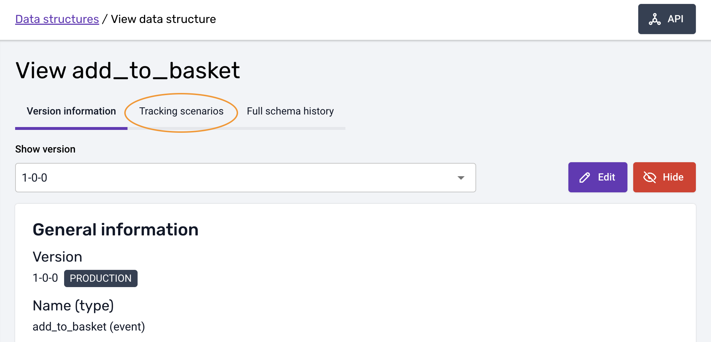

Next, click the **'Add new scenario'** button. A new dialog box will appear with fields for basic information that can be defined during creation, as shown.

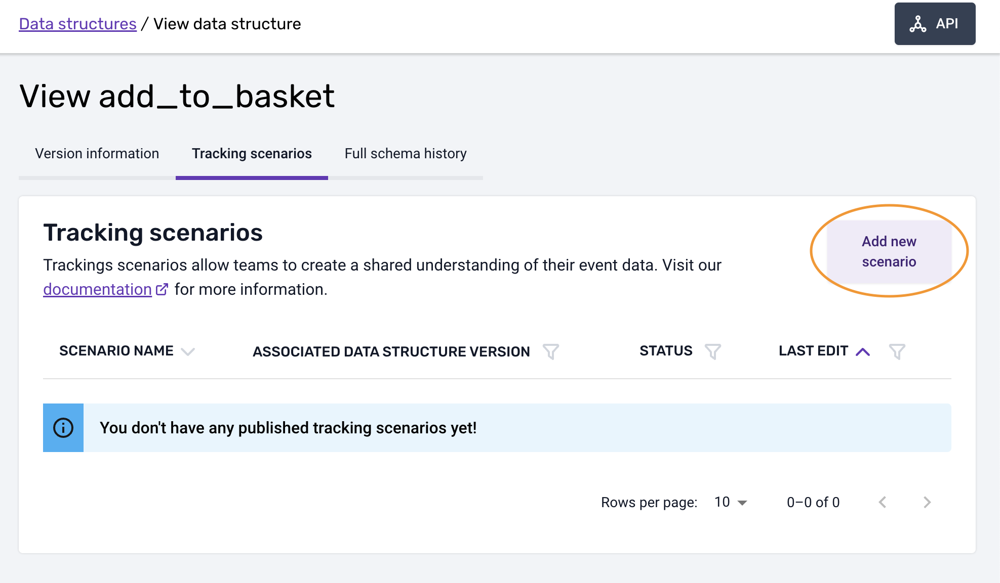

Tracking scenarios should be created in association with the most recent version of the data structure deployed in production. This will determine the instructions for tracking implementation that can be set in the validation part of the tracking scenarios.

It is always guaranteed that your tracking scenario will have instructions compatible with the associated data structure version. This ensures that any event tracked by following the instructions defined in the tracking scenarios will pass validation for the associated data structure.

However, if a newer version of the data structure is subsequently deployed in production, you may wish to "upgrade" the tracking scenario and tracking to the newer data structure and verify that your implementation instructions still meet validation.

The fields available for filling at this stage are:

- A text field for the **scenario name**
- A tag field to indicate which applications this scenario is designed to track.
- A free text field for a **description** of the tracking scenario.

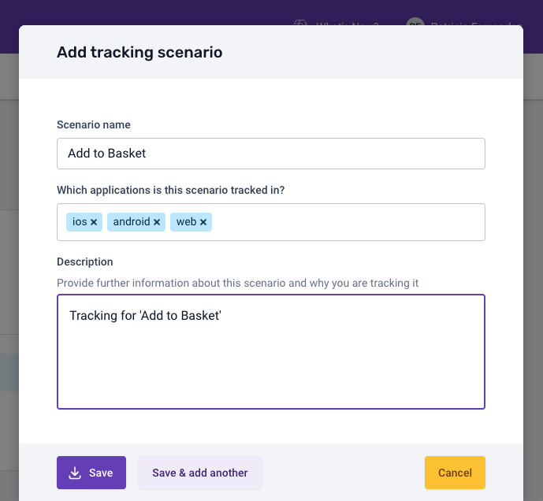

To create a tracking scenario, click the **'Save'** button. If you want to create multiple scenarios at once, such as different scenarios for mobile and web tracking, click the **'Save & add another'** button. You can cancel the creation process by clicking the **'Cancel'** button.

After creating your first tracking scenario, a list of tracking scenarios will appear on the page.

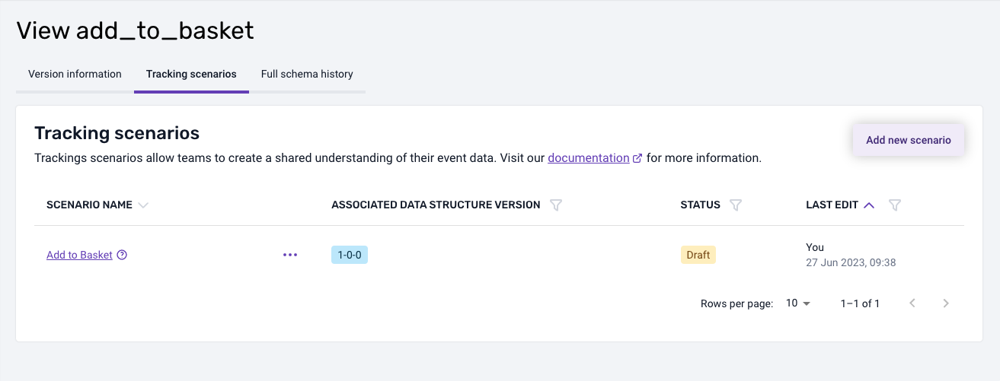

Until published, the scenario status is set to "Draft" to represent that it is a work in progress. During this time, you may wish to share it with others in the business to get feedback or approval. To do this, select the link to the tracking scenario and click the **'Share scenario'** button located at the top right of the page. Please note that others will need access to the Snowplow Console Data Structures section to view the scenario.

* * *

## Adding more details and editing a Tracking Scenario

To add more information or modify a tracking scenario, select it from the appropriate list view in the "Data Structure and Tracking Scenarios" section. This will open a new page displaying the details of the selected tracking scenario.

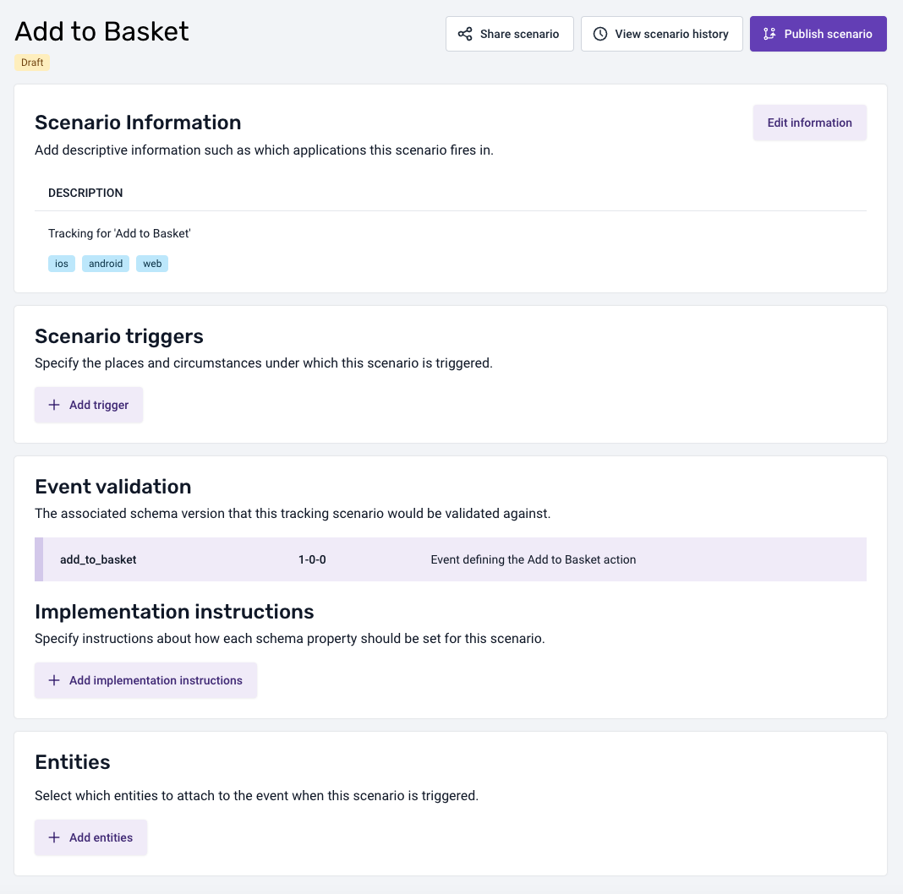

To make changes, edit the information in each section, and then click the **'Save changes'** button to save your changes.

### Implementation instructions

The Implementation Instructions section is where you can specify how each property for this event should be populated.

To add multiple implementation instructions, click the **'Add implementation instructions'** button in the Implementation Instructions section. This will open a dialog view.

The dialog displays the list of properties defined in the data structure associated with this scenario.

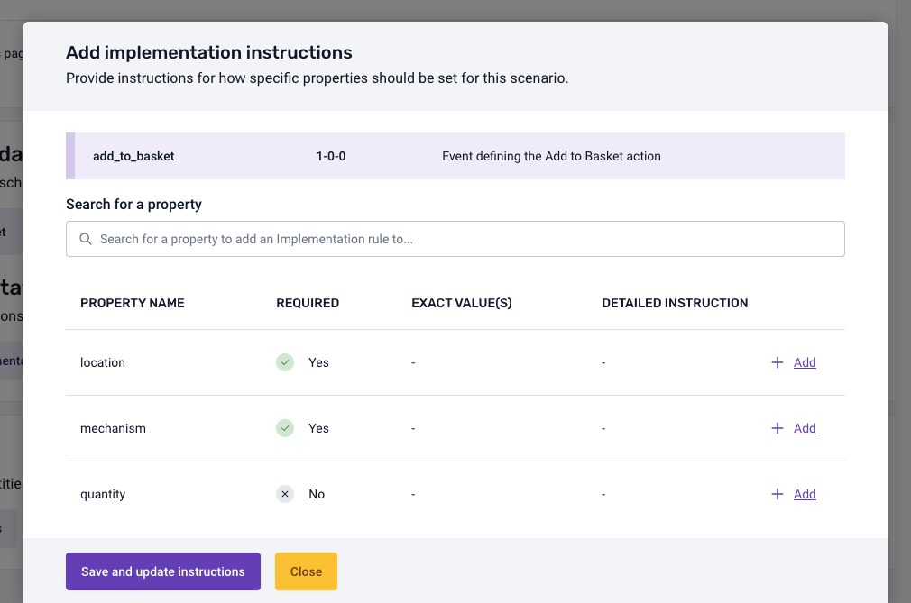

You can click on any of the properties shown in the list to access a new view inside the dialog box. Here, you will be able to configure the instructions's Type of condition, Value, and Comments properties.

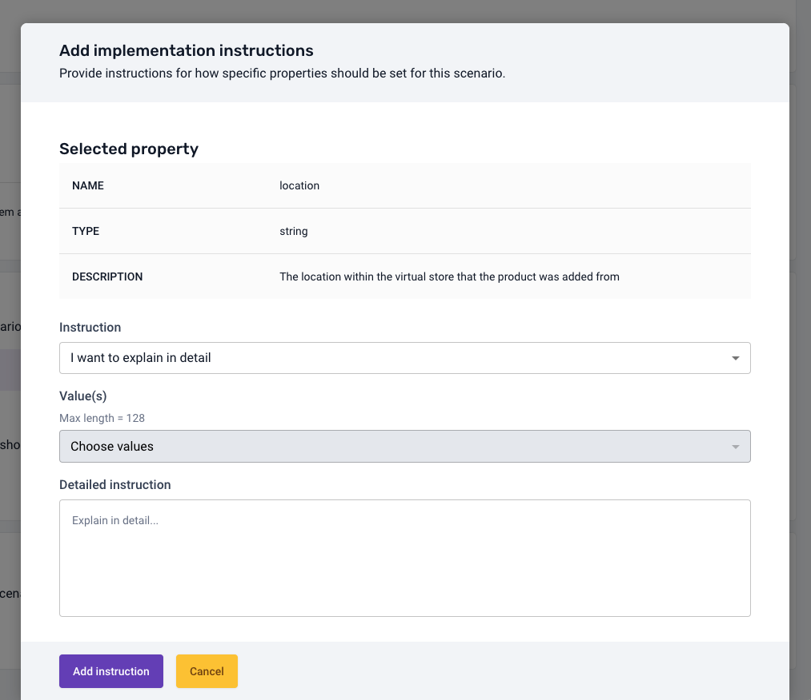

Click **'Add instruction'** to save the instruction, or click the **'Cancel'** button to discard changes.

After configuring the instructions, click **'Save and update instruction'** to confirm the changes or click **'Close'** to discard them.

You can edit or remove instructions in the tracking detail view's instructions list.

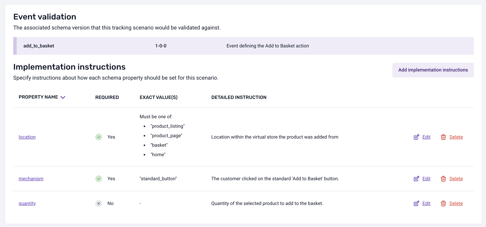

### Entities

In this section, you can define which [Entities](/docs/understanding-your-pipeline/entities/index.md) should be tracked as context for this event.

To add multiple entities, click the **'Add entities'** button. A new dialog box will appear to select entities. This includes both entities from Iglu Central and your own custom entities.

To view detailed information about the properties of an entity, click **'View properties'**. You can use the search bar to find an entity by name.

Once you have selected the entities you want to add to the tracking scenario, click the **'Select entities'** button to confirm, or the **'Cancel'** button to discard your selections. On the next screen, you can configure additional rules. For example, you can specify how many instances of an entity should be tracked with this event, or whether the entity is optional or should always be tracked.

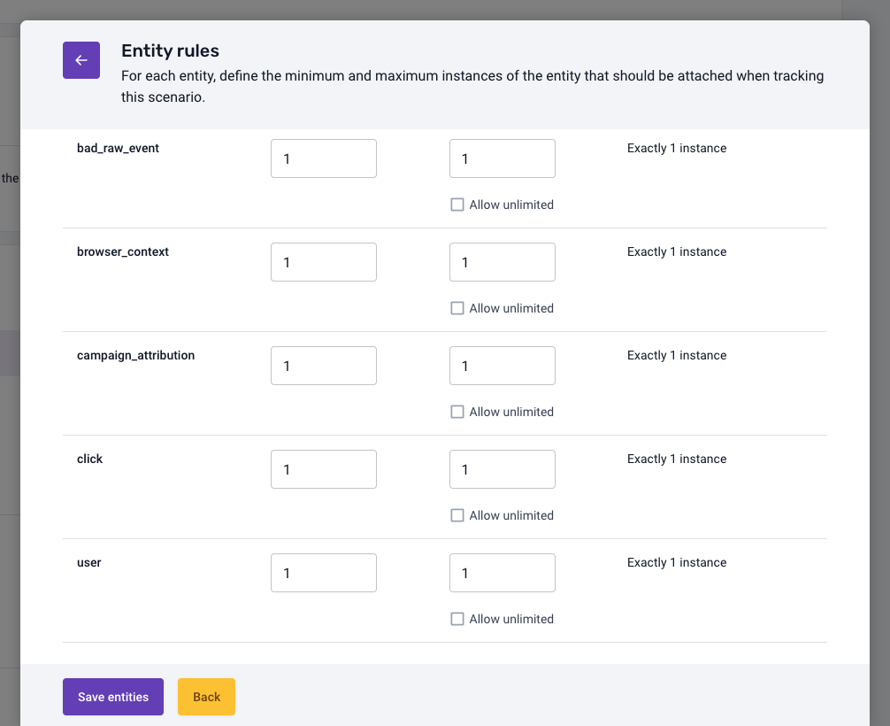

Click **'Save entities'** to save your changes, or **'Back'** to discard them.

After saving the entities, you will see a list of them in the detail view, where you can edit, add, or remove them.

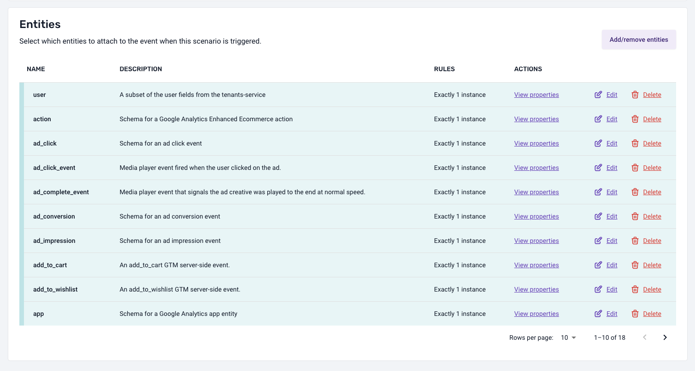

## Publishing a Tracking Scenario

Once you have finalized your definition of the tracking scenario and completed all necessary approval stages, you can publish it by clicking the **'Publish scenario'** button located at the right side of the scenario name in the detailed view.

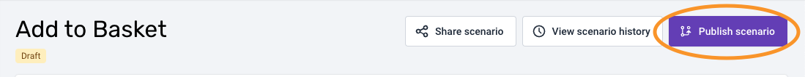

Publishing a new scenario indicates an intention to implement the tracking defined in it. For data consumers, a published scenario signals that the tracking associated with the event complies with the instructions contained in it.

Once published, the scenario's status will appear as "Published" in the list view.

If you need to edit a published scenario, you can do so by selecting the **'Edit'** button. This action will reset the scenario's status to "Draft."

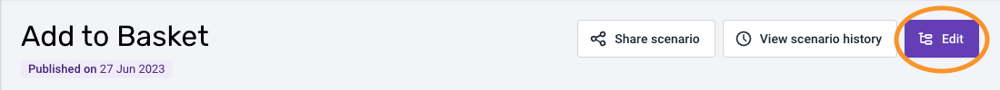

## Sharing a Tracking Scenario

If you want to share a tracking scenario, whether it is published or still a draft, follow these steps. First, go to the Tracking scenario tab. Then, click on the name of the tracking scenario you want to share. From the detailed view, click the **'Share scenario'** button, which is located near the publish button.

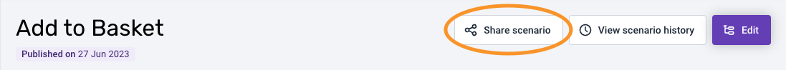

A dialog box will appear with a link and a **'Copy'** button.

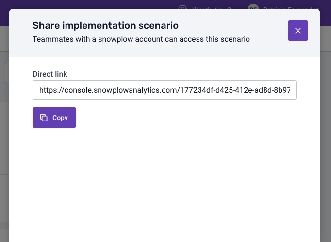

## Deleting Draft Tracking Scenarios

Whilst a tracking scenario is in *draft* mode, it can be deleted. To delete a draft tracking scenario, navigate to the **Tracking scenarios** tab and click the **'Delete'** button.

A confirmation dialog box will appear.

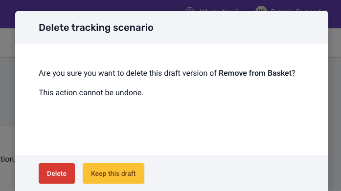

:::warning
This operation cannot be undone.
:::

## Deprecating a published Tracking Scenarios

If you believe a published scenario no longer reflects your tracking implementation, or you wish to remove this tracking from your product, you can choose to deprecate it.

Deprecating a tracking scenario signals the intention to remove this tracking from your product. It's important to note that deprecating a tracking scenario does not automatically prevent new events from being tracked in line with the instructions of this scenario. Developers will need to manually stop tracking events for the deprecated scenario.

Deprecating a scenario can also notify data consumers that the information contained in the scenario is not reflective of the tracking implementation and should not be used to understand the data.

We strongly advise keeping your scenario in sync with your tracking, so that the information contained in it can be used by data consumers for data discovery and understanding purposes.

To deprecate a published tracking scenario, go to the **Tracking scenarios** tab, click on the triple-dot (**'...'**) menu button to the right of the scenario name. A small menu will appear, and then click the **'Deprecate'** button. A confirmation dialog box will appear where you can add some comments.

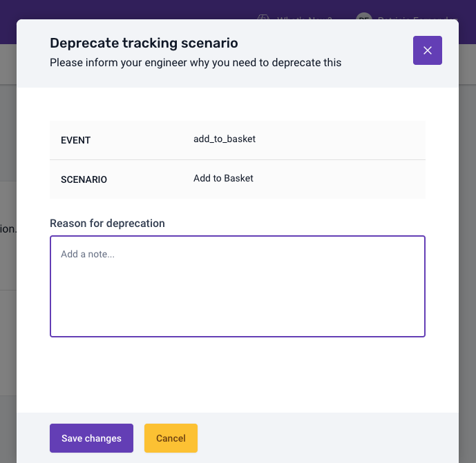

Once completed, the status of the scenarios will appear as "Deprecated".

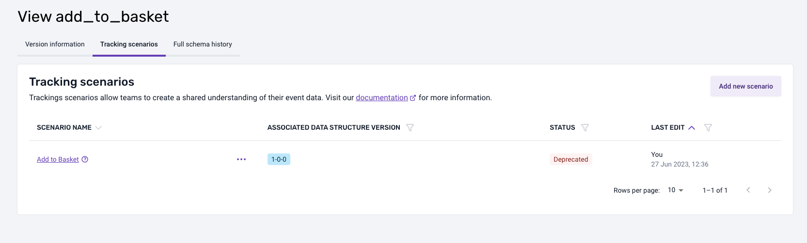

:::info
To undo this action, click on the scenario. In the detail view, you will see a **'Change status to draft'** button. Click on it to revert the action.

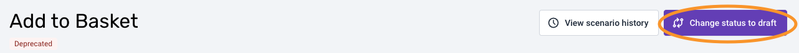
:::

:::info
To perform certain actions on a tracking scenario, such as **'Duplicate'**, **'Share scenario'**, **'Publish scenario'**, **'View history'**, **'Delete'**, **'Edit'** and **'Deprecate'**, click the triple-dot menu button (**'...'**) from the Tracking scenario tab view.

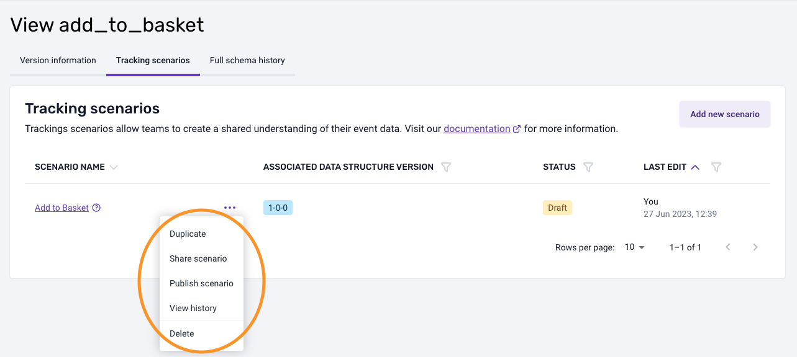
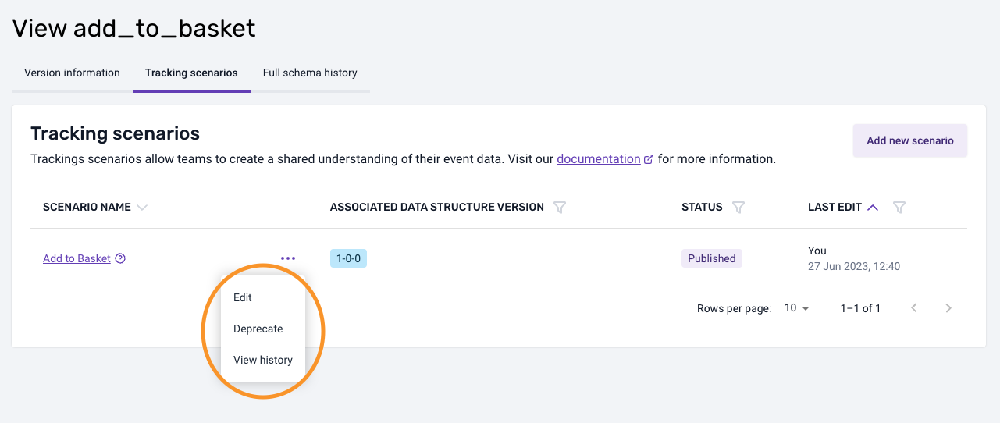
:::
