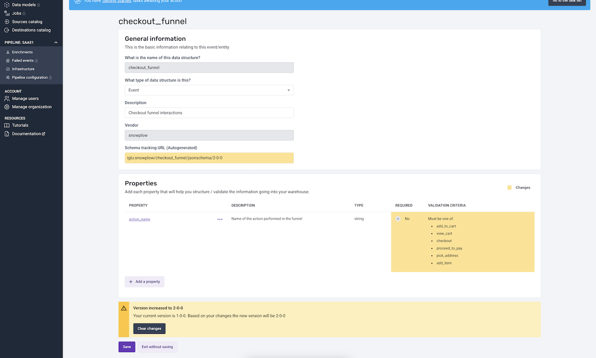

# Versioning in BDP Cloud

If you are a BDP Cloud customer, you will have used our Data Structure Builder to create your custom Data Structure for your Events and Entities.

**Breaking and non-breaking changes**

At the point of publishing a schema, there are two options for versioning your data structure.
- **Non-breaking** - a non-breaking change is backward compatible with historical data and your loader.
- **Breaking** - a breaking change is not backwards compatible with historical data and/or your loader.

The Data Structure builder will automatically select how to version up your data structure depending on the changes you have just made.

