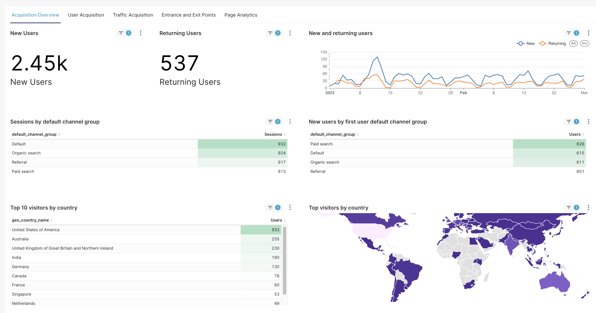
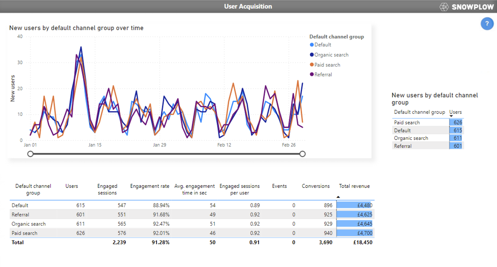
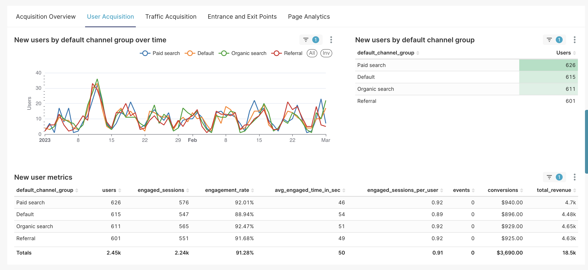
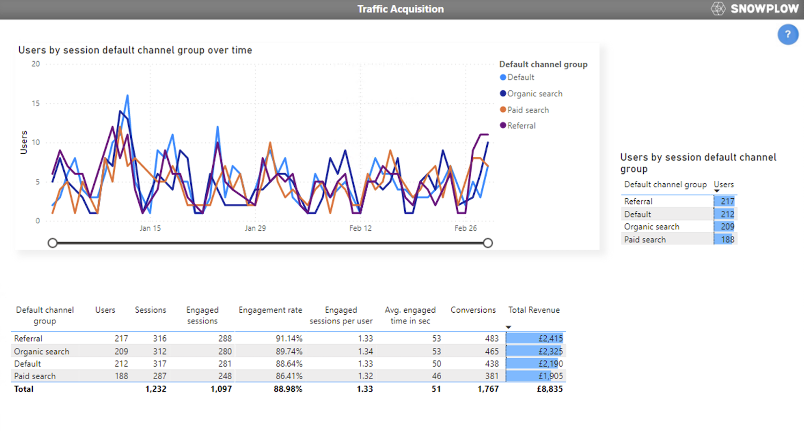

```mdx-code-block
import Tabs from '@theme/Tabs';
import TabItem from '@theme/TabItem';
import ThemedImage from '@theme/ThemedImage';
```

## Introduction

This guide is written to introduce you to the dashboard templates designed for visualising your derived tables produced by the [snowplow-web](https://docs.snowplow.io/docs/modeling-your-data/modeling-your-data-with-dbt/dbt-models/dbt-web-data-model/) dbt package. It will show you how to get started and what each visualization view (= page / tab / dashboard depending on the tool) represents.

## Setup

Pick your preferred BI tool and access the templates here:

- PowerBI
- Tableau
- Streamlit
- Preset

<Tabs groupId="dashboards" queryString>

<TabItem value="PowerBI" label="PowerBI">

### Connect your dataset

For performance reasons the PowerBI template is designed to retrieve only the data that is needed for the visualizations with the aggregations done on the database side (15 in total). Each query is set up with a list of connection parameters so that you only have to change them once. To do this go to *Transform Data / Edit parameters* and change the following to yours:

`Server / Database / Role / Schema`

Once you made the changes you will need to refresh the data by clicking the *Refresh* icon on the *Home* ribbon when in the *Report view*.

### Prefilter your data

#### App id filter

In case you would need to filter on a specific app_id, we have provided two parameters you can utilise for this purpose:

`App_id_1 / App_id_2`

You can of course add more, if needed, but these also need to be added to all queries, similar to the existing filters.

#### Time filters

The dashboard by design works with the most likely use case that it needs to display the last x number of days. You can change the `LastXDay` parameter to any of the default values (1, 7, 28, 30, 90) or add more, if you need to. This will ensure that the data is filtered for each of the visualizations.

Lastly there are two more parameters, the `Start Year / End Year` which control the dimDate table, it should be set to cover a period you need for the duration of your reporting so you would only need to set it up once.

Each of these parameters get updated once you refresh your database and are exposed in the Home page. There is a field called `Last Refreshed` which always show you the last time the queries were updated, which might come in handy for users to see.


</TabItem>

<TabItem value="Tableau" label="Tableau">

### Prepare your Tableau workbook

In order for you to be able to connect the workbook template to your dataset you will have to change the connection parameters in the template.

First, unpackage the twbx file: change the twbx extension to zip and then you can treat it like one.

Open the twb file. Use find and replace function in your editor of choice to replace all occurrences of the following connection parameters:

`YOUR_SERVER, YOUR_WAREHOUSE, YOUR_DATABASE, YOUR_SCHEMA, YOUR_USER, YOUR_ROLE`

Save the file.

In order for Tableau to accept the twbx format you have to select all files first and then compress it back to a zip to avoid an additional level of folder structure. Once done rename the extension back to `twbx` from `zip` and your file should be ready to be used.

### Prefilter your data

Once the file is uploaded to Tableau online or opened elsewhere you will be prompted to log in with your username and password. Once authenticated you can change the data source settings e.g. switch the live connection to an extract.

On the Home dashboard you will see a parameter called 'Last_x_day' which can be used to filter the number of days of data you would like the refresh to retrieve.


</TabItem>

<TabItem value="Streamlit" label="Streamlit">

### Preparing the enviroment to run the application

There are a few ways you can run the application:
  1. [locally](#1-run-it-locally)
  1. [Steamlit on Snowflake](#2-run-it-on-streamlit-on-snowflake)
  1. [Streamlit cloud](#3-run-it-on-streamlits-cloud)

<details>
<summary>#### 1. Run it locally)</summary>

To run the application on your local machine you will need a working python environment running python 3.8.16 - this is the current version Snowflake are using on their Streamlit environment.

Install Streamlit:
```
pip install streamlit==1.20.0
```

Install dependencies:

```
pip install plotly==5.9.0 geopandas==0.12.2 pydeck==0.7.1 snowflake-connector-python==3.0.4
snowflake-snowpark-python==1.4.0 snowflake-connector-python[pandas]
```

Provide credentials: create file called `credentials.json` in the current directory with the following structure:
```
{
  "account": "<snowflake_account>",
  "user": "<snowflake_username>",
  "password": "<snowflake_password>",
  "warehouse": "<snowflake_warehouse>"
  "database": "<database>",
  "schema": "<schema>",
  "role": "<role>"
}
```

Run it:
```
streamlit run snowplow.py
```
&nbsp; &nbsp; or depending on your setup:
```
python -m streamlit run snowplow.py
```

</details>

<details>
<summary>#### 2. Run it on Streamlit on Snowflake</summary>

##### Step 1: Create a Streamlit Application:
  1. Log into Snowsight as a user with the CREATE STREAMLIT privilege.
  2. In the left navigation bar, select Streamlit Apps.
  3. Select + Streamlit. The Create Streamlit App window opens.
  4. Enter a name for your app.
  5. In the Warehouse dropdown, select the warehouse where you want to run your app and execute queries.
  6. In the App location dropdown, select the database and schema for your app.
  7. Select Create. The Streamlit in Snowflake editor opens an example Streamlit application in Viewer mode. Viewer mode allows you to see how the Streamlit application appears to users.
  8. Click Edit to create your application.

##### Step 2: Install required packages:
  [PUT](https://docs.snowflake.com/en/sql-reference/sql/put) the [environment.yml](/environment.yml) file to the stage location specified by the `STREAMLIT_ROOT_LOCATION` parameter of the Streamlit object:
  ```
  $ SELECT STREAMLIT_ROOT_LOCATION FROM <database>.INFORMATION_SCHEMA.STREAMLITS;

  > <database>.<schema>."<appname> (Stage)"
  ```
  ```
  PUT file:///<full_path>/environment.yml '@<database>.<schema>."<appname> (Stage)"' AUTO_COMPRESS=FALSE OVERWRITE=TRUE;
  ```

##### Step 4: Provide the geojson [file](/countries.geo.json) that contains the country information required to render the choropleth map:
  ```
  PUT file:///<full_path>/countries.geo.json '@<database>.<schema>."<appname> (Stage)"' AUTO_COMPRESS=FALSE OVERWRITE=TRUE;
  ```

##### Step 5: Copy the code from [snowplow.py](/snowplow.py) inside the editor

and Click `Run`

</details>

<details>

<summary>#### 3. Run it on Streamlit's cloud</summary>

Follow the instruction on [https://streamlit.io/cloud](https://streamlit.io/cloud)

</details>

### Applying filters

#### Time filters

By default the app is configured to always retrieve the last 7 days data. Users are also able to modify the start and end date of this filter to modify this range at any point in time, which will rerun all queries and applies the filters to all visualisations.

## App_id filters

Users could also filter on app_ids. To change the default two items, replace appid1 and appid2:

    ```app_id1 = st.text_input("App ID:", key = 'appid1')
     app_id2 = st.text_input("App ID:", key = 'appid2')```

</TabItem>

<TabItem value="Preset" label="Preset">

</TabItem>

</Tabs>

## Dashboards

### Acquisition Overview

The **Acquisition Overview** provides an overview on the website traffic, with a breakdown by marketing channels.

There is also a distinction between `New Users` who have not previously had a session on the website (domain_sessionidx=1) and `Existing users` who have a session with domain_sessionidx > 1.

<Tabs groupId="dashboards" queryString>

<TabItem value="PowerBI" label="PowerBI">


</TabItem>

<TabItem value="Tableau" label="Tableau">


</TabItem>

<TabItem value="Streamlit" label="Streamlit">


</TabItem>

<TabItem value="Preset" label="Preset">



</TabItem>

</Tabs>

### User Acquisition
This view is about **User Acquisition** which is effectively about what channels / methods were used to acquire new users.

Every visual is already filtered on new users only (domain_sessionidx = 1).

The metric are defined as:

- **engaged_sessions** = count(case when engaged=True end)
- **engagement_rate** = engaged_sessions / count(distinct domain_sessionid)
- **conversion_count** =sum(cv__all_volume)
- **conversion_revenue** = sum(cv__all_total)

<Tabs groupId="dashboards" queryString>

<TabItem value="PowerBI" label="PowerBI">



</TabItem>

<TabItem value="Tableau" label="Tableau">


</TabItem>

<TabItem value="Streamlit" label="Streamlit">


</TabItem>

<TabItem value="Preset" label="Preset">



</TabItem>

</Tabs>

### Traffic Acquisition

This page is about **Traffic Acquisition** which highlights which channels are used to re-engage existing (returning) users.

Every visual is already filtered on returning users only (domain_sessionidx =>1).

The metric are defined as:

- **engaged_sessions** = count(case when engaged=True end)
- **engagement_rate** = engaged_sessions / count(distinct domain_sessionid)
- **conversion_count** =sum(cv__all_volume)
- **conversion_revenue** = sum(cv__all_total)

<Tabs groupId="dashboards" queryString>

<TabItem value="PowerBI" label="PowerBI">



</TabItem>

<TabItem value="Tableau" label="Tableau">


</TabItem>

<TabItem value="Streamlit" label="Streamlit">


</TabItem>

<TabItem value="Preset" label="Preset">


</TabItem>

</Tabs>

### Entrance and Exit Points

A separate overview is dedicated for the top 10 Entrance and Exit points with a breakdown on new and returning users.

An `entrance point` is the first page URL within a session. Although the sessions table produces a field called first_page_url, for BI purposes we exclude queries or fragments.

Similarly an `exit point` is the last page URL within a session.

<Tabs groupId="dashboards" queryString>

<TabItem value="PowerBI" label="PowerBI">


</TabItem>

<TabItem value="Tableau" label="Tableau">


</TabItem>

<TabItem value="Streamlit" label="Streamlit">


</TabItem>

<TabItem value="Preset" label="Preset">


</TabItem>

</Tabs>

### Page Analytics

The **Page Analytics** view is aimed at giving insight into how the visitors interact with your web page.

The `bounce rate` visualisation is essentially about the inverse of engagement rate, it shows the ratio of non-engaged sessions over the total sessions.

There is also a pivot heat map called the `Entrance vs exit points` which show the top 10 most visited first pages based on total session_id count and displays the total sessions where the session ended (from the same top 10 pages only).


<Tabs groupId="dashboards" queryString>

<TabItem value="PowerBI" label="PowerBI">


</TabItem>

<TabItem value="Tableau" label="Tableau">


</TabItem>

<TabItem value="Streamlit" label="Streamlit">


</TabItem>

<TabItem value="Preset" label="Preset">


</TabItem>

</Tabs>

## Customization

The templates are designed with the intention that they can be used out of the box, therefore we refrained from adding too much styling that might not fit a wide audience's taste. There are many other additional changes you could make to fine-tune the interactivity, enhance the performance or develop it further depending on the tool to make it your own.

If you would like us to give you a more detailed guide on how you can do that you can request this and we could add a new Accelerator to cover this topic for you.


