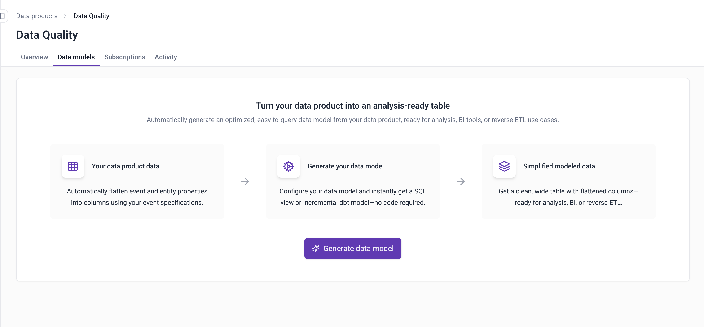
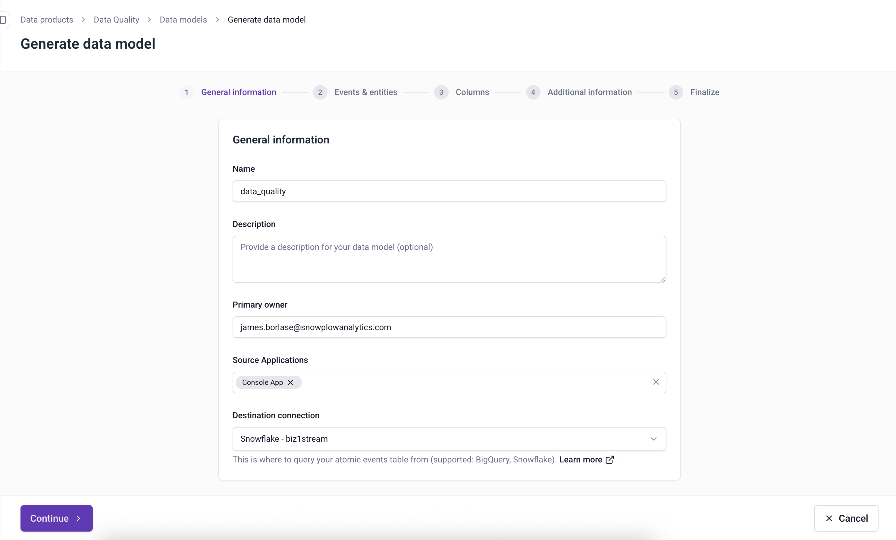
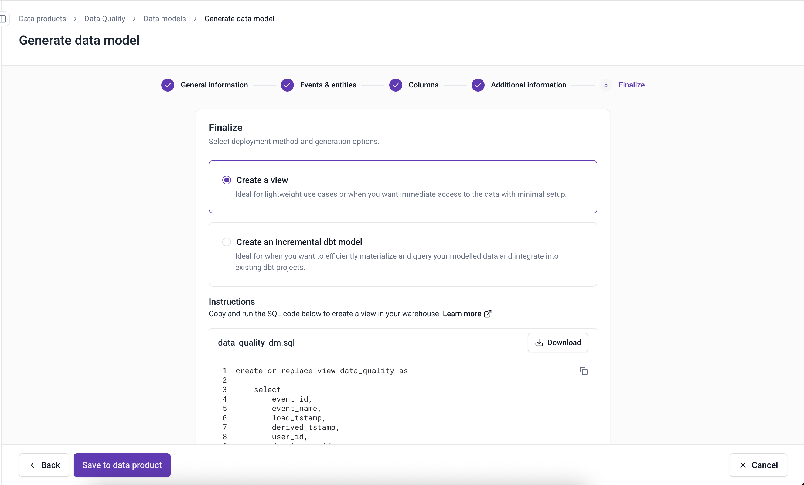

We are excited to announce the general availability of Automatically Generated Data Models, a new capability in Snowplow Console that transforms your tracking plans, event specifications, and custom events into optimized, analysis-ready data models. This feature enables analytics engineers and data teams to go from event specifications to warehouse-ready tables without writing SQL or complex configurations.

With automatically generated data models, you can create views or incremental dbt models directly from your tracking plans in minutes, eliminating the manual work of building custom models on top of the atomic events table.

## The release includes

**Self-service model generation in Console**

Navigate to any tracking plan and access the Data Models tab to generate optimized models with a guided workflow. You can specify which event specifications, entities, and atomic properties to include, and immediately create a model ready to be run in the warehouse.

**Flexible deployment options**

Choose the deployment approach that fits your use case:

* Views for immediate data access with minimal setup
* Simple incremental dbt models for standalone implementations
* Unified Digital or Normalize-based incremental models that integrate with existing Snowplow dbt packages

**Automatic data flattening**

Models automatically flatten your event and entity data structures into individual columns, creating wide tables ready for analysis, BI tools, or reverse ETL use cases. Single entities are expanded into separate columns, while array entities are preserved for later unnesting.

**Event specification filtering**

For teams using Snowtype, models can filter by event specification ID to guarantee high data quality. For teams not using Snowtype, models use intelligent filtering based on events, entities, and cardinalities to access historical data without requiring tracking changes.

**Multi-warehouse support**

Create models for Snowflake and BigQuery warehouses directly from Console. Databricks coming soon.

---

## Key benefits

**Reduces manual SQL work**

Eliminate the need to manually write SQL to filter and flatten your custom event data. The model generator handles the complexity of joining entities, extracting nested properties, and optimizing query performance.

**Accelerates time-to-value**

Go from defining a tracking plan to querying analysis-ready tables in your warehouse within minutes. No need to coordinate between tracking designers and analytics engineers, or spend hours building and testing custom transformations.

**Works with and without dbt**

Generate simple SQL views for immediate use in your warehouse, or create dbt models that integrate seamlessly with your existing data transformation workflows. Models based on Snowplow Unified Digital and Normalize packages leverage our optimized incremental processing patterns.

---

## Getting started

Automatically generated data models are available now for all Snowplow CDI customers using BigQuery or Snowflake loaders.

To create your first model:

1. Open any tracking plan in Console
2. Navigate to the new "Data Models" tab

   
3. Follow the guided workflow to configure and generate your model

   
4. Download and deploy the model to your warehouse

   

For detailed implementation guidance, see the [documentation here](/docs/modeling-your-data/automatically-generated-data-models/).
