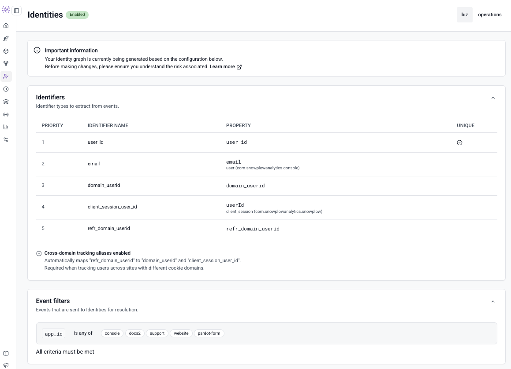

We're excited to announce the general availability of Snowplow Identities, a real-time identity resolution service built natively into your Snowplow pipeline. Snowplow Identities makes it easy to unify anonymous and known users across devices, domains, and sessions, giving every enriched event a persistent `snowplow_id` in real-time without complex custom warehouse logic.

## Key Benefits

* **Deterministic & Graph-Based:** No probabilistic matching or black-box scoring. A graph-based identity model eliminates recursive SQL and manual edge case logic — results are transparent, reproducible, and auditable.
* **Real-Time, Not Batch:** Resolved IDs are available on the event stream immediately, not hours later in the warehouse. Every event arrives at your destinations already attributed to the right user.
* **Handles Complex Cases Automatically:** Cross-domain tracking, multiple-device users, and shared devices are resolved out of the box without custom stitching logic.
* **Runs on Your Infrastructure:** VPC-hosted, encrypted, and zero third-party data sharing. Runs within your current Snowplow infrastructure (Cloud or PMC) with no additional services required.

## How Snowplow Identities Works

Snowplow Identities is a deterministic identity resolution engine that operates during the enrichment stage of your pipeline. As events flow through, the Identities service matches configurable identifiers against an evolving identity graph and attaches an [identity entity](/docs/identities/concepts/#identity-entity) to each enriched event containing the resolved `snowplow_id`.

* **Cross-device and cross-domain stitching:** Links users across configurable identifiers — from atomic event fields like `domain_userid` and `user_id` to properties inside custom events and entities — into a single profile. Supports [cross-domain tracking](/docs/identities/concepts/#identity-resolution-process) via `refr_domain_userid` for seamless resolution across cookie domains.
* **Unique identifier enforcement:** Prevents incorrect merges when distinct users share a device. If merging would violate a unique identifier constraint (e.g., two different `user_id` values), the merge is blocked and a new anonymous identity is created instead.
* **Merge events:** When profiles merge, the older profile's `snowplow_id` becomes the canonical ID and a dedicated [`identity_merge`](/docs/identities/concepts/#merge-events) event is emitted into the enriched stream, enabling downstream systems to reconcile historical data.

The resolved `snowplow_id` flows to all configured destinations, including your warehouse, Snowplow Signals, and Event Forwarding targets. The new Snowplow Identities dbt package transforms raw identity data into profile mapping and identifier lookup tables, ready for analytics and activation.

## Get Started

Snowplow Identities is now generally available to all Snowplow CDI customers as an optional add-on. To discuss enabling it for your organization or for further information, reach out to your Customer Success Manager! For full documentation, visit the [Snowplow Identities docs](/docs/identities/).
