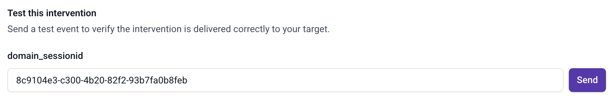
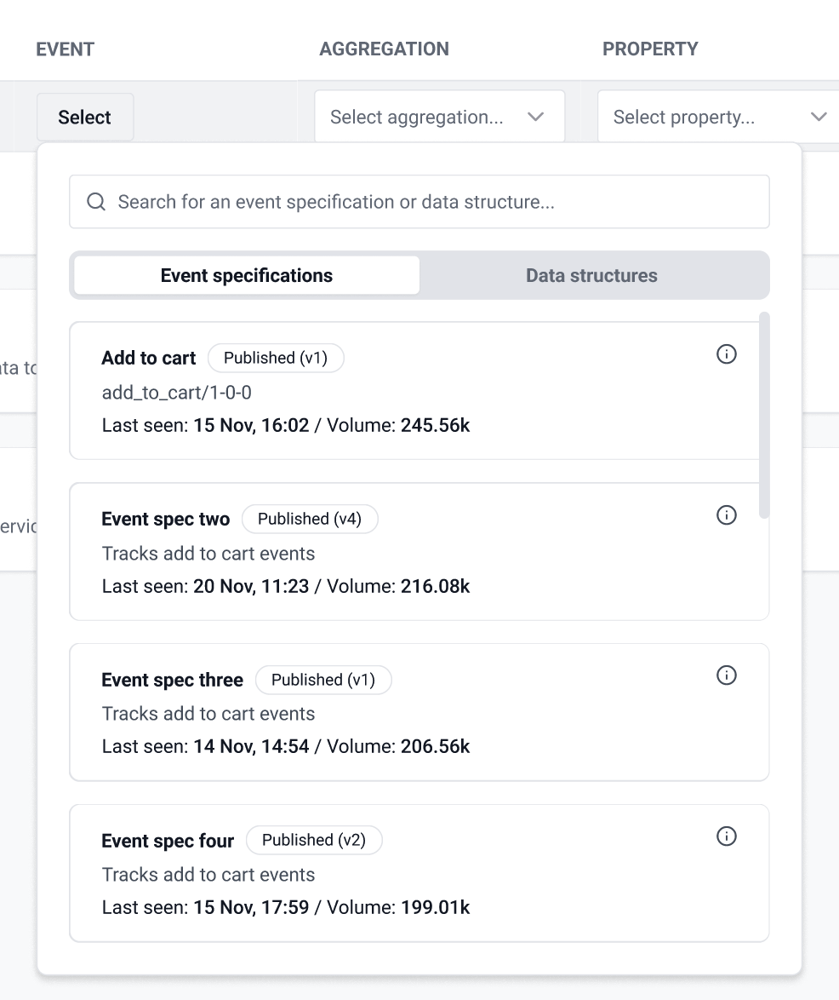
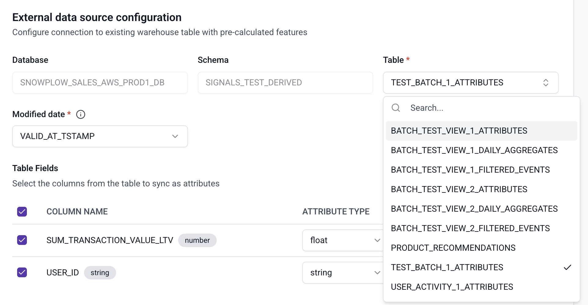

We're excited to share the latest round of improvements to Snowplow Signals. This release brings new tools to validate and refine interventions before they go live, tighter integration between attributes and your event specifications, and a number of other improvements and bug fixes.

---

##

## 1. Intervention Previews & Connection Tests

You can now **preview an intervention definition against real data in your warehouse,** which will surface the number of users who would have received the intervention — making it easy to sense-check audience size and catch misconfigured filters before they affect real users.

You can also send a test intervention to a connected client via server-sent events, to ensure that the client is set up correctly to receive the intervention.

Together, these capabilities close the feedback loop between intervention design and deployment.

---

##

## 2. Define Attributes Using Event Specifications

Signals attributes are real-time properties that describe your users, built from your behavioral event stream. **Snowplow event specifications** — part of Snowplow's tracking plans — are the governed definitions of what each event means in your data: what properties it carries, how it should be validated, and how it's consistently interpreted across your organization.

You can now **reference event specifications directly when defining attribute event filters**, anchoring your attribute logic to your existing tracking plan. You can also see any extra tracking implementation rules in the attribute criteria. This helps get new use-cases live quicker, and improves data quality, as event specs have tighter correctness guarantees than raw event schemas.

---

##

## 3. Pre-filling External Batch Tables & Fields

When creating an external batch attribute group, you previously had to manually type the names of the tables and columns you wanted to sync, leaving room for typos and requiring you to cross-reference your warehouse schema separately. We now read this information directly from your warehouse and let you select the tables and fields you need from a pre-populated list.

This makes it significantly easier to bring your existing warehouse data into Signals. Common use cases include syncing transaction history to power purchase-based personalization, importing pre-built audience segments or propensity scores from your data science models, or pulling in batch recommendations — for example, a list of products or content items curated for each user — so they're available in real time at the point of intervention.

---

##

## 4. Other Improvements & Bug Fixes

* **Filters & non-null checks for Attribute Group Preview Function:** You can now filter the preview function by app_id or attribute_key_identifier, so it only returns results for specified users. Additionally, the preview function will only return users where the attribute values are not null, giving you better visibility over how your user attributes look.
* **Explicit attribute selection for interventions.** When creating or updating an intervention, you now explicitly define which attributes to include in the intervention payload, giving you precise control over what data is passed through.
* **Validation for intervention criteria.** Intervention criteria are now validated at save time, surfacing configuration errors earlier in the workflow rather than at runtime.
* **Disallow duplicate attribute names within a service.** Attribute groups sharing the same attribute names can no longer be used within the same service, making attribute resolution more predictable.
* Fixed an issue where creating a batch source that already existed would cause an error rather than being skipped gracefully.
* Resolved a bug where intervention criteria were not consistently enforced during evaluation.
* Fixed incorrect TTL behaviour for certain attribute group types where an empty TTL was being handled incorrectly.
* Corrected a parsing issue with attribute name and version resolution.
* Fixed an issue where external batch attribute groups were not editable.
* Fixed an issue with editing long-duration TTL values.
