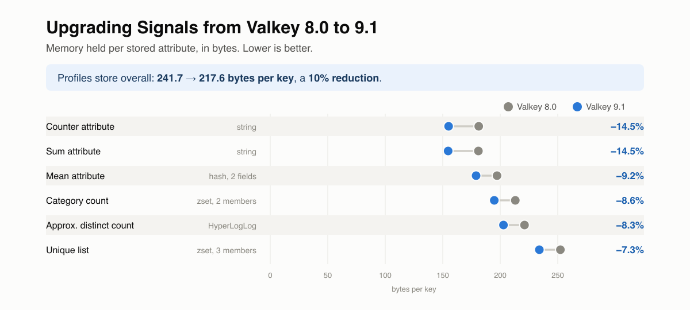

Signals stores customer profiles in Valkey, which runs on ElastiCache in your cloud account. Every Signals engine, streaming or batch, reads and writes the same Valkey database, so its memory footprint and write speed shape how Signals performs and what it costs to run.

We benchmarked Signals against Valkey 8.0, 8.1, 9.0, and 9.1. Compared to 8.0, Valkey 9.1 uses 10% less memory per stored attribute and spends 28% less time on each write command.

## How we tested

Each run used the official Valkey image for that version, started from an empty database, and received the same recorded stream of e-commerce events in the same order. The Signals configuration was a standard e-commerce setup, with attribute groups and interventions, and was identical across runs. We measured the memory held once each run finished, broken down by attribute type, and the time Valkey spent executing each command it received.

## Memory per attribute

A Signals profile is made up of many small values, each stored under its own key so that it can be updated independently. The key identifies the user, the attribute, and the time window, and it's often larger than the value it holds. For example, a counter attribute holding the number 3 takes about 181 bytes on Valkey 8.0.

The average stored attribute took 241.7 bytes on Valkey 8.0 and 217.6 bytes on 9.1.

Most of the saving comes from the [hashtable redesign](https://valkey.io/blog/new-hash-table/) in Valkey 8.1, which removes about 18 bytes of fixed overhead from every stored value. Counter and sum attributes save a further 8 bytes per value in 9.1, which reverses a small increase in the cost of storing very small values introduced in 8.1.

## Write performance

A single event causes dozens of Valkey commands: updating the affected attributes, refreshing their windowed buckets, adjusting TTLs, and checking for duplicate processing. These commands averaged 1.22 microseconds on Valkey 8.0 and 0.88 microseconds on 9.1.

Almost all of this improvement comes from Valkey 9.0, which improved how pipelined commands are handled. Signals always sends commands to Valkey in pipelines. Valkey 8.1 on its own doesn't improve write time, and makes counter and sum updates slightly slower until 9.0.

Including TTL updates, which didn't change, total Valkey time per event fell by 21% on 9.1. Absolute figures depend on hardware, but the relative reduction was consistent across runs.

## What this means for your deployment

Signals uses the same storage structure for every use case, so these improvements apply regardless of which attributes you define:

* **Lower infrastructure cost:** less memory per attribute means fewer nodes are needed to hold the same profiles. This matters most for deployments close to their memory limit.
* **More headroom for traffic peaks:** less Valkey time per event leaves more capacity when event volume spikes.

To learn more about how Signals calculates and stores attributes, see the [Signals documentation](/docs/signals/).
