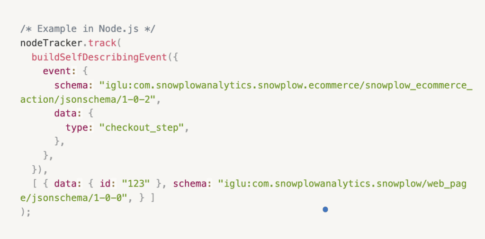
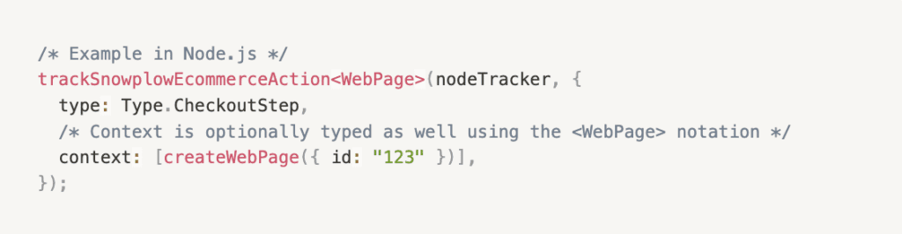

# Snowtype: Enhanced Client-Side Validation and Multi-Platform Support

Today we're announcing several new features and improvements to our tracking code generation tool, [Snowtype](https://snowplow.io/blog/implement-custom-snowplow-tracking-faster-with-snowtype). These expanded capabilities and multi-platform support empower developers to catch data quality issues instantly during development, eliminating the need for downstream cleanup while working across web, mobile, and server environments.

## The Evolution of Snowtype

Most event tracking technologies allow teams to send arbitrary data, leaving analysts to make sense of it later. While this approach seems convenient initially, it often leads to challenges when multiple teams contribute data, resulting in data duplication, incomplete information, and delayed insights.

Instead, Snowplow delivers high-quality behavioral data to your stream or warehouse by strictly validating all incoming events against a predefined schema. However, we recognized that implementing correct tracking can be challenging. This is where Snowtype comes in, addressing two critical challenges:

1. **Implementation Efficiency**: Developers can now use generated, type-safe code in their preferred programming language, complete with IDE and browser warnings, instead of manually writing tracking functions that reference event schemas.
2. **Data Accuracy**: By generating strict tracking code upfront, Snowtype eliminates common data quality issues that typically arise from incorrect data transmission from applications.

Snowtype works by integrating with our Data Product Studio to retrieve custom schemas and data products - including our newly launched [git-backed data structures](https://snowplow.io/blog/introducing-git-backed-management). After retrieving these components, it automatically generates corresponding types/classes and tracking functions. But what sets Snowtype apart is its advanced handling of data products and event specifications: when event and entity Data Structures combine in interactions, Snowtype responds by crafting precise tracking APIs. These APIs are built to match specifications exactly, implementing both property and cardinality rules validation that work during compilation and as the code runs.

## New Features and Improvements
### Enhanced Client-Side Validation

In addition to Snowtype’s strongly typed APIs, we've implemented [client-side validation](/docs/collecting-data/code-generation/client-side-validation/) for the browser tracker, focusing on three key areas:

1. **Schema Validation**: Catches type mismatches between your data and defined schemas. For example, if your button_click event expects an id property of type string but receives a number, you'll get an immediate browser console warning‍
2. **[Cardinality Rules](/docs/collecting-data/code-generation/client-side-validation#entity-cardinality-rules-validation-example) Validation**: Ensures the correct number of entities are included with each event. For instance, if a Product Click event is missing its associated product data, you'll receive an error notification, i.e Exactly 1, At least 1 Between 1 and 2‍
3. **[Property Rules](/docs/understanding-tracking-design/managing-event-specifications/ui#properties) Validation**: Validates field values against predefined rules. If a product entity with a category attribute must be either "related" or "cross-sell" but receives "upsell", the system flags this immediately.

### Expanded Platform Support

Snowtype now supports nine different platforms and frameworks so its even easier to deploy across your entire app suite:

* Browser (JS/TS)
* Javascript
* Node (JS/TS)
* iOS (Swift)
* Golang
* Android (Kotlin)
* [React Native](/docs/collecting-data/code-generation/using-the-cli/) (TS)
* [Flutter](/docs/collecting-data/code-generation/using-the-cli/) (Dart)
* [Google Tag Manager](/docs/collecting-data/code-generation/working-with-gtm/) (JS)

### Developer Experience Improvements

We've enhanced the development experience with:

* IDE autocomplete suggestions for expected values
* Warnings about unpublished schema updates or outdated data structures
* Inline documentation errors
* More comprehensive error messages and suggestions

## From Theory to Practice

Consider the difference in implementation. Previously, tracking an e-commerce event required manual schema references and property definitions.

With Snowtype, the same functionality is achieved with cleaner, more maintainable code that includes built-in validations and type safety.

## Looking Forward

Snowtype represents our commitment to helping teams create high-quality data at the source. By catching and preventing errors early in the development process, teams can have greater confidence in their analyses and achieve insights faster.

The combination of strict validation, cross-platform support, and enhanced developer tools makes Snowtype an essential part of modern data collection infrastructure. Whether you're working with web applications, mobile apps, or server-side tracking, Snowtype provides the tools needed to ensure data quality and consistency across your entire data collection pipeline.

Ready to try Snowtype? [Contact our team](https://snowplow.io/get-started/book-a-demo-of-snowplow-bdp) to learn how it can improve your data collection workflow and quality.
