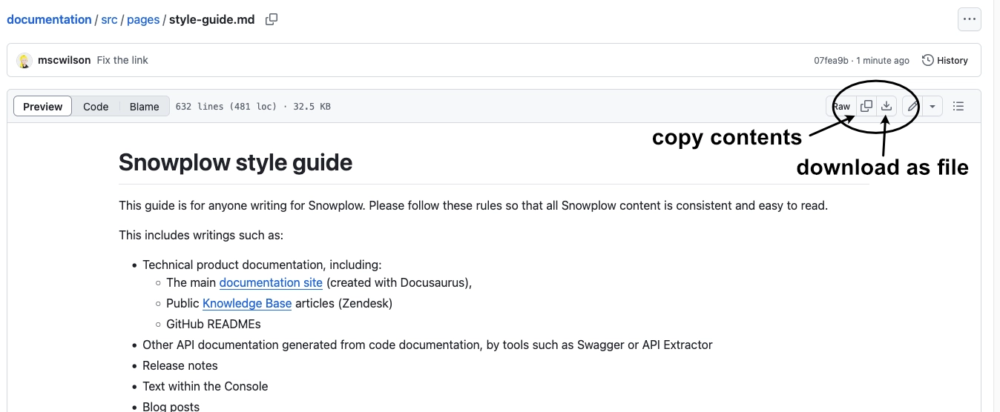

# Snowplow style guide

This guide is for anyone writing for Snowplow. Please follow these rules so that all Snowplow content is consistent and easy to read.

This includes writings such as:
- Technical product documentation, including:
  - The main [documentation site](/docs/) (created with Docusaurus),
  - Public [Knowledge Base](https://support.snowplow.io/hc/en-us) articles (Zendesk)
  - GitHub READMEs
- Other API documentation generated from code documentation, by tools such as Swagger or API Extractor
- Release notes
- Text within the Console
- Blog posts
- Other marketing content for the [main Snowplow website](https://snowplow.io/)

This guide is linked from the [docs GitHub README](https://github.com/snowplow/documentation).

## Using this guide with an AI tool

If you're using an LLM AI tool to help you write, provide it with this guide.

The style guide file is found [here](https://github.com/snowplow/documentation/blob/main/src/pages/style-guide/index.md).
Depending which AI you are using, you will need to copy the file contents, or save the file.



### Writing new content

If you have only a free account for the AI, manually provide the style guide for each chat.

Example prompt:
```text
I'm writing a blog post to advertise a new product release. Here is the company style guide. Follow the rules for all generated writing.
```

If you have a paid account, create a summarized version of the style guide to set in your project instructions, so that it will apply to all chats in the project.

Example prompt:
```text
Here is the company style guide. Create a compact version that I can set as custom project instructions.
```

Example instructions for chatGPT:
```text
This is for writing documentation on Snowplow (docs.snowplow.io) in markdown format. Create a code window.

all headings sentence case
[etc.]
```

### Editing existing content

Try asking the AI to create an edited version that is consistent with the style guide. It might do a reasonable job of updating things like formatting and spelling (then again, it might not). It is less likely to do a good job of improving less easily-defined things, such as replacing an unnecessary explanation of a concept with a link to a Fundamentals page.

Example prompt:
```text
Here is an existing piece of documentation, and the company style guide. Update the documentation to be compliant with the style guide. Do a first pass looking for and improving on any larger structural or design problems. Then a second pass looking for more specific technical problems.

Tell me any issues you find in the content. I expect to get a full updated version that aligns with the style guide.
```

Alternatively, ask it just to just list problems rather than trying to edit the text itself. It will likely still miss some problems (and hallucinate others) but this can provide a useful checklist for improvements.

Example prompt:
```text
Here is an existing piece of documentation, and the company style guide. Go through every section in the style guide (everything at header level h3 i.e. ###) and work out whether the documentation complies with it or not.

If the page is not following that rule, tell me so and the evidence for your decision. I expect to get a list of some of the headings from the style guide, along with the associated evidence, and advice on updating the content.
```

## Examples

Here are two pieces of older content that only partially follow the style guide. You can see the original text and the text that has been updated to match the style guide rules:

* Documentation: [annotated screenshot](annotated-docs.webp); [original text](/style-guide/example-docs-before); [updated text](/style-guide/example-docs-after)
* Blog post: [annotated screenshot](annotated-blog.webp); [original text](/style-guide/example-blog-before); [updated text](/style-guide/example-blog-after)

## Grammar and spelling

### US English
- Use US English spelling

  | ✅               | ❌                |
  | --------------- | ---------------- |
  | behavioral data | behavioural data |
  | data center     | data centre      |
  | organize        | organise         |
  | modeled         | modelled         |

- [Reference for US vs UK differences](https://radix-communications.com/uk-vs-us-english-a-fairly-comprehensive-checklist/)
- Be careful with "anonymization". We accidentally used the British spelling for some config options in our trackers (`withServerAnonymisation` in the JavaScript tracker, `serverAnonymisation` and `userAnonymisation` on mobile)
- Don't worry about US vs UK grammar rules aside from spelling

### Data
- Use "data" as singular

    | ✅                    | ❌                     |
    | -------------------- | --------------------- |
    | the data is captured | the data are captured |

### Set up and log in
- "Set up" is a verb, "setup" is a noun or adjective
  - Prefer "configuration" over "setup"
  - Avoid the hyphenated version, "set-up", because it's unclear

    | ✅   verb             | ✅         noun                             | ✅ adjective |
    | -------------------- | ------------------------------------------ | ----------- |
    | set up your tracking | your tracking implementation setup         | setup page  |
    |                      | your tracking implementation configuration |             |

- "Log in" is a verb, "login" is a noun or adjective
  - Prefer "credentials" over "login"
  - Avoid the hyphenated version, "log-in", because it's unclear

    | ✅   verb               | ✅         noun                      | ✅ adjective |
    | ---------------------- | ----------------------------------- | ----------- |
    | log in to your account | set up a login for your account     | login page  |
    |                        | set up credentials for your account |             |

## Formatting and punctuation
### Quotation marks
- Use double quotation marks (") rather than single (')

    | ✅                    | ❌                    |
    | -------------------- | -------------------- |
    | the "Filters" button | the 'Filters' button |

- For **documentation**, use straight quotes (") rather than smart ones (“)

    | ✅               | ❌               |
    | --------------- | --------------- |
    | a "spiky" value | a “spiky” value |

- For **all other writing**, smart quotes are fine as long as this is consistent within the piece of writing

    | ✅               | ✅               |
    | --------------- | --------------- |
    | a "spiky" value | a “spiky” value |

### Oxford comma
- Use a comma before the last item in a list

    | ✅                                                            | ❌                                                           |
    | ------------------------------------------------------------ | ----------------------------------------------------------- |
    | digital products, customer experiences, and fraud mitigation | digital products, customer experiences and fraud mitigation |

### Titles and headings
- Headings never finish with punctuation (no full stops, colons, etc.)
- Use only heading levels 1, 2 and 3
- The title of the page should have header level 1 (#)
- Subheadings should be H2 (##), with any sections under that as H3 (###)
- Do not use smaller headings - they look confusingly like normal text
  - Docusaurus doesn't include smaller headings in the table of contents
- For **documentation** and **release notes**, use sentence case for titles and headings

    | ✅                               | ❌                               |
    | ------------------------------- | ------------------------------- |
    | Configuring how events are sent | Configuring How Events Are Sent |

- For the **main website** and **blog posts**, use title case

    | ✅                               | ❌                               |
    | ------------------------------- | ------------------------------- |
    | Configuring How Events Are Sent | Configuring how events are sent |

### Bold and italic
- Highlight specific key words or phrases using bold (`**`, preferred) or italic (`_`)
  - Choose bold _or_ italic, don't combine them for the same words
- Use bold for UI components that the reader will interact with: page titles, tabs, buttons, dropdown menus, checkboxes, etc.
- Don't make entire paragraphs bold or italic

   | ✅                                                    | ❌                                                          |
   | ---------------------------------------------------- | ---------------------------------------------------------- |
   | events are **automatically tracked** once configured | **events** are _**automatically tracked**_ once configured |
   | click on the **Add action** button                   | click on the _Add action_ button                           |
   | the **Settings** page                                | the "Settings" page                                        |

### Code
- Use inline code (single backticks, <code>`</code>) for names of tables, fields, columns, classes, file names, etc.
- If the name has underscores or is all lower case, it should probably be marked as code (rather than in bold or with apostrophes)

    | ✅                                        |
    | ---------------------------------------- |
    | `snowplow_fractribution_channel_counts`  |
    | `iglu:com.acme/context/jsonschema/1-0-0` |
    | a single `geo_location` field            |
    | an `event_id` UUID string                |
    | tracking a `ScreenView` event            |

### Lists (bullets and numbers)
- Introduce the whole list with a sentence ending in a colon
- Start each item with a capital letter
- Don't put a full stop at the end of the sentence
- Exception: list items that have multiple sentences within them should have full stops at the end
- Lists should be consistent - either single sentence (no full stop) or multiple sentences (with full stop)
- There should be no more than seven items in the list
- When using a colon to make a kind of list item header, the subsequent sentence starts lowercase, like when using colons normally
  - Avoid using hyphens for list item "headers"

  | ✅                                                                                                                        | ❌                                                                                                                        |
  | ------------------------------------------------------------------------------------------------------------------------ | ------------------------------------------------------------------------------------------------------------------------ |
  | * Make tracking implementation easier                                                                                    | * make tracking implementation easier                                                                                    |
  | * Boolean: the value will be interpreted as a boolean                                                                    | * Boolean: The value will be interpreted as a boolean.                                                                   |
  | 2. **Remove** the attribute entirely                                                                                     | 2. **Remove** - remove the attribute entirely                                                                            |
  | Make the following changes:<br></br>- Replace `com.myvendor` with your company domain<br></br>- Leave `jsonschema` as-is | Make the following changes:<br></br>- replace `com.myvendor` with your company domain<br></br>- leave `jsonschema` as-is |

### Tables
- Text inside tables should start with a capital letter
- Exception: code and related text should be formatted as inline code, with appropriate capitalization (e.g. `true`)
- Text should be consistent, either single sentence (no full stop) or multiple sentences (with full stop)

### Ampersands
- Use "and" rather than "&"
- This is partly for consistency and aesthetic reasons, but also helps with screen reader accessibility

    | ✅                                          | ❌                                        |
    | ------------------------------------------ | ---------------------------------------- |
    | version and amend                          | version & amend                          |
    | User and Marketing Analytics visualization | User & Marketing Analytics visualization |

## Writing style
### Tone
- For **documentation**, **release notes**, and the **main website**, use a calm, encouraging, professional tone
  - Contractions such as "don't" are fine
  - Try not to stress out the reader with cautions and warnings
- For **blog posts**, a more casual and friendly tone is welcome

    | ✅           | ❌                              |
    | ----------- | ------------------------------ |
    | press enter | make sure you press enter      |
    | specify     | you must be careful to specify |

### Self-promotion
- For **blog posts** and the **main website**, it's important to say how great Snowplow is
- For **all other writing**, this is inappropriate
  - Documentation must not sound like sales or marketing collateral
- Blog posts should not be linked to from the **documentation**

  | Marketing                                                | Documentation                               |
  | -------------------------------------------------------- | ------------------------------------------- |
  | stream your enhanced events effortlessly to destinations | stream your enhanced events to destinations |
  | allows users to easily record                            | allows users to record                      |
  | create events quickly and accurately                     | create events                               |
  | we have the best features to do X                        | we do X                                     |

### Brevity
- Explain the point as simply as possible, without any extra words or phrases that don't add meaningful information

    | ❌              |
    | -------------- |
    | simply         |
    | on top of that |
    | quickly        |

- Importantly, don't explain concepts: link to existing pages about them such as those in the [Fundamentals](/docs/fundamentals/) docs section
  - This includes events, entities and context, schemas, enrichment, the structure of the data, failed events, etc.

### Voice
- Use active rather than passive voice

    | ✅                             | ❌                                    |
    | ----------------------------- | ------------------------------------ |
    | the Collector receives events | events are received by the Collector |

    - Exception: use passive voice if it makes for better writing

    | ✅                                                                                | ❌                                                                       |
    | -------------------------------------------------------------------------------- | ----------------------------------------------------------------------- |
    | Set up your tracking and send events. These events are received by the Collector | Set up your tracking and send events. The Collector receives the events |

### Pronouns
- Refer to the reader directly as "you" (second-person pronoun) where possible

    | ✅                                   | ❌                                         |
    | ----------------------------------- | ----------------------------------------- |
    | you can find your organization's ID | the user can find their organization's ID |

- Use "the user" to refer to users of the reader's products - the people who are generating the data

    | ✅                                                  |
    | -------------------------------------------------- |
    | you can track information about the user's browser |

- For **documentation**, primarily refer to Snowplow as "Snowplow"
  -  Exception: use "our", "we", "us" (first-person pronouns) if it makes for a better sentence

    | ✅                                            | ❌                                       |
    | -------------------------------------------- | --------------------------------------- |
    | Snowplow supports two types of Iglu registry | we support two types of Iglu registry   |
    | Snowplow provides                            | we provide                              |
    | but you can also build your own              | but we also encourage building your own |
    | use the Snowplow trackers                    | use our trackers                        |
    | because we discard stray pings               | because Snowplow discards stray pings   |

- For **release notes**, **blog posts**, and the **main website**, using first-person pronouns as well as "Snowplow" is fine

    | ✅                          |
    | -------------------------- |
    | we are pleased to announce |
    | we have fixed a bug        |
    | the Snowplow trackers      |

### Timelessness
- For all **documentation** except for **migration guides**, stay within the current moment in time
    - We won't remember to come back and update it
    - The documentation is not an appropriate place to announce upcoming features

    | ❌                 |
    | ----------------- |
    | currently         |
    | in the future     |
    | you can now       |
    | Snowplow plans to |
    | latest            |

- For **migration guides**, **release notes**, and all **other writing**, it's fine to compare to the past, or make reference to already-announced upcoming features
  - Referring to previous functionality is the point of migration guides, after all

    | ✅                        |
    | ------------------------ |
    | the tracker now supports |
    | will be coming soon      |
    | currently                |

### Exclamation marks
- For **documentation** and **release notes**, avoid exclamation marks

    | ✅                           | ❌                           |
    | --------------------------- | --------------------------- |
    | That's it for installation. | That's it for installation! |

- For **other writing**, occasional exclamation marks are fine
  - They can help maintain a friendly, casual tone

    | ✅                                                    |
    | ---------------------------------------------------- |
    | keep your data AI-ready from collection to delivery! |

### Emojis
- For most **documentation**, emojis can be used sparingly, to provide information
  - Emojis must not be used for decoration

    | ✅                    | ❌                                    |
    | -------------------- | ------------------------------------ |
    | ✅ Geolocation entity | 🏔️ “Glass-box” technical architecture |


- For **release notes** and **API documentation**, no emojis at all

- For **blog posts** and the **main website**, occasional emojis are fine
  - They can help maintain a friendly, casual tone

    | ✅                                              |
    | ---------------------------------------------- |
    | 🎉 Reduce your data loading costs by up to 80%. |

### Diagrams and images
- Adding diagrams and images is encouraged
- Diagrams and images should have white backgrounds
- For images, use `.webp` (preferred - the file size is smaller) or `.png` format
- Images should be a sensible size (max 2000px x 500px)
- Highlighting the relevant part of an image is recommended
- For **documentation** diagrams, [Mermaid](http://mermaid.js.org/#/) code is recommended as they adjust automatically

## Inclusive language
### Allowlist and denylist
- Use allowlist and denylist instead of the older white/blacklist terminology

    | ✅                         | ❌                         |
    | ------------------------- | ------------------------- |
    | allowed form elements     | whitelisted form elements |
    | allowlisted form elements |                           |

### Gendered language
- Avoid gendered language
- Use plural, or the gender-neutral "they" third-person pronoun

  | ✅                  | ❌                   |
  | ------------------ | ------------------- |
  | users will need to | he will need to     |
  | they will need to  | he/she will need to |
  | five person-hours  | five man-hours      |

## Snowplow-specific terms

### Snowplow
- Snowplow is called Snowplow, not Snowplow Analytics
- Most products can have "Snowplow" added to their name if it helps clarify what's being referred to

  | ✅                               |
  | ------------------------------- |
  | the Snowplow JavaScript tracker |
  | the Snowplow Collector endpoint |
  | the Snowplow dbt data models    |

### Capitalization
- A few products/concepts always have capital letters

    | ✅                                     |
    | ------------------------------------- |
    | Data Product Studio                   |
    | Snowtype                              |
    | Snowplow Customer Data Infrastructure |
    | Data Model Packs                      |

- Most products or features should not have capital letters when being used in a sentence

   | ✅                                              | ❌                                              |
   | ---------------------------------------------- | ---------------------------------------------- |
   | track a page view                              | track a Page View                              |
   | creating data products                         | creating Data Products                         |
   | all the source applications                    | all the Source Applications                    |
   | Unified Digital data model                     | Unified Digital Data Model                     |
   | stream that contains all of your failed events | stream that contains all of your Failed Events |
   | custom self-describing event                   | custom Self-describing event                   |
   | Snowplow tag template                          | Snowplow Tag Template                          |

- Product names should be in normal text, not code markup

   | ✅            | ❌              |
   | ------------ | -------------- |
   | Snowplow CLI | `snowplow-cli` |

### Deprecated terminology
- Use "entity", not "context"
    - It's unavoidable to use "context" when referring to some table columns or APIs, but use the correct nomenclature around them anyway
    - Link to the Fundamentals [page about entities](https://docs.snowplow.io/docs/fundamentals/entities/) if it feels unclear

   | ✅                                                | ❌                                                |
   | ------------------------------------------------ | ------------------------------------------------ |
   | these entities provide some context to the event | these contexts provide some context to the event |
   | all versions of the entity                       | all versions of the context                      |
   | pass a list of entities using the `context` key  | pass a list of contexts using the `context` key  |
   | the derived entities                             | the derived contexts                             |

- Use "self-describing event", not "unstructured event"

   | ✅                             | ❌                          |
   | ----------------------------- | -------------------------- |
   | custom self-describing events | custom unstructured events |

- Use "failed events", not "bad rows"
  - Exception: if specifically referring to the legacy bad row JSON format and associated tooling

   | ✅                                 | ❌                             |
   | --------------------------------- | ----------------------------- |
   | where your failed event files are | where your bad rows files are |
   | the bad rows format               |                               |


- Use "visualization", not "data application"

   | ✅                                       | ❌                                  |
   | --------------------------------------- | ---------------------------------- |
   | the Marketing Attribution visualization | the Marketing Attribution data app |


### Pipeline components
- Console is capitalized, and doesn't have a definite article (no "the")
- It can also be called "Snowplow Console"
  - This is fine at the start of a piece of writing but feels overly wordy if used throughout, so maybe open with that then just call it "Console" subsequently

   | ✅                                   | ❌                                       |
   | ----------------------------------- | --------------------------------------- |
   | data structures in Console          | data structures in the console          |
   | data structures in Snowplow Console | data structures in the Snowplow Console |

- Collector is capitalized, and gets a definite article ("the")
    - Use "the Collector endpoint" where possible for clarity - the reader might not know what we mean by "Collector", but they probably know what an endpoint is

    | ✅                                    |
    | ------------------------------------ |
    | events hit the Collector             |
    | events hit the Collector application |
    | events hit the Collector endpoint    |

- Enrich is capitalized, but doesn't always get a definite article ("the")

    | ✅                                                |
    | ------------------------------------------------ |
    | enabled by default within the Enrich application |
    | enabled by default within Enrich                 |
    | Enrich can enrich an event                       |

- All the Loaders are capitalized, and get a definite article ("the")

   | ✅                                         | ❌                                     |
   | ----------------------------------------- | ------------------------------------- |
   | the Lake Loader on AWS                    | the lake loader on AWS                |
   | the BigQuery Loader reads enriched events | BigQuery loader reads enriched events |

- Iglu is capitalized, as are Iglu Central and Iglu Server, but not any other Iglu components

   | ✅                                                   | ❌                                                   |
   | --------------------------------------------------- | --------------------------------------------------- |
   | an Iglu client resolving a schema from Iglu Central | an Iglu Client resolving a schema from Iglu Central |
   | setting up an instance of the Iglu Server           | setting up an instance of the Iglu server           |
   | the Iglu webhook adapter                            | the Iglu Webhook adapter                            |

### Trackers
- The trackers have the specific language capitalized, followed by lowercase "tracker"
- Refer to the iOS and Android trackers together as the "native mobile" trackers (no capitalization)

   | ✅                           | ❌                           |
   | --------------------------- | --------------------------- |
   | the Java tracker            | the Java Tracker            |
   | the Snowplow Python tracker | the Snowplow Python Tracker |
   | the native mobile trackers  | the mobile native trackers  |

- Use "JavaScript tracker" to refer to the web trackers collectively - the one loaded via tags and the one installed using npm (a.k.a. browser tracker)
    - This doesn't apply within the docs pages for the web trackers themselves

   | ✅                                              | ❌                                        |
   | ---------------------------------------------- | ---------------------------------------- |
   | track a page view using the JavaScript tracker | track a page view using the web trackers |

### Events without schemas
- Use "baked-in events" for events that don't have a schema
- Specifically, these are page views, page pings, and the legacy ecommerce transaction events
- We've previously referred to them as primitive, canonical, or standard events

    | ✅                                            |
    | -------------------------------------------- |
    | baked-in events aren't described by a schema |

### Versions
- Refer to specific versions as "version X.Y.Z" or just "X.Y.Z"
- It's not necessary to put all 3 numbers if there aren't any patches

  | ✅                     | ❌              |
  | --------------------- | -------------- |
  | install version 1.3.0 | install v1.3.0 |
  | since 0.12            | since v0.12    |

## General technical terms
### Acronyms
- Acronyms should be in capitals

    | ✅    |
    | ---- |
    | HTTP |
    | CDI  |
    | CLI  |
    | API  |
    | SQL  |
    | SDK  |
    | URL  |

- Some can be pluralized with an "s", but not all

  | ✅            | ❌     |
  | ------------ | ----- |
  | JSON         | JSONs |
  | JSON schemas |       |
  | APIs         |       |
  | SDKs         |       |
  | URLs         |       |

- For the **documentation** website, we have a docs plugin that adds a dotted line and a tooltip explanation to acronyms, e.g. hovering over "CDI" will show that it stands for "Customer Data Infrastructure": add new acronym definitions to the `src/remark/abbreviations.js` file to enable this behavior
- (Technically, these are all initialisms, not acronyms)

### Capitalization
- Third-party products should be capitalized as appropriate

    | ✅         |
    | --------- |
    | Google    |
    | Snowflake |
    | dbt       |
    | Kafka     |
    | npm       |

- Don't use capitalization to highlight things

  | ✅                            | ❌                            |
  | ---------------------------- | ---------------------------- |
  | using machine learning       | using Machine Learning       |
  | due to an enrichment failure | due to an Enrichment Failure |

- Use lower case for "web"

  | ✅             | ❌             |
  | ------------- | ------------- |
  | a web browser | a Web browser |

### Hyphenation
- "Real-time" is hyphenated if it's used as an adjective
  - It's two separate words if it's being used as a noun

    | ✅   adjective                       | ✅         noun              |
    | ----------------------------------- | --------------------------- |
    | data available in real-time streams | data available in real time |

- "Back-end" and "front-end" are hyphenated
  - Strictly speaking, they should only be hyphenated if they're used as adjectives, and two separate words when used as nouns
  - We are going for consistency instead of being entirely grammatically correct here

    | ✅   adjective        | ✅         noun           |
    | -------------------- | ------------------------ |
    | front-end developers | working on the front-end |
    | back-end tracking    | a storage back-end       |

- "Server-side" and "client-side" are hyphenated

    | ✅                                     | ❌                                     |
    | ------------------------------------- | ------------------------------------- |
    | ingestion from server-side            | ingestion from server side            |
    | Google Tag Manager Server-side        | Google Tag Manager Server Side        |
    | enable client-side anonymous tracking | enable client side anonymous tracking |

- Use "ecommerce" without hyphen or capitalization (similar to "email")
    - Exception: you're referring to a specific Snowplow product or feature, in which case it should be capitalized

    | ✅                        | ❌                        |
    | ------------------------ | ------------------------ |
    | track ecommerce events   | track e-commerce events  |
    | the Ecommerce plugin     | the E-commerce plugin    |
    | the Ecommerce data model | the eCommerce data model |

## Accessibility
### Images
- Images should have alt text provided
- Save the image using a useful file name
- [Guidelines for writing alt text](https://accessibility.huit.harvard.edu/describe-content-images)

   | ✅                                                                                                          | ❌                                       |
   | ---------------------------------------------------------------------------------------------------------- | --------------------------------------- |
   | `` | `` |
   | `snowbridge-architecture.png`                                                                              | `image.png`                             |

### Links
- Links should be clearly described, either by the preceding text or the link itself
- Use the name of the page you're linking to where possible
- [Guidelines for writing link text](https://developers.google.com/style/link-text)

   | ✅                                                        | ❌                                         |
   | -------------------------------------------------------- | ----------------------------------------- |
   | `for more information, see [Tracking specific events]()` | `for more information, see [this page]()` |
   | `the schema for this event is found [here]()`            | `[here]() is the schema for this event`   |


## Markdown formatting

### Bullet point lists
- It's ok to use `-` or `*` for the list bullet points, since they come out looking the same

### Admonitions
- This applies to the main **documentation** site only
- Highlight blocks of text using the built-in [Docusaurus admonitions](https://docusaurus.io/docs/markdown-features/admonitions) feature
- Use admonitions sparingly; having multiple within one page is overwhelming
- Set a custom heading where possible

   | ✅                            | ❌         |
   | ---------------------------- | --------- |
   | `:::info Function signature` | `:::info` |

- Use "Tip" blocks to encourage readers to take action

    | ✅                                                                                                                                |
    | -------------------------------------------------------------------------------------------------------------------------------- |
    | :::tip Avoiding duplicate column names<br></br>Make sure you include a prefix value to avoid duplicate column names.<br></br>::: |

- Use "Note" or "Info" blocks to highlight information that doesn't necessarily require action, such as that about a newer version being available, how a specific component works, or what versions are supported
- The "Warning" and "Danger" blocks are reserved for information about potential data loss or permissions breaches

### Code
- Use code blocks (triple backticks, <code>```</code>) for code examples
- Specify the language next to the opening backticks, so that the code block is rendered correctly
- For the main **documentation** site only: if the rendering doesn't look right, make sure that the specified language is listed under `prism: additionalLanguages` in the `docusaurus.config.js` file

    | ✅                                                          |
    | ---------------------------------------------------------- |
    | \`\`\`json<br></br>{"accessToken":"string"}<br></br>\`\`\` |
